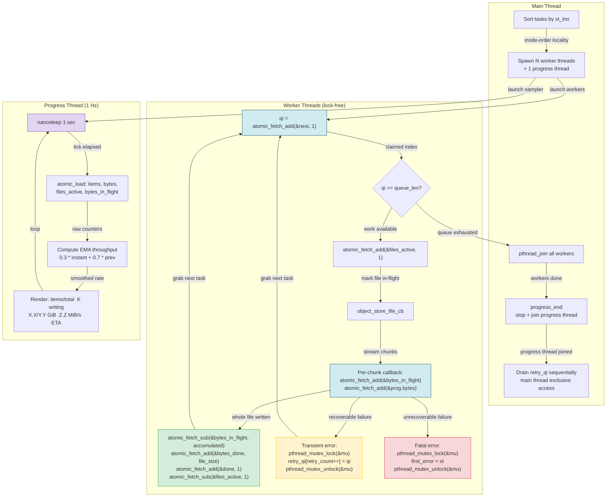

# Phase 3 Thread Synchronization

How the lock-free worker pool, atomic counters, progress thread, and retry queue interact during parallel content storage.

## Key synchronization points

- **Lock-free dispatch**: Workers claim tasks via `atomic_fetch_add(&next)` — no mutex on the hot path
- **Mutex only for errors**: `mu` protects `retry_qi[]` and `first_error` — rare path only
- **Progress sampling**: 1 Hz thread reads atomic counters without locking
- **Barrier**: `pthread_join` on all workers guarantees all atomic writes are visible before retry drain
- **bytes_in_flight lifecycle**: chunk callback adds, completion subtracts, net change = 0 per file
