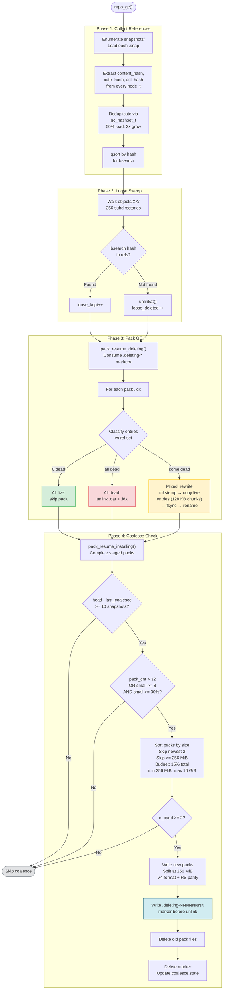

# Pack GC + Coalesce Decision Tree

The complete flow from `repo_gc()` through reference collection, loose sweep, pack rewrite, and conditional coalescing.

```mermaid
flowchart TD
    START(["repo_gc()"])

    subgraph "Phase 1: Collect References"
        ENUM["Enumerate snapshots/<br/>Load each .snap"]
        EXTRACT["Extract content_hash,<br/>xattr_hash, acl_hash<br/>from every node_t"]
        DEDUP["Deduplicate via<br/>gc_hashset_t<br/>50% load, 2x grow"]
        SORT_REFS["qsort by hash<br/>for bsearch"]
    end

    START --> ENUM --> EXTRACT --> DEDUP --> SORT_REFS

    subgraph "Phase 2: Loose Sweep"
        WALK["Walk objects/XX/<br/>256 subdirectories"]
        BSEARCH_L{"bsearch hash<br/>in refs?"}
        KEEP_L["loose_kept++"]
        DELETE_L["unlinkat()<br/>loose_deleted++"]
    end

    SORT_REFS --> WALK --> BSEARCH_L
    BSEARCH_L -- "Found" --> KEEP_L
    BSEARCH_L -- "Not found" --> DELETE_L

    subgraph "Phase 3: Pack GC"
        RESUME_DEL["pack_resume_deleting()<br/>Consume .deleting-* markers"]
        EACH_PACK["For each pack .idx"]
        CLASSIFY{"Classify entries<br/>vs ref set"}
        ALL_LIVE["All live:<br/>skip pack"]
        ALL_DEAD["All dead:<br/>unlink .dat + .idx"]
        MIXED["Mixed: rewrite<br/>mkstemp → copy live<br/>entries (128 KB chunks)<br/>→ fsync → rename"]
    end

    KEEP_L --> RESUME_DEL
    DELETE_L --> RESUME_DEL
    RESUME_DEL --> EACH_PACK --> CLASSIFY
    CLASSIFY -- "0 dead" --> ALL_LIVE
    CLASSIFY -- "all dead" --> ALL_DEAD
    CLASSIFY -- "some dead" --> MIXED

    subgraph "Phase 4: Coalesce Check"
        RESUME_INST["pack_resume_installing()<br/>Complete staged packs"]
        SNAP_GAP{"head - last_coalesce<br/>>= 10 snapshots?"}
        TRIGGER{"pack_cnt > 32<br/>OR small >= 8<br/>AND small >= 30%?"}
        SELECT["Sort packs by size<br/>Skip newest 2<br/>Skip >= 256 MiB<br/>Budget: 15% total<br/>min 256 MiB, max 10 GiB"]
        ENOUGH{"n_cand >= 2?"}
        WRITE_NEW["Write new packs<br/>Split at 256 MiB<br/>V4 format + RS parity"]
        MARKER["Write .deleting-NNNNNNNN<br/>marker before unlink"]
        UNLINK["Delete old pack files"]
        CLEANUP["Delete marker<br/>Update coalesce.state"]
    end

    ALL_LIVE --> RESUME_INST
    ALL_DEAD --> RESUME_INST
    MIXED --> RESUME_INST

    RESUME_INST --> SNAP_GAP
    SNAP_GAP -- "No" --> SKIP(["Skip coalesce"])
    SNAP_GAP -- "Yes" --> TRIGGER
    TRIGGER -- "No" --> SKIP
    TRIGGER -- "Yes" --> SELECT --> ENOUGH
    ENOUGH -- "No" --> SKIP
    ENOUGH -- "Yes" --> WRITE_NEW --> MARKER --> UNLINK --> CLEANUP

    style ALL_DEAD fill:#f8d7da,stroke:#dc3545
    style MIXED fill:#fff3cd,stroke:#ffc107
    style ALL_LIVE fill:#d4edda,stroke:#28a745
    style MARKER fill:#d1ecf1,stroke:#0c5460
    style SKIP fill:#e2e3e5,stroke:#6c757d
```
