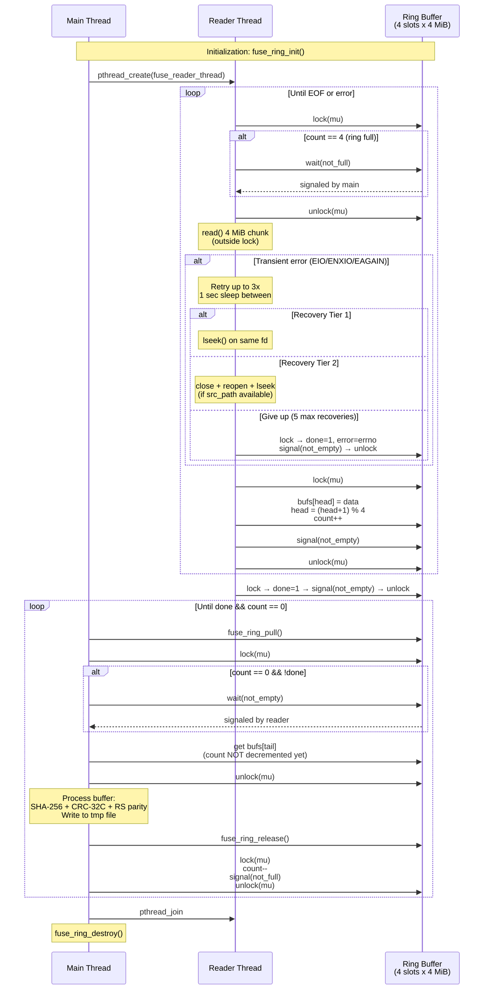

# FUSE Readahead Ring Buffer Concurrency

Producer/consumer model between the reader thread and main thread when reading from FUSE-mounted filesystems.

## Key design constraints

- **Bounded ring**: 4 slots x 4 MiB = 16 MiB max in flight. FUSE daemon never has more than 1 outstanding read.
- **Lock scope**: Mutex protects only ring state (head/tail/count/done/error). Actual I/O happens outside the lock.
- **Pull/release split**: Main thread holds a slot while processing (count not decremented), preventing reader from overwriting it. `release()` frees the slot back.
- **Recovery budget**: 5 total across seek + reopen attempts. 3 retries per transient error with 1-second backoff.
