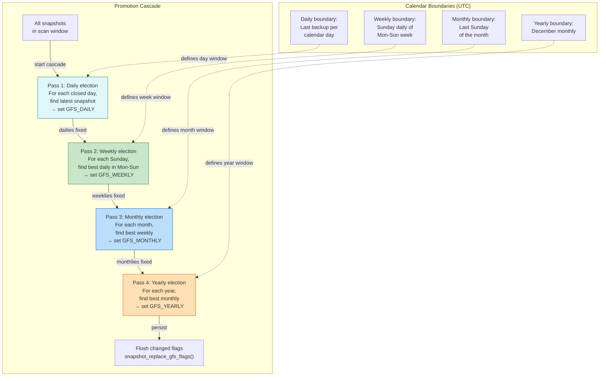
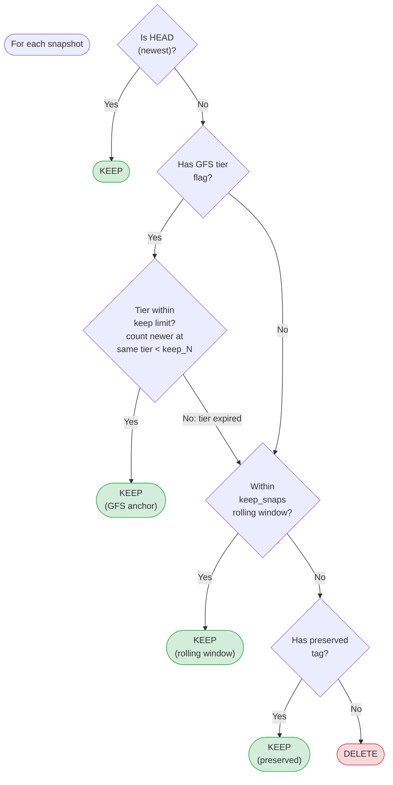

# GFS Tier Promotion and Prune Logic

How snapshots are assigned to GFS tiers (daily/weekly/monthly/yearly) and how the prune decision determines which snapshots to keep or delete.

## Tier Promotion

## Prune Decision

## Key details

- **Incremental mode** (default after backup): Only processes windows closed since last run
- **Full-scan mode** (`--full-scan`): Clears all flags, recomputes from scratch
- **Self-healing**: Incremental mode detects missing flags on older snapshots and extends scan backward
- **Tier expiry**: A daily with 3 newer dailies is expired if `keep_daily <= 3`
- **keep_snaps = 0**: Disables rolling window entirely (only GFS tiers and preserved tags protect snapshots)
