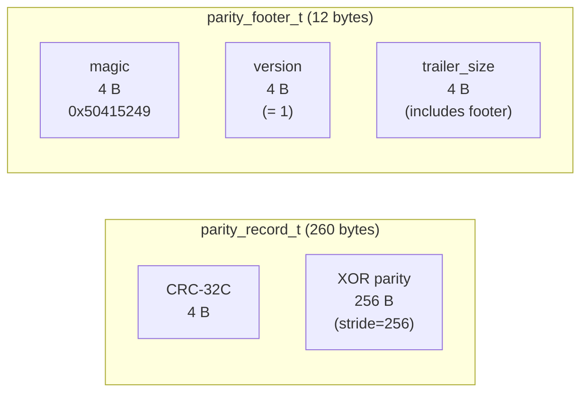
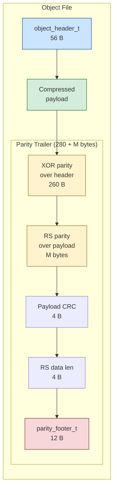
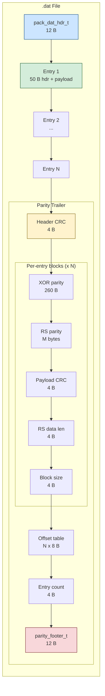
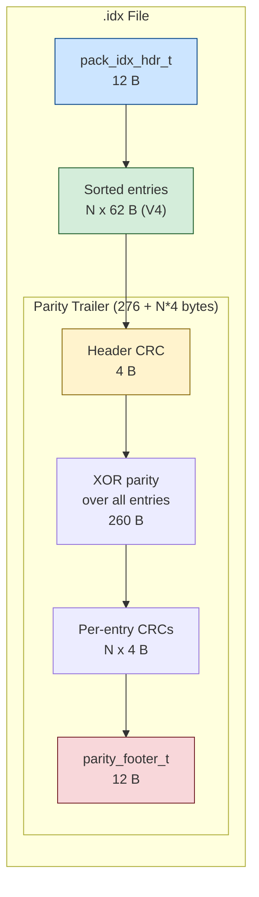

# Parity Trailer Byte Layout

Physical byte-level anatomy of parity trailers across all on-disk file types.

## Common building blocks

## Loose Object (version 2)

## Pack .dat (V3/V4)

## Pack .idx (V3/V4)

## Snapshot .snap (V5)

Same structure as loose object: `[60 B header] + [compressed payload] + [260 B XOR + M B RS + 4 B CRC + 4 B len + 12 B footer]`

## Bundle .cbb (V2)

Per-record trailer after each record's path + payload: `[260 B XOR over 52 B rec header] + [M B RS over payload] + [4 B CRC + 4 B len + 4 B block size]`

## Global pack index (pack-index.pidx)

Same structure as loose object: `[16 B header + 1024 B fanout + N*52 B entries] + [260 B XOR over header + M B RS over data section + 4 B CRC + 4 B len + 12 B footer]`
