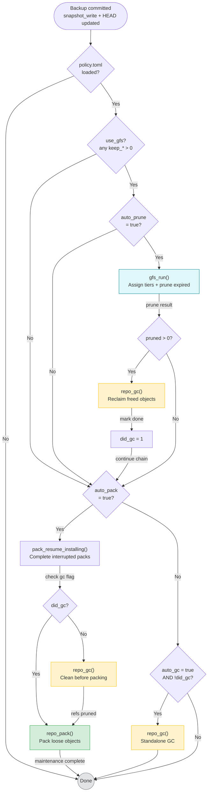

# Post-Backup Maintenance Decision Tree

The conditional maintenance flow that runs after a successful `backup run`, controlled by policy flags.

## Key invariant

GC runs **at most once** per backup. The `did_gc` flag prevents redundant GC calls:
- If prune triggered GC, packing skips its GC
- If no prune ran, packing runs GC itself
- If neither prune nor pack ran, standalone GC runs only if `auto_gc = true`
