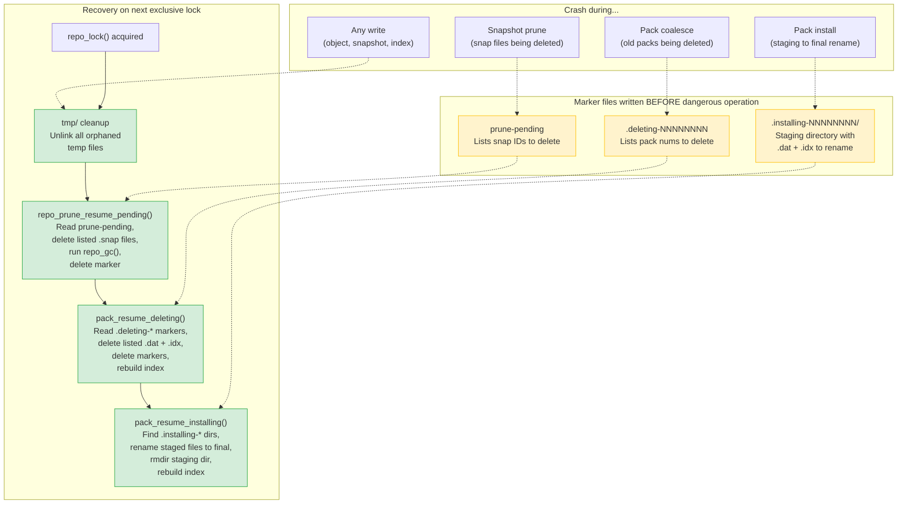
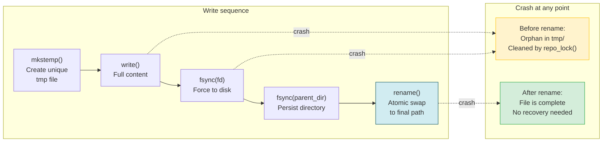

# Crash Recovery State Machine

How the repository recovers from interrupted operations using marker files and atomic write patterns.

## Recovery mechanisms overview

## Atomic write pattern (universal safety net)

## Recovery trigger points

| Mechanism | Written by | Consumed by | Trigger |
|-----------|-----------|-------------|---------|
| `prune-pending` | `gfs_run()` | `repo_prune_resume_pending()` | Every exclusive lock acquisition |
| `.deleting-NNNNNNNN` | `maybe_coalesce_packs()` | `pack_resume_deleting()` | Start of `pack_gc()` and `maybe_coalesce_packs()` |
| `.installing-NNNNNNNN/` | `repo_pack()` | `pack_resume_installing()` | Start of `maybe_coalesce_packs()` |
| `tmp/*` orphans | Any write operation | `repo_lock()` | Every exclusive lock acquisition |

## Signal safety

`SIGINT` / `SIGTERM` handler calls only `write(STDERR)` + `_exit(130)`. The OS releases `flock` on process exit. The atomic write pattern guarantees no partial files are visible — they're either fully renamed or orphaned in `tmp/`.
