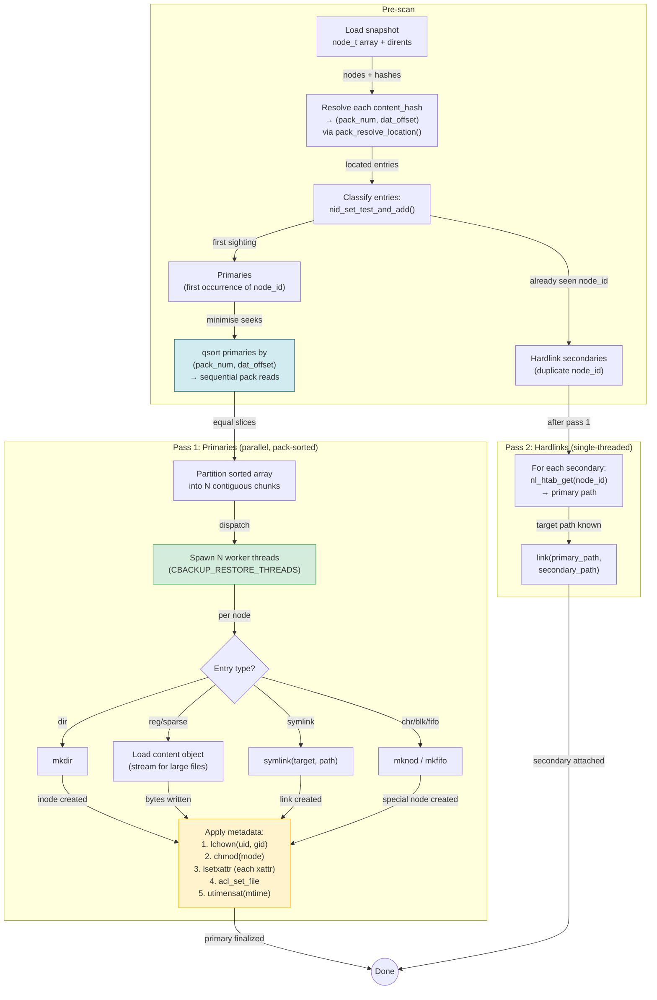

# Restore I/O Flow

The two-pass, pack-sorted restore strategy that minimizes random I/O by reading pack files sequentially.

## Key optimization

Sorting primaries by `(pack_num, dat_offset)` converts random pack reads into sequential sweeps. Each worker thread processes a contiguous slice of the sorted array, so workers don't contend on the same pack files. Thread count auto-tunes: 2 max for HDD, full CPU count for SSD.
