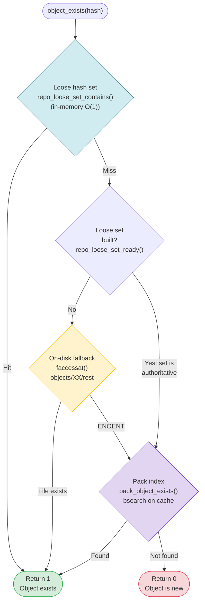

# Dedup Decision Cascade

The layered existence check that determines whether an object needs to be stored or can be skipped.

## When each tier runs

| Tier | Check | Runs when | Cost |
|------|-------|-----------|------|
| 1 | Loose hash set | Always (if set built) | O(1) memory lookup |
| 2 | faccessat | Only if loose set not yet built | O(1) syscall per check |
| 3 | Pack index | Always (if tiers 1-2 miss) | O(log N) binary search |

During a typical backup run, the loose set is built early and tier 1 handles most dedup hits. Tier 2 is a cold-start fallback. Tier 3 catches objects that were packed in previous runs.
