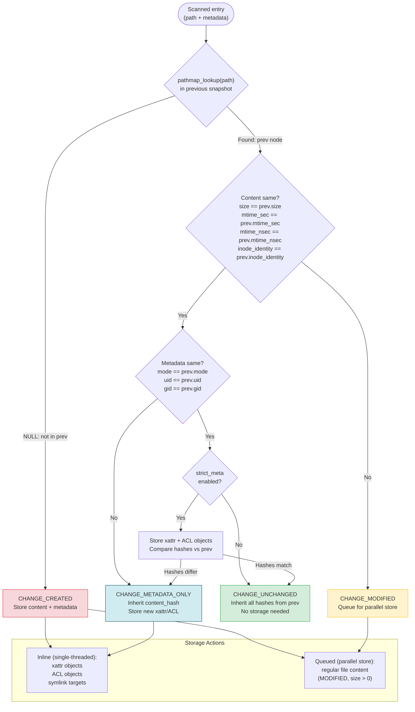

# Snapshot Comparison and Classification

How Phase 3 classifies each scanned entry by comparing it against the previous snapshot's pathmap.

## Classification summary

| Classification | Content stored? | Metadata stored? | Frequency |
|---------------|----------------|-----------------|-----------|
| UNCHANGED | No (inherit hash) | No (inherit hash) | Most entries |
| METADATA_ONLY | No (inherit hash) | Yes (xattr/ACL) | Rare |
| MODIFIED | Yes (parallel queue) | Yes (inline) | Changed files |
| CREATED | Yes (parallel queue) | Yes (inline) | New files |
