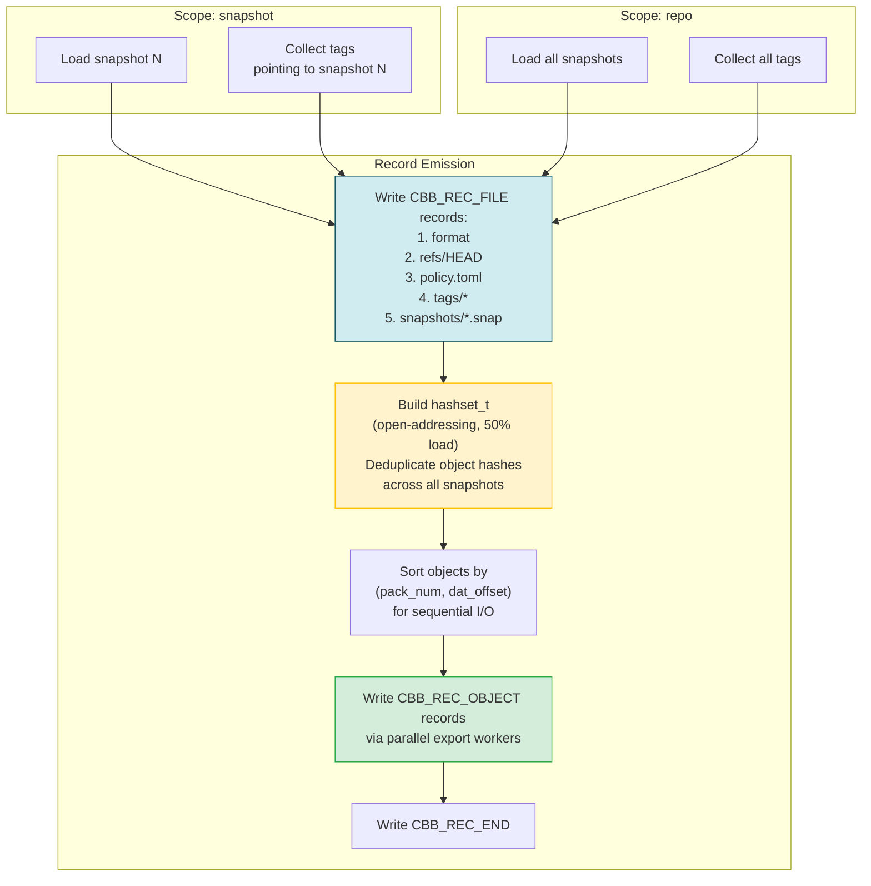
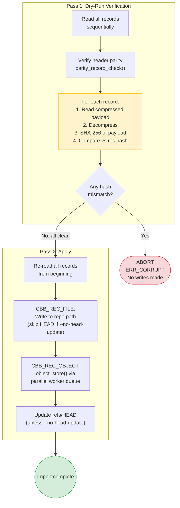

# Bundle Export/Import Two-Pass Safety

How export collects and deduplicates records, and how import uses a dry-run verification pass before writing anything.

## Export

## Import

## Safety guarantee

The two-pass design ensures atomicity at the verification level: either every record arrives intact (all SHA-256 hashes match) and the apply pass proceeds, or no writes are made to the repository. A truncated or corrupted bundle is detected in pass 1 before any repository state is modified.
