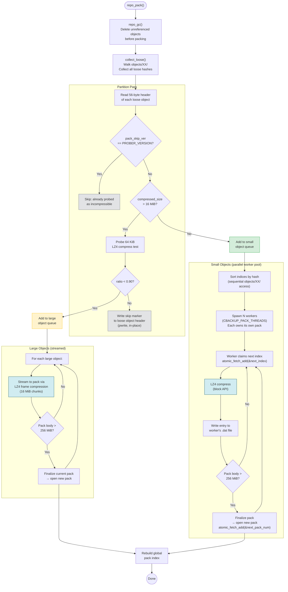

# Pack Creation Dispatch

How `repo_pack()` partitions loose objects between large-object streaming and the parallel worker pool.

## Key design decisions

- **Large objects stream** to avoid buffering multi-gigabyte files in RAM. Each gets LZ4 frame compression.
- **Small objects use block-API LZ4** (single call, faster for small payloads).
- **Each worker owns its own pack files** — no shared writer, no serialization bottleneck.
- **Pack numbers assigned atomically** — `atomic_fetch_add` ensures uniqueness across workers without locks.
- **256 MiB cap** — when any pack exceeds this, it's finalized and a new one starts. Keeps packs manageable for GC/coalesce.
