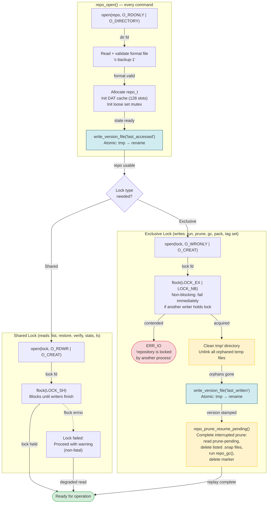

# Lock Acquisition Cascade

What happens when the repository is opened and locked, including all recovery mechanisms that trigger automatically.

## Automatic recovery on exclusive lock

Three recovery mechanisms fire automatically before any write operation begins:

| Step | Mechanism | What it recovers |
|------|-----------|-----------------|
| tmp/ cleanup | Unlink orphaned temp files | Crashed mid-write (before atomic rename) |
| last_written | Version stamp | Tracks which binary version last wrote |
| prune_resume | Complete interrupted prune | Crashed between prune-pending write and snap deletion |

Additional recovery (pack_resume_deleting, pack_resume_installing) triggers at the start of GC and pack operations, not at lock time.
