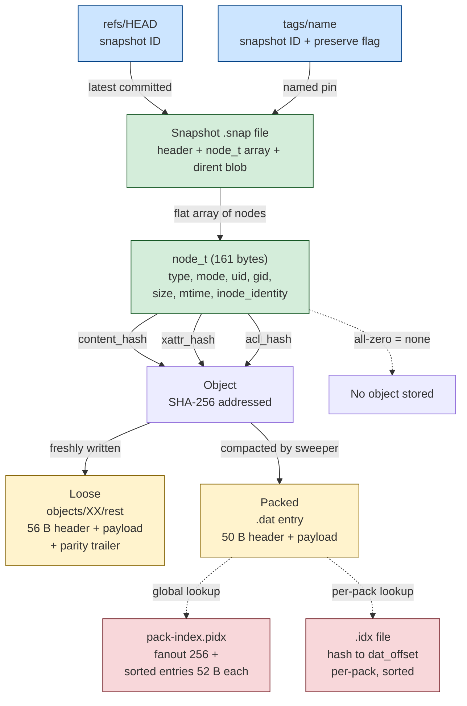
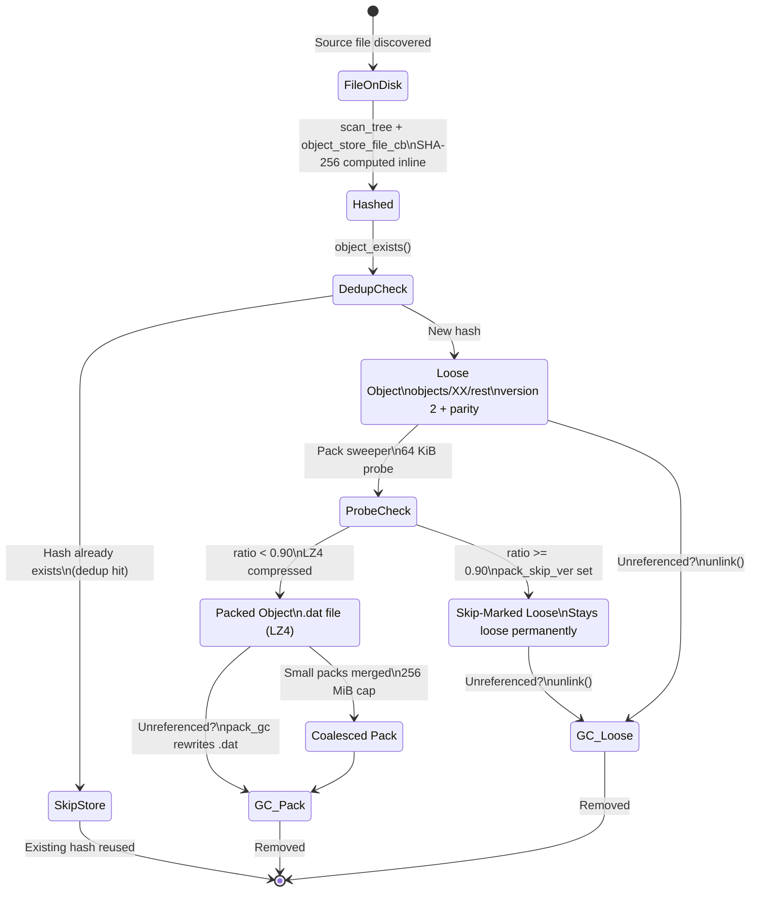
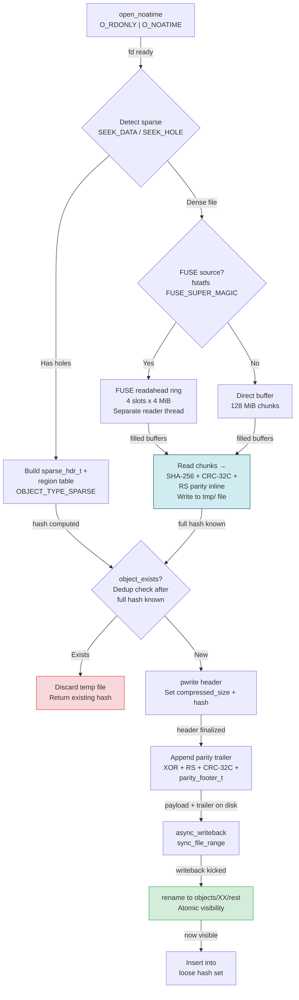
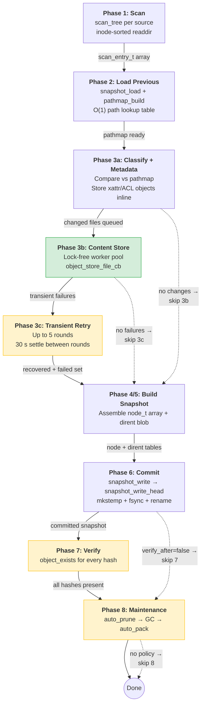

# c-backup Technical Manual

## Revision History

| Date | Notes |
|------|-------|
| 2026-04-06 | Snapshot V6 (`logical_bytes` in header), stats cache, snapshot path index (`.pidx`), `reindex-snaps` command, version system (`release_version`, `--version`, `last_accessed`/`last_written`), `--help`/`-h`, debug build target, parallel make, removed `doctor` command, viewer Help > About dialog, diagrams, manual reorder and RFC-style format diagrams, RPC reference (`rpc.md`) |
| 2026-04-05 | Streaming RS parity (bounded-RAM `rs_parity_stream_t`), FUSE readahead ring (4×4 MiB), unified pack workers (per-thread packs), bounded-RAM GC copy, transient-error retry queue with multi-round retry, O_NOATIME, rotational disk detection, `migrate-v4` command, JSON RPC session mode |
| 2026-04-02 | HDD I/O optimizations: global pack index, pack sharding, dynamic DAT cache, async writeback, inode-sorted scan, pack-worker hash sort, pack-ordered restore/verify, parity read consolidation, `reindex` and `migrate-packs` commands |
| 2026-03-26 | Build/bench section, verify --deep removal, GFS Tree viewer tab, post-backup runbook accuracy |
| 2026-03-24 | Initial |

---

## Table of Contents

1. [Introduction](#1-introduction)
2. [Glossary](#2-glossary)
3. [Repository Layout](#3-repository-layout)
4. [CLI Reference](#4-cli-reference)
   - 4.1 `init`
   - 4.2 `run`
   - 4.3 `list`
   - 4.4 `ls`
   - 4.5 `cat`
   - 4.6 `restore`
   - 4.7 `diff`
   - 4.8 `grep`
   - 4.9 `export` / `import` / `bundle verify`
   - 4.10 `prune`
   - 4.11 `gc`
   - 4.12 `pack`
   - 4.13 `verify`
   - 4.14 `stats`
   - 4.15 `snapshot delete`
   - 4.16 `tag`
   - 4.17 `policy`
   - 4.18 `gfs`
   - 4.19 `reindex`
   - 4.20 `reindex-snaps`
   - 4.21 `migrate-packs`
   - 4.22 `migrate-v4`
5. [policy.toml Reference](#5-policytoml-reference)
6. [Common Configurations](#6-common-configurations)
   - 6.1 Laptop / Workstation
   - 6.2 Server with Long History
   - 6.3 Conservative Prune (Keep Many Local Manifests)
   - 6.4 Manual Retention Control
   - 6.5 Legal Hold Pattern
   - 6.6 Multi-Source Backup
7. [Troubleshooting](#7-troubleshooting)
8. [Environment Variables](#8-environment-variables)
9. [Viewer GUI](#9-viewer-gui)
   - 9.1 Architecture
   - 9.2 Launching
   - 9.3 Tab reference
10. [Storage Model](#10-storage-model)
    - 10.1 Snapshot model
    - 10.2 Content-addressed object store
    - 10.3 Deduplication
    - 10.4 Locking model
11. [Data Flow: Source to Store to Pack](#11-data-flow-source-to-store-to-pack)
    - 11.1 Backup phase walk-through
    - 11.2 Object write path
    - 11.3 Compression strategy — stage 1 disabled, sweeper handles it
    - 11.4 Pack write path
    - 11.5 Object read path
12. [Backup Pipeline](#12-backup-pipeline)
    - 12.1 Pipeline overview
    - 12.2 Filesystem scan
    - 12.3 Compare phase
    - 12.4 Parallel content store
    - 12.5 Transient error retry queue
    - 12.6 Snapshot commit
13. [Restore](#13-restore)
    - 13.1 Full snapshot restore
    - 13.2 Single file / subtree restore
    - 13.3 Sparse file reconstruction
    - 13.4 Metadata replay
14. [Export and Import](#14-export-and-import)
    - 14.1 TAR export
    - 14.2 Bundle export
    - 14.3 Bundle import
    - 14.4 Bundle verify
15. [GFS Retention Engine](#15-gfs-retention-engine)
    - 15.1 Tier boundaries
    - 15.2 Promotion rules
    - 15.3 Prune decision logic
16. [Pack System](#16-pack-system)
    - 16.1 Pack creation (`repo_pack`)
    - 16.2 Sweeper intelligence — compressibility probing
    - 16.3 Large object streaming
    - 16.4 Worker pool (small objects)
    - 16.5 Pack index cache
    - 16.6 Pack object loading
17. [Garbage Collection](#17-garbage-collection)
    - 17.1 Reference collection
    - 17.2 Loose object GC
    - 17.3 Pack GC (`pack_gc`)
    - 17.4 Prune-resume safety mechanism
18. [Pack Coalescing](#18-pack-coalescing)
    - 18.1 Trigger conditions
    - 18.2 Candidate selection and budget
    - 18.3 Coalesce write procedure
    - 18.4 Crash-safety and deletion recovery marker
19. [Performance Tuning](#19-performance-tuning)
20. [Safety and Operational Notes](#20-safety-and-operational-notes)
21. [On-Disk File Formats](#21-on-disk-file-formats)
    - 21.1 Snapshot manifest (`.snap`)
    - 21.2 Loose object file
    - 21.3 Pack data file (`.dat`)
    - 21.4 Pack index file (`.idx`)
    - 21.5 Bundle file (`.cbb`)
    - 21.6 Tag files
    - 21.7 Policy file (`policy.toml`)
    - 21.8 Administrative files
    - 21.9 Snapshot path index (`.pidx`)
22. [Object Lookup Algorithms](#22-object-lookup-algorithms)
23. [JSON RPC API](#23-json-rpc-api)
    - 23.1 Modes of operation
    - 23.2 Request and response format
    - 23.3 Session lifecycle
    - 23.4 Action reference
24. [Parity Error Correction](#24-parity-error-correction)
25. [Runtime Infrastructure](#25-runtime-infrastructure)
    - 25.1 Signal handling
    - 25.2 Media type detection
    - 25.3 FUSE readahead ring
    - 25.4 DAT file handle cache
    - 25.5 Loose object hash set
    - 25.6 Progress display system
    - 25.7 Restore verification
26. [On-Disk Format Version History](#26-on-disk-format-version-history)

Additional visual diagrams covering concurrency, I/O flows, and decision trees are in [`diagrams/`](diagrams/).

---

## 1. Introduction

`c-backup` is a deduplicating filesystem backup tool for Linux, written in C. It is designed around four core constraints:

1. **Arbitrary size** — individual files and total repository data may be of arbitrary size. No hardcoded limit short of available disk space applies.
2. **Files exceed RAM** — the system cannot assume that any single file fits in memory. Large objects are handled through streaming paths throughout the write and read stacks.
3. **Ungodly file counts require fast traversal** — repositories with millions of inodes are expected. Path maps use open-addressing hash tables; snapshot comparisons are O(n) not O(n²).
4. **Incompressible files must back out of compression fast** — the sweeper intelligence layer probes a 64 KiB sample before committing to LZ4 compression. Objects that will not compress are flagged with a skip marker so they are never re-probed.

History is stored as **snapshot manifests** (`.snap` files) that reference immutable content objects. Each object is identified by its SHA-256 hash and stored exactly once regardless of how many snapshots reference it. Restores are manifest-driven and never require any GC or pack maintenance to be current.

---

## 2. Glossary

| Term | Definition |
|------|-----------|
| **Restore Point** | A snapshot ID (or tag name) you can restore. Synonymous with snapshot. |
| **Snapshot / Manifest** | On-disk file `snapshots/XXXXXXXX.snap` that describes all paths, metadata, and object hash references for one backup run. |
| **HEAD** | The ID of the most recently committed snapshot, stored in `refs/HEAD`. |
| **Object** | An immutable content-addressed blob, keyed by its SHA-256 hash. |
| **Loose Object** | An object stored as an individual file under `objects/XX/<rest-of-hash>`. |
| **Pack** | A compacted store: `.dat` (payload) plus `.idx` (sorted hash→offset index), stored in sharded subdirectories under `packs/NNNN/`. |
| **Pack Entry** | One object record inside a `.dat` file: a 50-byte entry header followed by the compressed (or raw) payload. |
| **GFS** | Grandfather-Father-Son calendar-based retention: daily / weekly / monthly / yearly tiers. |
| **Anchor** | A snapshot that has been assigned one or more GFS tier flags and is therefore retained past the rolling window. |
| **Tag** | A named human-readable label pointing to a snapshot ID, stored as a file in `tags/`. |
| **Preserved Tag** | A tag created with `--preserve`; any `prune` run will keep the tagged snapshot indefinitely. |
| **Pack Skip Marker** | A one-byte field (`pack_skip_ver`) in the loose object header that records the prober version that determined the object is incompressible. Objects with a set skip marker are not re-probed. |
| **Coalesce** | The process of merging multiple small pack files into a single larger pack file, triggered by `pack_gc`. |
| **prune-pending** | A crash-safety file listing snapshot IDs whose `.snap` files should be deleted. Written before any deletion so interrupted prunes can be resumed. |
| **CBB / Bundle** | The native binary bundle format (`.cbb`) used for export and import, identified by magic `CBB2`. |
| **node_t** | The packed 161-byte structure describing one filesystem object (file, dir, symlink, etc.) within a snapshot. |
| **dirent_rec_t** | Variable-length record encoding the parent→child directory relationship within a snapshot. |

---

## 3. Repository Layout

```
<repo>/
│
├── format                    # ASCII marker "c-backup-1"
├── lock                      # Lock file; not deleted; used for flock(2)
├── policy.toml               # Retention and backup policy
├── prune-pending             # (transient) Crash-safety file for interrupted prunes
├── last_accessed             # Build version string; mtime = last repo open
├── last_written              # Build version string; mtime = last write operation
├── stats.cache               # Cached aggregate stats (rebuilt after gc/pack/coalesce)
│
├── refs/
│   └── HEAD                  # ASCII decimal snapshot ID of the latest snapshot
│
├── tags/
│   └── <name>                # One file per tag; contains "snapshot = N\npreserve = true|false"
│
├── snapshots/
│   ├── 00000001.snap         # Snapshot manifest
│   ├── 00000001.pidx         # Path index (FNV-1a hash → node index)
│   ├── 00000002.snap
│   └── ...
│
├── objects/
│   └── aa/
│       └── <remaining 62 hex chars>   # Loose object file
│
├── packs/
│   ├── pack-index.pidx              # Global pack index (merged view of all .idx files)
│   ├── 0000/                   # Shard directory (pack_num / 256, hex)
│   │   ├── pack-00000001.dat   # Pack data file
│   │   ├── pack-00000001.idx   # Pack index file
│   │   └── ...
│   ├── 0001/
│   │   └── ...
│   ├── .deleting-NNNNNNNN     # (transient) Coalesce deletion recovery marker
│   └── ...
│
├── logs/
│   ├── pack-coalesce.state   # Last HEAD ID at which coalesce ran
│   └── ...                   # Structured log output (if enabled)
│
└── tmp/
    └── ...                   # Temp files for crash-safe writes (mkstemp + rename)
```

**Key invariants:**

- `format` is written by `backup init` and checked by `repo_open`. An absent or wrong `format` file causes the open to fail.
- `lock` is never deleted. Exclusive locks use `F_WRLCK`; shared locks use `F_RDLCK` via `fcntl(2)`. Readers block on any active exclusive writer.
- `tmp/` is used exclusively for `mkstemp()`-based crash-safe writes. Files are written to `tmp/`, fsynced, then atomically renamed to their final location. The directory is never purged by the tool; stale temp files are left harmless (not referenced by any index).
- Object files are split into 256 two-hex-character subdirectories (`00/` through `ff/`) under `objects/`, limiting directory entry count per bucket.
- Pack numbers are monotonically increasing integers formatted as zero-padded eight-digit decimal strings. The next pack number is always `max(existing) + 1`.
- Pack files are stored in sharded subdirectories under `packs/`: `packs/NNNN/pack-NNNNNNNN.{dat,idx}` where `NNNN = pack_num / 256` (4-char zero-padded hex). Each shard holds at most 256 packs (512 files). Legacy flat-layout packs (`packs/pack-NNNNNNNN.*`) are found via fallback when the sharded path does not exist.
- `packs/pack-index.pidx` is a global index merging all per-pack `.idx` entries. It is rebuilt automatically after `pack`, `gc`, and `coalesce` operations. If absent or stale, the runtime falls back to scanning individual `.idx` files.

---

## 4. CLI Reference

All commands take `--repo <path>` to specify the repository directory, except `init` and `bundle verify` which do not require an open repository.

Signal handling: `SIGINT` and `SIGTERM` are caught and result in a clean exit. In-progress writes complete normally; the process does not exit mid-write.

### 4.1 `init`

```
backup init --repo <path> [OPTIONS]
```

Creates a new repository at `<path>`. The directory must not already exist or must be empty. Creates the full directory tree (`objects/`, `packs/`, `snapshots/`, `refs/`, `tags/`, `logs/`, `tmp/`), writes the `format` file, and writes an initial `policy.toml` if any policy flags are supplied.

When this command completes, the repository is ready for `backup run`. No lock is held during init since no concurrent access is possible for a brand-new repository.

**Options**: All `policy` flags are accepted at init time as a convenience (`--path`, `--exclude`, `--keep-snaps`, `--keep-daily`, `--keep-weekly`, `--keep-monthly`, `--keep-yearly`, `--auto-pack`, `--auto-gc`, `--auto-prune`, `--verify-after`, `--strict-meta`).

### 4.2 `run`

```
backup run --repo <path> [OPTIONS]
```

Runs a full backup. Acquires an exclusive lock. Executes all eight phases (§11.1). When complete, a post-backup maintenance runbook runs:

1. If `auto_prune = true` and any GFS/retention tier is configured, `gfs_run` assigns tier flags and prunes expired snapshots. If snapshots were actually pruned, `repo_gc` runs to reclaim freed objects.
2. If `auto_pack = true`, any interrupted pack installs are resumed (`pack_resume_installing`), then GC runs (if it did not already run in step 1), and `repo_pack` packs all loose objects.
3. Otherwise, if `auto_gc = true` and GC has not yet run, `repo_gc` runs standalone.

GC runs at most once per backup. Packing always follows GC to avoid packing objects that are about to be deleted.

Progress is reported to stderr if stderr is a TTY. Use `--quiet` to suppress all progress output.

The result you observe when this command completes successfully:
- A new `.snap` file exists in `snapshots/`.
- `refs/HEAD` points to the new snapshot.
- All changed file content, xattrs, and ACL data are durably written to the object store.
- If packing ran, previously loose objects have been merged into a pack file and the loose files have been unlinked.

**Options**:

| Flag | Description |
|------|-------------|
| `--path <abs-path>` | Override or supplement policy source paths (repeatable) |
| `--exclude <abs-path>` | Override or supplement policy excludes (repeatable) |
| `--verify-after` | Check all stored objects after commit |
| `--no-verify-after` | Override policy `verify_after = true` |
| `--no-policy` | Ignore `policy.toml` entirely |
| `--quiet` | Suppress progress output |
| `--verbose` | Log skipped unreadable paths |

### 4.3 `list`

```
backup list --repo <path> [--simple | --json]
```

Lists all snapshots in the repository. Acquires a shared lock. Reads snapshot headers (not full manifests) for performance.

**Default table columns**:

| Column | Meaning |
|--------|---------|
| `head` | `*` marks HEAD |
| `id` | Decimal snapshot ID |
| `timestamp` | UTC creation time |
| `ent` | Node count |
| `logical` | Sum of regular file sizes in the manifest |
| `phys_new` | Deduped physical bytes first introduced by this snapshot |
| `manifest` | `Y` if the `.snap` file is present on disk |
| `gfs` | Active tier flags (e.g., `daily`, `weekly+monthly`) |
| `tag` | Tag name(s) pointing to this snapshot |

`--simple`: Prints only ID and timestamp, one line per snapshot.

`--json`: Emits a JSON array of objects with all fields. Suitable for scripted consumption.

### 4.4 `ls`

```
backup ls --repo <path> --snapshot <id|tag|HEAD> [OPTIONS]
```

Lists the directory tree within a snapshot. Acquires a shared lock. Loads the full snapshot manifest.

| Option | Description |
|--------|-------------|
| `--path <abs-path>` | Show only this path and its contents |
| `--recursive` | Include all descendants, not only direct children |
| `--type <f\|d\|l\|p\|c\|b>` | Filter by node type |
| `--name <glob>` | Filter displayed names by shell glob |

Size is shown in human-readable format by default (e.g., `4.0K`, `1.6M`, `2.3G`).

### 4.5 `cat`

```
backup cat --repo <path> --snapshot <id|tag|HEAD> --path <rel-path> [OPTIONS]
```

Prints the content of one file from the snapshot to stdout. Acquires a shared lock.

| Option | Description |
|--------|-------------|
| `--pager` | Pipe output through `$PAGER` (defaults to `less -R`) |
| `--hex` | Print a hex dump instead of raw bytes |

For sparse files, the full logical content (data regions + zero-filled holes) is emitted in order. For large files, the stream path is used to avoid loading the entire object into RAM. Binary files are safe to cat; use `--hex` for inspection.

### 4.6 `restore`

```
backup restore --repo <path> [--snapshot <id|tag|HEAD>] --dest <path> [OPTIONS]
```

Restores a snapshot. Acquires a shared lock. If `--snapshot` is omitted, HEAD is used.

| Option | Description |
|--------|-------------|
| `--file <rel-path>` | Restore only this file or directory subtree |
| `--verify` | After restoring each regular file, re-hash it and compare to the stored hash |

The `--dest` directory is created if it does not exist. Existing files in `--dest` are overwritten without warning. Paths with absolute components or traversal sequences (`../`) are rejected before writing begins.

When `--verify` is specified, every restored regular file is re-read from disk and its SHA-256 is compared to the stored `content_hash`. Any mismatch is reported as an error. This confirms that the restore wrote the correct bytes and that neither the object store nor the destination filesystem is corrupted.

### 4.7 `diff`

```
backup diff --repo <path> --from <id|tag|HEAD> --to <id|tag|HEAD>
```

Compares two snapshots. Acquires a shared lock. Loads both manifests and builds a pathmap of the `from` snapshot. Iterates the `to` snapshot and compares paths.

Output markers:

| Marker | Meaning |
|--------|---------|
| `A` | Path added in `to` (not present in `from`) |
| `D` | Path deleted from `to` (present in `from`) |
| `M` | Content changed (`content_hash` differs) |
| `m` | Metadata changed only (mode, uid, gid, mtime, xattr, or ACL differ; content hash same) |

### 4.8 `grep`

```
backup grep --repo <path> --snapshot <id|tag|HEAD> --pattern <regex> [OPTIONS]
```

Searches text content within a snapshot. Acquires a shared lock. For each regular file node, loads the content object and searches for `--pattern` (POSIX extended regex).

| Option | Description |
|--------|-------------|
| `--path-prefix <abs-path>` | Limit search to paths under this prefix |

Output format: `path:line:content` for each match. Binary objects and sparse payload objects are silently skipped.

### 4.9 `export` / `import` / `bundle verify`

```
backup export --repo <path> [OPTIONS]
backup import --repo <path> --input <file>
backup bundle verify --input <file>
```

See §14 for full format description.

**Export options**:

| Option | Default | Description |
|--------|---------|-------------|
| `--format <tar\|bundle>` | `bundle` | Output format |
| `--scope <snapshot\|repo>` | `snapshot` | What to include |
| `--snapshot <id\|tag\|HEAD>` | `HEAD` | Snapshot to export (snapshot scope only) |
| `--output <path>` | required | Output file path |
| `--compress <lz4\|none>` | `lz4` | Payload compression (bundle only) |

**Import options**:

| Option | Description |
|--------|-------------|
| `--input <path>` | Input `.cbb` file |
| `--dry-run` | Verify hashes but do not write anything |
| `--no-head-update` | Do not update HEAD after import |
| `--quiet` | Suppress progress output |

**`backup bundle verify`** does not require an open repository. It validates the bundle structure and all record hashes without performing any writes. Use this to check bundle integrity before import.

### 4.10 `prune`

```
backup prune --repo <path> [OPTIONS]
```

Applies retention policy and removes expired snapshots. Acquires an exclusive lock. Runs `gfs_run` with `auto_gc=1` and `auto_prune=1`.

| Option | Description |
|--------|-------------|
| `--keep-snaps N` | Override rolling window |
| `--keep-daily N` | Override daily tier count |
| `--keep-weekly N` | Override weekly tier count |
| `--keep-monthly N` | Override monthly tier count |
| `--keep-yearly N` | Override yearly tier count |
| `--dry-run` | Show what would be pruned without deleting |

When this command completes, all expired snapshot manifests have been deleted, GC has run, and storage has been reclaimed for any objects that were referenced only by the deleted snapshots.

### 4.11 `gc`

```
backup gc --repo <path>
```

Runs garbage collection. Acquires an exclusive lock. Calls `repo_gc` which:
1. Collects all object hashes referenced by surviving snapshots.
2. Deletes unreferenced loose objects.
3. Rewrites packs to remove unreferenced entries.
4. Runs pack coalescing if thresholds are met.

When this command completes, the repository contains no objects that are not referenced by at least one surviving snapshot.

### 4.12 `pack`

```
backup pack --repo <path>
```

Packs all loose objects. Acquires an exclusive lock. Calls `repo_pack` which first runs GC (to avoid packing objects about to be deleted), then processes all loose objects into one or more pack files.

Multi-object packs are capped at 256 MiB; large compressible objects (> 16 MiB) each get their own dedicated single-object pack. When this command completes, all loose objects (except skip-marked incompressible ones) have been merged into pack files and the loose files have been unlinked.

Progress during packing:
```
pack: N/M objects  X.X/Y.Y GiB  Z.Z MiB/s  ETA HHmMSs
```

### 4.13 `verify`

```
backup verify --repo <path> [--repair]
```

Verifies repository integrity. Without `--repair`, acquires a shared lock. With `--repair`, acquires an exclusive lock.

Calls `repo_verify`, which loads every surviving snapshot and collects all unique content, xattr, and ACL hashes across all nodes, deduplicating so each object is verified exactly once regardless of how many snapshots reference it. The unique hashes are resolved to pack locations and sorted by `(pack_num, dat_offset)` so that verification sweeps each pack file sequentially. Each object is loaded, decompressed, and its SHA-256 hash is compared to the stored hash.

If parity data is present (format version 2 objects, version 3+ packs, version 5+ snapshots), corruption is automatically detected via CRC-32C and corrected in memory via XOR or Reed-Solomon parity. The object is then verified against its SHA-256 hash as usual.

With `--repair`, any object that was corrected via parity during the verify pass is rewritten to disk using `pwrite()`, making the repair permanent. This covers loose objects, packed objects, and snapshots.

On completion, reports: objects checked, parity repairs made, and uncorrectable corruptions found.

Returns zero exit status if all objects are present and uncorrupted (including those corrected by parity). Returns non-zero and logs errors for any missing or uncorrectable objects.

When this command completes with exit status 0, you can be confident that every file in every surviving snapshot can be restored correctly.

### 4.14 `stats`

```
backup stats --repo <path> [--json]
```

Reports repository statistics. Acquires a shared lock.

Fields reported:

| Field | Description |
|-------|-------------|
| `snap_count` | Number of `.snap` files present |
| `snap_total` | HEAD snapshot ID |
| `head_entries` | Node count in HEAD manifest |
| `head_logical_bytes` | Sum of regular file sizes in HEAD |
| `snap_bytes` | Byte total of all `.snap` files |
| `loose_objects` | Count of loose object files |
| `loose_bytes` | Byte total of loose object files |
| `pack_files` | Number of `.dat` pack files |
| `pack_bytes` | Combined byte size of `.dat` + `.idx` files |
| `total_bytes` | `snap_bytes + loose_bytes + pack_bytes` |

`--json` emits these fields as a JSON object. Use this for dashboards and monitoring.

### 4.15 `snapshot delete`

```
backup snapshot --repo <path> delete --snapshot <id|tag|HEAD> [OPTIONS]
```

Deletes a specific snapshot. Acquires an exclusive lock.

| Option | Description |
|--------|-------------|
| `--force` | Allow deleting HEAD; allow deleting snapshots with tags (tags are removed first) |
| `--no-gc` | Skip GC after deletion |
| `--dry-run` | Show what would happen without deleting |

Without `--force`, attempting to delete HEAD or a snapshot with tags fails with an error. This prevents accidental destruction of important history.

When this command completes (without `--no-gc`), the deleted snapshot's `.snap` file has been removed and GC has run to reclaim any objects that were referenced only by the deleted snapshot.

### 4.16 `tag`

```
backup tag --repo <path> set --snapshot <id|tag|HEAD> --name <name> [--preserve]
backup tag --repo <path> list
backup tag --repo <path> delete --name <name>
```

Manages named snapshot tags.

`set`: Creates or updates a tag. The `--preserve` flag marks the tag as preserved, preventing pruning. Without `--preserve`, the tag is informational only and does not protect the snapshot from pruning.

`list`: Lists all tags with their snapshot IDs and preserve flags.

`delete`: Removes a tag file. Does not affect the snapshot.

Snapshot selectors accept tag names wherever `--snapshot` is used: `backup restore --snapshot my-tag` resolves to the snapshot ID stored in the tag file.

### 4.17 `policy`

```
backup policy --repo <path> get
backup policy --repo <path> set [OPTIONS]
backup policy --repo <path> edit
```

`get`: Prints the current `policy.toml` content.

`set`: Updates policy fields non-destructively (only specified fields are changed). All fields listed in §5 are settable.

`edit`: Opens `policy.toml` in `$EDITOR`.

### 4.18 `gfs`

```
backup gfs --repo <path> [--dry-run] [--full-scan] [--quiet]
```

Runs GFS tier assignment manually. Acquires an exclusive lock.

`--full-scan`: Clears all existing GFS flags and recomputes them from scratch across the entire history. Use after changing retention configuration to correct tier assignments retroactively.

`--dry-run`: Reports what tier changes would be made without writing anything.

### 4.19 `reindex`

```
backup reindex --repo <path>
```

Rebuilds the global pack index (`packs/pack-index.pidx`) from all per-pack `.idx` files. Acquires an exclusive lock. Use after manual pack manipulation, repository migration, or if the global index is suspected corrupt. The runtime already rebuilds the index automatically after `pack`, `gc`, and `coalesce`, so this command is primarily for repair and migration scenarios.

### 4.20 `reindex-snaps`

```
backup reindex-snaps --repo <path>
```

Rebuilds snapshot path index (`.pidx`) files for all snapshots that don't already have one. Acquires a shared lock. Path indices are built automatically during `backup run`, so this command is only needed for snapshots created before path indexing was introduced. Reports the number of index files rebuilt. Running it on a repository where all snapshots already have indices is harmless (no files rebuilt).

### 4.21 `migrate-packs`

```
backup migrate-packs --repo <path>
```

Moves flat-layout pack files (`packs/pack-NNNNNNNN.{dat,idx}`) into sharded subdirectories (`packs/NNNN/pack-NNNNNNNN.{dat,idx}`). Acquires an exclusive lock. After moving all files, rebuilds the global pack index. New packs are always created in sharded directories; this command is only needed for repositories created before pack sharding was introduced. Running it on an already-sharded repository is harmless (no files to move).

### 4.22 `migrate-v4`

```
backup migrate-v4 --repo <path>
```

Migrates pack index files (`.idx`) to the v4 format with 64-bit compressed size fields. Acquires an exclusive lock. Reports the number of index files migrated. Repositories created with recent versions already use v4; this command is only needed for repositories created before the v4 index format was introduced. Running it on an already-migrated repository is harmless (no files to migrate).

---

## 5. `policy.toml` Reference

Stored at `<repo>/policy.toml`. All fields are optional; the table below shows defaults applied by `policy_init_defaults` when a field is absent.

| Field | Type | Default | Description |
|-------|------|---------|-------------|
| `paths` | `[string]` | `[]` | Absolute source paths to back up |
| `exclude` | `[string]` | `[]` | Absolute subtractive path excludes |
| `keep_snaps` | integer | `1` | Rolling window: keep the N most recent snapshots |
| `keep_daily` | integer | `0` | Keep N daily anchors (0 = tier disabled) |
| `keep_weekly` | integer | `0` | Keep N weekly anchors |
| `keep_monthly` | integer | `0` | Keep N monthly anchors |
| `keep_yearly` | integer | `0` | Keep N yearly anchors |
| `auto_pack` | boolean | `true` | Run `pack` automatically after each `backup run` |
| `auto_gc` | boolean | `true` | Run `gc` automatically when no prune ran |
| `auto_prune` | boolean | `true` | Run GFS prune automatically after each `backup run` |
| `verify_after` | boolean | `false` | Verify all objects after committing each snapshot |
| `strict_meta` | boolean | `false` | Force full xattr/ACL scan on every run (not just when content changes) |

**Notes on `keep_snaps`**: A value of `1` means only HEAD is kept in the rolling window. Higher values keep recent history even when no GFS tiers are configured. This is independent of GFS: a snapshot may be kept by the rolling window even after its GFS tier expires, or by a GFS tier even after it falls outside the rolling window.

**Notes on `exclude`**: Excludes are subtractive from the source paths. An exclude of `/home/alice/.cache` applied to a source path of `/home/alice` will omit the `.cache` subtree entirely. Excludes must be absolute paths.

**Notes on `auto_pack` and `auto_gc`**: When `auto_prune = true`, GFS prune always runs GC internally. Setting `auto_gc = true` with `auto_prune = true` is redundant but harmless. When `auto_prune = false` and `auto_gc = true`, a standalone GC is run after each backup to collect any objects that may have become unreferenced.

---

## 6. Common Configurations

### 6.1 Laptop / Workstation

```toml
paths = ["/home/alice", "/etc"]
exclude = ["/home/alice/.cache", "/home/alice/node_modules", "/home/alice/.local/share/Trash"]
keep_snaps = 30
keep_daily = 14
keep_weekly = 8
keep_monthly = 6
auto_pack = true
auto_gc = true
auto_prune = true
verify_after = false
strict_meta = false
```

Balanced for fast daily backups. 30-day rolling window ensures recent history is always accessible even if GFS tiers have expired.

### 6.2 Server with Long History

```toml
paths = ["/srv", "/etc", "/var/lib"]
exclude = ["/srv/tmp", "/var/lib/mysql/binlog"]
keep_snaps = 14
keep_daily = 30
keep_weekly = 26
keep_monthly = 24
keep_yearly = 5
auto_pack = true
auto_gc = true
auto_prune = true
verify_after = true
strict_meta = true
```

`verify_after = true` catches silent write errors. `strict_meta = true` tracks permission and xattr drift even when file content is unchanged. Deep GFS tiers cover five years of monthly history.

### 6.3 Conservative Prune (Keep Many Local Manifests)

```toml
paths = ["/data"]
keep_snaps = 180
keep_daily = 0
keep_weekly = 0
keep_monthly = 0
keep_yearly = 0
auto_prune = true
```

Disables all GFS tiers; relies entirely on the rolling window. Six months of daily snapshots are kept. No GFS overhead.

### 6.4 Manual Retention Control

```toml
paths = ["/data"]
keep_snaps = 30
keep_daily = 14
auto_prune = false
```

Prune runs only when explicitly invoked:

```bash
backup prune --repo /mnt/backup/repo
```

Use `--dry-run` first to preview the effect before committing.

### 6.5 Legal Hold Pattern

For snapshots that must never be deleted regardless of retention policy:

```bash
backup tag --repo /mnt/backup/repo set --snapshot 42 --name legal-hold-2026-q1 --preserve
```

A preserved tag survives any prune run. To release the hold and allow normal pruning:

```bash
backup tag --repo /mnt/backup/repo delete --name legal-hold-2026-q1
```

### 6.6 Multi-Source Backup

Multiple source paths can be specified in `policy.toml` or via repeated `--path` flags:

```toml
paths = ["/home/alice", "/etc", "/srv/data"]
```

Or on the command line:

```
backup run --repo /mnt/backup/repo --path /home/alice --path /etc --path /srv/data
```

Command-line `--path` flags override `policy.toml` paths entirely. All source paths are scanned into a single combined scan result and stored in one snapshot. A shared inode map is maintained across all sources, so hard links between source trees are correctly detected and deduplicated — the content is stored only once.

Exclusions apply globally across all sources:

```toml
paths = ["/home/alice", "/etc"]
exclude = ["/home/alice/.cache", "/etc/mtab"]
```

---

## 7. Troubleshooting

### `error: --repo required`

Add `--repo <path>` to your command.

### `no source paths specified`

Either set `paths = [...]` in `policy.toml` or pass `--path <abs-path>` on the command line with `backup run`.

### `restore failed for old snapshot ID`

The snapshot was pruned. Check `backup list` to see which snapshots are still present (`manifest = Y`). If you need to recover a pruned snapshot and have a bundle backup, import it with `backup import`.

### `unexpected prune result`

Run `backup prune --dry-run` to preview which snapshots would be removed. Verify your `keep_*` settings match your intent. Remember:
- `keep_snaps = 1` keeps only HEAD plus any GFS anchors.
- A GFS tier count of 0 disables that tier entirely (no daily/weekly/etc. anchors are created).
- Preserved tags protect their snapshots regardless of rolling window and GFS tier expiry.

### `storage not shrinking after prune`

`prune` removes snapshot manifests and runs GC. If GC did not remove many objects, it means the surviving snapshots still reference nearly all the same objects. This is expected if recent backups have small deltas relative to the pruned history. Confirm by checking `backup stats` before and after.

If storage is not shrinking at all after prune + GC, ensure `auto_gc = true` or run `backup gc` explicitly.

### `pack contains no loose objects after backup`

If `auto_pack = true` and `backup run` reports that packing found no loose objects, the objects may all have been skip-marked (incompressible). This is expected for repositories containing primarily compressed media files. The skip-marked loose objects remain as loose files. Run `backup stats` to verify `loose_objects` count.

### `verify reports corrupt or missing objects`

1. Run `backup verify --repo <path>` for a comprehensive integrity check.
2. Check whether the missing objects were in a pack that was deleted. Review recent GC/pack log output.
3. If objects are in loose storage but report corrupt, the file may have been modified in place (filesystem corruption). `object_load` verifies the SHA-256 of decompressed content; a mismatch indicates the payload was corrupted after writing.
4. For packs: `pack_object_load` and `pack_object_load_stream` both verify SHA-256 after loading. A corrupt pack entry will return `ERR_CORRUPT`.

### `pack_gc` behavior when GC purges entries

When `backup gc` processes packs:
- A pack where **all** entries are unreferenced has both its `.dat` and `.idx` files deleted outright.
- A pack where **no** entries are unreferenced is left completely untouched.
- A pack where **some** entries are unreferenced is **fully rewritten** to a new pair of `.dat` / `.idx` files containing only the live entries, then renamed over the original files. The old files do not persist.

This rewrite does not merge multiple packs; each pack is processed independently. Cross-pack consolidation is handled separately by `maybe_coalesce_packs` (§18).

### `bundle verify fails`

The bundle file is damaged or was truncated during transfer. The SHA-256 of each record's payload is checked against the hash stored in the record header. Verify the file's own checksum (`sha256sum`) against a known-good value if one is available, or re-export the bundle.

---

## 8. Environment Variables

All environment variables are optional. Defaults are chosen automatically based on hardware detection.

| Variable | Default | Description |
|----------|---------|-------------|
| `CBACKUP_STORE_THREADS` | CPU count (capped: 2 for HDD, 1 for FUSE/NFS) | Worker threads for parallel content storage during `backup run` (§12). |
| `CBACKUP_PACK_THREADS` | CPU count (max 16) | Worker threads for `backup pack` / post-run packing (§16). |
| `CBACKUP_RESTORE_THREADS` | CPU count (capped: 2 for HDD, 1 for FUSE/NFS, max 256) | Worker threads for parallel restore writes (§13). |
| `CBACKUP_EXPORT_THREADS` | CPU count (capped: 2 for HDD, 1 for FUSE/NFS, max 8) | Threads for bundle export (§14). |
| `CBACKUP_IMPORT_THREADS` | CPU count (capped: 2 for HDD, 1 for FUSE/NFS, max 8) | Threads for bundle import (§14). |
| `CBACKUP_RETRY_SETTLE_SEC` | 30 | Seconds to wait between transient-error retry rounds during `backup run` (§12). |
| `CBACKUP_RETRY_FILE_DELAY_SEC` | 5 | Seconds between individual file retries within a round (§12). |
| `CBACKUP_PROGRESS` | *(unset)* | Set to any non-empty value to force progress output even when stderr is not a TTY. |
| `EDITOR` | *(none)* | Editor launched by `backup policy edit`. |
| `PAGER` | `less -R` | Pager used by `backup cat --pager`. |
| `NO_COLOR` | *(unset)* | Set to any value to disable coloured output in `backup ls`. |

Thread count variables bypass the automatic media-type detection (HDD/SSD/FUSE) when set. All thread counts are capped at the documented maximum regardless of the value provided. Set retry variables to `0` for instant retries (useful in testing).

---

## 9. Viewer GUI

### 9.1 Architecture

The viewer is a Python/Tkinter application at `tools/viewer/`. It communicates with the repository through the JSON RPC API (§23), which provides read-only access to all repository data. The RPC API is a general-purpose interface available to any third-party application; the viewer is the only built-in consumer. See §23 for the full protocol specification and action reference.

GUI components are completely separated from data access logic. The viewer is read-only; it makes no writes to the repository.

### 9.2 Launching

```
cd tools/viewer
python -m viewer <optional-repo-path>
```

Or, from the project root:

```
python -m tools.viewer <optional-repo-path>
```

The window opens at 1200×850 pixels. Use **File → Open Repository** to select a repository directory, or **File → Open Single File** to inspect an individual `.snap`, `.idx`, or `.dat` file without opening a full repository.

### 9.3 Tab Reference

**Overview**

Displays a summary table of all snapshots: ID, creation time, node count, logical bytes, physical new bytes, GFS tier flags, tags, and whether the `.snap` file is present. Clicking a row navigates the Snapshots tab to that snapshot. Also shows high-level repository statistics (loose objects, pack files, total storage).

**Analytics**

Three chart sections, each with a horizontal bar chart:

*Compressibility* — Two bars as percentages of total object count:
- **Compressible** (solid bar, green): Objects stored with LZ4 compression or uncompressed objects without a skip marker (i.e., potentially compressible).
- **Incompressible / skip-marked** (stacked bar, orange sections): Objects with `pack_skip_ver` set (skip-marked as incompressible) and packed objects whose `compressed_size / uncompressed_size ≥ 0.90` (high-ratio; nearly no compression benefit).

*Uncompressed size by type* — One bar per object type (file, sparse, xattr, ACL), height proportional to aggregate uncompressed bytes. Provides insight into what type of content dominates storage.

*Pack vs. loose* — Three stacked bars showing the proportion of objects stored in packs, as loose objects, and as loose skip-marked objects. Useful for assessing whether a `backup pack` run is needed.

A text summary above the charts shows absolute counts and byte totals for each category.

**Search**

Full-text search across all snapshot path names. Enter a substring or glob pattern to find which snapshots contain a given path. Clicking a result navigates directly to that path within the Snapshots tab.

**Diff**

Select two snapshots and display a side-by-side diff of their path manifests. Change markers (`A`, `D`, `M`, `m`) match the CLI `backup diff` output.

**Snapshots**

The main file browser. Select a snapshot from the left panel; the right panel shows the directory tree. Drill into directories, view file metadata (size, mode, uid, gid, mtime, hash). If LZ4 is installed, text file content can be previewed in a sub-pane.

Supports navigation from Search and Overview tabs.

**Loose**

Lists all loose object files in the `objects/` directory. Shows hash, type, compression, skip-marker status, and sizes. Useful for monitoring how much data is awaiting packing.

**Packs**

Lists all pack files. For each pack, shows the pack number, object count, `.dat` file size, and `.idx` file size. Selecting a pack expands its object list: hash, type, compression, uncompressed size, and compressed size for each entry.

**Tags**

Lists all tags with their snapshot ID and preserve flag.

**Lookup**

Enter any SHA-256 hash (hex) to locate the object: reports whether it is loose or packed, which pack file (if packed), the object type, compression, and sizes. If LZ4 is installed and the object is small enough, the content is displayed.

**GFS Tree**

Displays all snapshots organized in a calendar hierarchy: year → month → individual snapshots. Each snapshot row is colour-coded by its highest GFS tier (yearly = amber, monthly = blue, weekly = green, daily = teal, untagged = grey). Columns show snap ID, date/time, GFS tier flags, node count, and physical new bytes. A summary line at the top reports tier counts across the entire repository.

**Policy**

Displays the parsed `policy.toml` in a human-readable table.

---

## 10. Storage Model

### 10.1 Snapshot Model

Each successful `backup run` writes exactly one snapshot manifest. The manifest is self-contained: given only the manifest file and the object store, the full filesystem tree for that backup can be reconstructed. The manifest contains:

- A fixed 52-byte header with metadata (timestamp, GFS tier flags, node count, etc.)
- A flat array of `node_t` structures (one per filesystem object)
- A raw dirent blob (sequence of variable-length `dirent_rec_t` + name bytes)

Snapshot IDs are sequential integers starting at 1. `HEAD` always holds the highest committed snapshot. Pruned snapshots leave gaps in the sequence; `snapshot_load` silently skips missing IDs.



### 10.2 Content-Addressed Object Store

Every content blob — file data, xattrs, ACL data — is stored as an object identified by its SHA-256 hash. The store is append-only at the logical level: objects are written once and never modified in place.

Three object types exist for file content:

| Type byte | Name | Description |
|-----------|------|-------------|
| `1` | `OBJECT_TYPE_FILE` | Regular (dense) file payload |
| `2` | `OBJECT_TYPE_XATTR` | Serialized extended attributes blob |
| `3` | `OBJECT_TYPE_ACL` | Raw ACL blob |
| `4` | `OBJECT_TYPE_SPARSE` | Sparse file: region table prepended to data regions |

Each `node_t` carries three hash fields: `content_hash`, `xattr_hash`, `acl_hash`. An all-zero hash indicates "no object" (no content, no xattrs, no ACL). These zero hashes are never stored and are skipped during GC reference collection.



### 10.3 Deduplication

Deduplication is content-hash-based and operates at the object (file) level, not at the block or chunk level. Before writing an object, `object_exists` checks both loose storage and the pack cache. If the hash is already present anywhere in the store, the write is skipped entirely. The new snapshot's `node_t` records the existing hash, and no additional storage is consumed.

This means:
- An unchanged file between two backup runs consumes zero incremental storage for its content.
- A metadata-only change (permissions, timestamps, xattrs) stores only a new xattr/ACL object if those changed; the content object is re-referenced.
- An identical file at different paths within the same or different snapshots stores one object.

### 10.4 Locking Model

The lock file at `<repo>/lock` is used for all coordination:

- **Exclusive lock** (`F_WRLCK`): required for all write operations — `run`, `prune`, `gc`, `pack`, `snapshot delete`, `tag set/delete`. Fails immediately with `ERR_IO` if another writer holds the lock.
- **Shared lock** (`F_RDLCK`): acquired for read-only operations — `restore`, `list`, `diff`, `verify`, `stats`, `ls`. Blocks until any exclusive writer finishes. If acquisition fails, the operation proceeds with a warning (non-fatal).

Exclusive lock acquisition automatically calls `repo_prune_resume_pending` before returning, completing any interrupted prune from a prior session.

---

## 11. Data Flow: Source to Store to Pack

### 11.1 Backup Phase Walk-Through

`backup run` executes in eight sequential phases:

**Phase 1 — Scan**

Each source path is walked recursively by `scan_tree`. Within each directory, entries are batched from `readdir()`, sorted by `d_ino` (inode number), and then processed in inode order. On ext4 and similar filesystems where `readdir` returns entries in htree (filename hash) order, this reordering converts random inode-table seeks into sequential reads, significantly improving scan throughput on spinning disks. The scan produces a flat `scan_result_t` array of `scan_entry_t` structures. Each entry records the full absolute path, stripped repo-relative path, stat result, node type, xattr blob, ACL blob, and (for hard links) the node ID of the primary inode.

A shared `scan_imap_t` (inode map) is passed to all `scan_tree` calls so hard links spanning multiple source roots are correctly detected and deduplicated. Hard-link secondaries record `hardlink_to_node_id` pointing at the primary; they do not store a separate content object.

Progress is reported to stderr at 1-second intervals: `Phase 1: scanning (N entries)`.

**Phase 2 — Load Previous Snapshot**

If a previous snapshot exists (HEAD > 0), it is loaded and a `pathmap_t` (open-addressing hash table keyed by repo-relative path) is built from its dirent tree. This map is used in Phase 3 to classify changes.

`pathmap_build_progress` fires a callback every 1 second: `Phase 2: loading previous snapshot (N/M)`.

**Phase 3 — Compare and Store**

Each scanned entry is compared against the previous snapshot pathmap. Changes are classified:

| Code | Meaning |
|------|---------|
| `CHANGE_UNCHANGED` | Same content hash and metadata — re-reference existing objects |
| `CHANGE_CREATED` | New path not present in previous snapshot |
| `CHANGE_MODIFIED` | Content hash changed |
| `CHANGE_METADATA_ONLY` | Same content hash, different metadata (mode/uid/gid/mtime/xattr/ACL) |

Regular files classified as `CREATED` or `MODIFIED` are submitted to the parallel store pool. Before dispatch, the store task array is sorted by source inode number (`st_ino`), converting random disk access into sequential I/O on rotational media. The pool dispatches file store tasks across `CBACKUP_STORE_THREADS` worker threads (default: CPU count, reduced to 1 for FUSE/NFS sources).

Each worker calls `object_store_file_cb`, which:
1. Opens the file read-only with `O_NOATIME` (falls back to plain `O_RDONLY` if not permitted), avoiding atime writeback on HDD
2. Detects sparse regions via `lseek(SEEK_HOLE)` / `lseek(SEEK_DATA)`
3. If sparse: builds a `sparse_hdr_t` + `sparse_region_t[]` table prepended to the data regions; stores as `OBJECT_TYPE_SPARSE`
4. If dense: streams the file through the object write path (with ownership of the fd for reopen recovery on transient errors)

A per-chunk progress callback (`store_chunk_cb`) fires after each ~16 MiB chunk is written to disk. This callback atomically adds the chunk byte count to the pool's `bytes_in_flight` counter without waiting for file completion. A dedicated progress thread (`phase3_progress_fn`) wakes every 1 second and reads `bytes_done + bytes_in_flight` as the monotonically increasing "seen" byte count, computing an EMA-based throughput rate and ETA. ETA display is suppressed during a warmup period to avoid misleading early estimates.

Display format:
```
Phase 3: N/M objects  K writing  X.X/Y.Y GiB  Z.Z MiB/s  ETA HHmMSs
```

Where `K writing` shows the number of in-flight files (incremented at task start, decremented at completion). When no files are actively in flight this field is suppressed.

On file completion, the worker subtracts its accumulated `bytes_in_flight` contribution from the pool's counter and adds the full `file_size` to `bytes_done`. The net change to `bytes_done + bytes_in_flight` is zero, avoiding double-counting.

**Transient error handling**: Files that fail with transient errors (ENOENT, EACCES, ESTALE, EIO, ENXIO, ECONNRESET, ETIMEDOUT, etc.) during parallel storage are not immediately discarded. Instead, they are enqueued in a dynamic retry queue. After all parallel workers complete, the retry queue is drained single-threaded with delays to let the filesystem/array settle:

- Up to 5 retry rounds, with a 30-second settle delay between rounds and 5-second delays between files within a round (configurable via `CBACKUP_RETRY_SETTLE_SEC` and `CBACKUP_RETRY_FILE_DELAY_SEC` environment variables).
- Successfully recovered files are stored normally. Files that fail with non-transient errors are permanently excluded.
- If no files are recovered in a round, remaining rounds are skipped (source is assumed unavailable).
- Progress is displayed during retry rounds: `Phase 3 retry R/5: N/M  recovered K  failed F`.

Files that remain unrecoverable after all retry rounds, or that change on disk between scan and store, are added to a `skipped` set and excluded from the snapshot. If all new files failed and no changes were detected, the snapshot is not created.

**Phase 4 / 5 — Build Snapshot Structures**

`node_t` structures are assembled for all entries. Hard-link secondaries are not added to the node array (they share the primary's `node_id`); instead, both primary and secondary appear in the dirent table, with the secondary's `node_id` pointing at the primary.

**Phase 6 — Commit**

`snapshot_write` writes the `.snap` file via `mkstemp` + `fsync` + `rename`. `snapshot_write_head` updates `refs/HEAD`. Only after both succeed is the backup considered committed.

**Phase 7 — Optional Verify**

If `verify_after = true` (policy or `--verify-after` flag), every node in the new snapshot is checked: `object_exists` is called for each non-zero `content_hash`, `xattr_hash`, and `acl_hash`. Any missing object produces an error. This confirms that all data made it to disk.

**Phase 8 — Post-Run Pack**

If `auto_pack = true`, `repo_pack` is called. Pack errors are non-fatal to the backup result; the committed snapshot is intact regardless.

### 11.2 Object Write Path

The core object write function (`write_object` / `write_object_file_stream`) follows this sequence:



1. **Write placeholder header** — `mkstemp` under `tmp/`, write a 56-byte `object_header_t` with `compressed_size = 0` (patched after streaming).
2. **Stream payload** — read source in chunks, computing SHA-256, CRC-32C, and RS parity inline. Write each chunk as raw uncompressed bytes. Stage 1 compression is disabled; compression is handled entirely by the pack sweeper (see §16.2).
3. **Existence check** — after the full hash is known, `object_exists` checks loose storage and the pack cache. If found, discard the temp file and return immediately (deduplication complete, no rename).
4. **Patch header** — `pwrite` the final `compressed_size` and `hash` into the header at offset 0.
5. **Parity trailer** — append the XOR interleaved parity record for the header, the RS parity data (from the streaming accumulator), the CRC-32C checksum, and the parity footer.
6. **Async writeback** — on Linux, `sync_file_range(SYNC_FILE_RANGE_WRITE)` initiates non-blocking writeback of the temp file. On non-Linux systems, `fdatasync()` is used as a fallback. Because the object is not visible until the subsequent `rename`, a crash before writeback completes simply loses the temp file — no corruption is possible.
7. **Rename** — `rename(tmp_path, final_path)`. The final path is `objects/XX/<rest>` where `XX` is the first two hex characters of the hash.

For large streaming files (`write_object_file_stream`), the payload is written in 128 MiB chunks on local filesystems, or via a FUSE readahead ring on FUSE sources. After each chunk, `progress_cb(chunk_bytes, ctx)` is invoked if a callback was supplied.

**FUSE readahead ring**: When the source fd is on a FUSE filesystem (detected via `fstatfs` / `FUSE_SUPER_MAGIC`), a dedicated reader thread fills a bounded 4-slot ring of 4 MiB buffers. The main thread pulls filled buffers for processing (SHA-256 + write + CRC + RS parity). The ring is bounded so the FUSE daemon never has more than one outstanding read, avoiding the readahead flooding that `POSIX_FADV_SEQUENTIAL` causes on userspace filesystems. This overlaps FUSE read latency with disk write I/O.

**Streaming RS parity**: RS parity is computed inline during the write loop via `rs_parity_stream_t`, a bounded-RAM streaming accumulator that spills completed parity groups to a temp file when the in-RAM buffer exceeds 256 MiB. This avoids allocating a parity buffer proportional to object size.

**Transient read recovery**: The streaming loop handles transient read errors (ENXIO, EIO, EAGAIN) with two-tier recovery: (1) lseek on the existing fd, (2) close + reopen by path + seek. Up to 5 recovery attempts are allowed per file. This is critical for FUSE/NFS sources where the underlying filesystem daemon may temporarily lose connections.

### 11.3 Compression Strategy

**Stage 1 (write-time) compression is disabled.** All loose objects are stored uncompressed (`COMPRESS_NONE`). This provides three benefits:

- Write throughput is not limited by compression CPU time. For multi-gigabyte files this is decisive.
- Incompressible content (already-compressed video, images, archives) does not waste CPU on a futile compression attempt.
- Compression can be done in parallel at pack time with full knowledge of object sizes.

**Stage 2 (pack-time) compression** is performed by the pack sweeper (§16.2). The sweeper probes each object's compressibility before committing to compression. Incompressible objects are stored in the pack as `COMPRESS_NONE` and permanently flagged with a skip marker in the loose object header so they are never re-probed.

Objects that compress well are stored in packs as `COMPRESS_LZ4` (single-call block API, for objects ≤ INT_MAX bytes) or `COMPRESS_LZ4_FRAME` (streaming LZ4 frame API, for very large objects). LZ4 is chosen for its extremely low decompression latency and predictable throughput.

### 11.4 Pack Write Path

See §16 (Pack System) for the detailed pack creation sequence.

### 11.5 Object Read Path

`object_load` resolves an object hash through two tiers in order:

1. **Loose** — `objects/XX/<rest>` is opened directly. The 56-byte header is read and validated (magic, version, hash match). The compressed payload is loaded, decompressed, and the hash of the decompressed content is verified.
2. **Pack** — if not found loose, `pack_object_load` is called. The pack cache (an in-RAM sorted array of `pack_cache_entry_t`) is consulted via `bsearch`. The matching entry's `pack_num` and `dat_offset` direct a seek into the `.dat` file. The per-entry header is read, the compressed payload loaded and decompressed, and the hash verified.

For objects too large to decompress into RAM (those exceeding the 16 MiB `STREAM_CHUNK` threshold, or any `COMPRESS_LZ4_FRAME` object), `object_load` returns `ERR_TOO_LARGE`. Callers that need to handle large objects use `object_load_stream` (loose) or `pack_object_load_stream` (packed), both of which stream the decompressed payload directly to a destination file descriptor in 16 MiB chunks.

---

## 12. Backup Pipeline

### 12.1 Pipeline Overview

A backup run proceeds through six phases:

1. **Scan** — walk each source path, collecting metadata for every file, directory, symlink, and special node.
2. **Load previous snapshot** — read the prior snapshot and build a pathmap for O(1) path lookups.
3. **Compare and store** — classify each scanned entry (created, modified, metadata-only, unchanged), store xattr/ACL objects immediately, and queue changed regular files for parallel content storage.
4. **Parallel content store** — a lock-free worker pool writes file content to the object store concurrently.
5. **Transient retry** — files that failed with recoverable errors are retried in multiple rounds with settling delays.
6. **Commit** — build the node and dirent tables, write the `.snap` file, and update `refs/HEAD`.

An optional verify phase follows commit, confirming that every object referenced by the new snapshot exists in the repository.



### 12.2 Filesystem Scan

The scan is implemented in `src/scan.c`. For each source path, `scan_tree()` walks the directory tree depth-first, producing a `scan_result_t` containing an array of `scan_entry_t` records.

**Directory traversal** proceeds in two passes per directory:

1. Batch all `readdir` entries into an array.
2. Sort the batch by inode number (`qsort` on `d_ino`), so that subsequent `lstat` calls access inodes in near-sequential disk order — a significant win on HDDs.

Each entry is `lstat`'d (symlinks are not followed). The scan records file type, mode, uid/gid, size, mtime, and inode identity (`st_dev << 32 | st_ino`).

**Exclusion patterns.** The `exclude[]` array in the scan options specifies absolute path prefixes. A path is excluded if it starts with any prefix and the match falls on a directory boundary (`/foo` excludes `/foo/bar` but not `/foobar`).

**Extended metadata.** When `collect_meta` is set (controlled by `strict_meta` in policy), xattrs are collected via `llistxattr` / `lgetxattr` and serialised into a binary blob (`[uint16 name_len + name + uint32 value_len + value]` per attribute, capped at 64 MiB per file). ACLs are collected via `acl_get_file` and stored as their text representation.

**One-filesystem mode.** When enabled, the scan records the device ID of the root and skips any entry whose `st_dev` differs, preventing traversal across mount points.

**Hardlink detection.** A shared `scan_imap_t` (open-addressing hash table keyed by `(st_dev, st_ino)`) is passed across all source paths. When `st_nlink > 1` for a regular file, the imap is checked:

- First occurrence: registered as the primary node.
- Subsequent occurrences: marked as hardlinks pointing to the primary's node ID. Content is stored only once.

**Progress.** A callback fires every 256 scanned entries (rate-limited to 1 Hz), updating the display with the running entry count.

### 12.3 Compare Phase

After scanning, the runtime loads the previous snapshot (if any) and builds a `pathmap_t` — a hash table mapping repo-relative path strings to `node_t` values. Progress is reported during pathmap construction for large snapshots.

The compare phase iterates every scan entry and classifies it by comparing against the pathmap:

| Classification | Condition | Action |
|---------------|-----------|--------|
| `CHANGE_CREATED` | Path not in previous snapshot | Store content + metadata |
| `CHANGE_MODIFIED` | mtime, size, or inode identity differs | Store content + metadata |
| `CHANGE_METADATA_ONLY` | Content hash unchanged, metadata differs | Store metadata only |
| `CHANGE_UNCHANGED` | All fields match | Skip |

Xattr and ACL objects are stored inline during the compare pass (single-threaded). Regular files with changed content are queued as `store_task_t` entries for the parallel store phase.

### 12.4 Parallel Content Store

File content is stored by a pool of worker threads implemented in `src/backup.c`.

**Thread sizing.** The base thread count is `sysconf(_SC_NPROCESSORS_ONLN)`, then adjusted by media type:

| Media | Detection | Thread cap |
|-------|-----------|------------|
| SSD | `path_is_rotational() == 0` | No cap (use all CPUs) |
| HDD | `path_is_rotational() == 1` | 2 (limits seek thrashing) |
| FUSE / NFS | `path_is_rotational() == -1` | 1 (avoids overwhelming userspace daemon) |

The absolute maximum is 256 threads. The `CBACKUP_STORE_THREADS` environment variable overrides auto-detection entirely.

**Lock-free work queue.** Tasks are distributed without a mutex. Each worker atomically increments a shared `next` counter to claim the next task index:

```c
uint32_t qi = atomic_fetch_add(&pool->next, 1);
if (qi >= pool->queue_len) break;  /* queue exhausted */
```

**Per-chunk callbacks.** Each file is stored via `object_store_file_cb()`, which fires a callback per chunk written. Workers use these to atomically update shared progress counters (`bytes_in_flight`, `bytes_done`, `phys_new_bytes`).

**Error handling.** A mutex protects only the error-recording path (rare). The first fatal error is captured in `pool->first_error`; transient failures are enqueued to the retry queue (§12.5).

### 12.5 Transient Error Retry Queue

Files that fail with recoverable errors during parallel store are not abandoned. Instead, their queue indices are collected into a retry array for multi-round reattempt.

**Transient errors:** `ENOENT`, `ESTALE`, `EIO`, `ENXIO`, `ENODEV`, `EACCES`, `EPERM`, `EHOSTDOWN`, `EHOSTUNREACH`, `ECONNRESET`, `ECONNREFUSED`, `ETIMEDOUT`.

**Retry parameters:**

| Parameter | Default | Environment override |
|-----------|---------|---------------------|
| Max rounds | 5 | — |
| Settle delay between rounds | 30 s | `CBACKUP_RETRY_SETTLE_SEC` |
| Delay between files within a round | 5 s | `CBACKUP_RETRY_FILE_DELAY_SEC` |

**Flow per round:**

1. Sleep for the settle delay (countdown displayed on stderr).
2. Attempt each queued file sequentially, with an inter-file delay.
3. Files that succeed are removed from the queue. Files that fail with a transient error again are re-enqueued for the next round.
4. If every file in a round fails, the source is presumed unavailable and remaining rounds are skipped.
5. After all rounds, any remaining failures are logged and excluded from the snapshot.

### 12.6 Snapshot Commit

After all content is stored (including retries), the runtime:

1. Builds the `node_t` array from successfully stored entries (failed entries are excluded).
2. Builds the dirent blob from the directory structure.
3. Writes the `.snap` file via atomic tmp + fsync + rename.
4. Updates `refs/HEAD` to point to the new snapshot ID.

---

## 13. Restore

### 13.1 Full Snapshot Restore

`backup restore --dest <path>` (without `--file`) restores the entire snapshot tree. Restore uses a two-pass strategy that sorts I/O by on-disk location to minimize random seeks:

**Pre-scan:** All content hashes are resolved to their pack location `(pack_num, dat_offset)` via the global pack index or fallback cache. Entries are classified as primaries (first occurrence of a `node_id`) or hardlink secondaries. Primaries are sorted by `(pack_num, dat_offset)` so that reads sweep each pack file sequentially.

**Pass 1 — Primaries (pack-sorted):** Non-hardlink entries are restored in pack-sorted order:

1. For directories: `mkdir`.
2. For regular files and sparse files: load the content object (using the stream path for large objects), write the payload. For sparse files, reconstruct the hole structure by seeking and writing data regions.
3. For symlinks: `symlink(target, path)`.
4. For character/block devices: `mknod` (requires root or `CAP_MKNOD`).
5. For FIFOs: `mkfifo`.
6. After content is written, apply metadata: `chown`, `chmod`, `lsetxattr`, ACL apply, `utimensat`. Failures on non-root restores are logged as warnings but do not abort.

**Pass 2 — Hardlinks:** Secondaries are created with `link(primary_path, secondary_path)`. All primaries are guaranteed to exist from Pass 1.

Symlink targets are extracted from the object's payload (stored in the content object for symlinks).

### 13.2 Single File / Subtree Restore

`--file <path>` selects a single file or directory subtree:

- **Exact file match**: Locates the `node_t` with matching repo-relative path. Restores just that file.
- **Directory subtree**: Prefix-match against all dirent paths. Collects all matching nodes. Creates a flat output structure with the full repo-relative path as the filename (parent directories are created as needed).

### 13.3 Sparse File Reconstruction

When restoring an `OBJECT_TYPE_SPARSE` object:
1. Load/stream the object payload.
2. Parse the `sparse_hdr_t` and `sparse_region_t[]` table at the start of the payload.
3. For each region, `lseek` to `region.offset` and `write` the corresponding data bytes from the payload.
4. Holes (gaps between regions) are created implicitly by the seek-ahead. On filesystems supporting sparse files (`SEEK_HOLE`/`SEEK_DATA`), the file will physically have holes. On filesystems without sparse file support, holes are zero-filled by the OS.

### 13.4 Metadata Replay

After writing content, restore applies:

- **Owner**: `chown(uid, gid)` — requires root or matching UID.
- **Mode**: `chmod(mode)` — requires root or file owner.
- **Extended attributes**: `lsetxattr` for each name/value pair decoded from the xattr object.
- **ACL**: ACL bytes are re-applied via the system ACL library if present.
- **Timestamps**: `utimensat` with `AT_SYMLINK_NOFOLLOW` to set `mtime_sec`/`mtime_nsec`.

With `policy.strict_meta = true`, xattr and ACL changes are detected during scan (not just at content-hash change). With `strict_meta = false` (default), xattr/ACL data is stored at creation time but drift may not be detected on every run unless the file content also changes.

---

## 14. Export and Import

### 14.1 TAR Export

`backup export --format tar --scope snapshot` materializes the snapshot through the restore engine into a temporary directory, then archives it with `tar czf`. The temp directory is cleaned up after archiving. Supported scope: snapshot only. Compression: gzip.

### 14.2 Bundle Export

`backup export --format bundle` writes a `.cbb` file.

**Snapshot scope**: Emits `CBB_REC_FILE` records for the snapshot's `.snap` file, `refs/HEAD`, and all tag files pointing to the snapshot. Emits `CBB_REC_OBJECT` records for every object referenced by the snapshot (content, xattr, ACL objects). Duplicate objects are tracked via a `hashset_t` and emitted only once.

**Repo scope**: Same as snapshot scope but iterates all surviving snapshots, all tag files, and all referenced objects. A single hashset prevents duplicate object emission across snapshots.

Object payloads in bundles are optionally LZ4-compressed independently of their on-disk compression format. The bundle compression flag in the header controls this.

### 14.3 Bundle Import

`import_bundle` reads a `.cbb` file:

1. **Validate header**: Check magic `CBB2` and version.
2. **Dry-run pass**: Read all records sequentially. For `CBB_REC_OBJECT` records: compute SHA-256 of the payload and compare to the record's `hash` field. For `CBB_REC_FILE` records: verify hash. Any mismatch aborts the entire import with no changes to the repository.
3. **Apply pass**: Re-read all records from the beginning and apply:
   - `CBB_REC_FILE`: Write the file to its repository-relative path, creating intermediate directories as needed.
   - `CBB_REC_OBJECT`: Call `object_store_fd` to write the object into the object store if not already present.
4. Update HEAD if the imported snapshot is newer than the current HEAD (unless `--no-head-update` is passed).

The two-pass approach guarantees atomicity at the verification level: either all objects arrive intact or none are written.

### 14.4 Bundle Verify

`backup bundle verify --input <path>` runs only the dry-run pass described above without importing. Reports any hash mismatches and exits with a non-zero status if any are found. Useful for validating bundle integrity before transport or storage.

---

## 15. GFS Retention Engine

### 15.1 Tier Boundaries

GFS tiers are computed using UTC calendar boundaries:

| Tier | Boundary |
|------|----------|
| **daily** | Last backup in a UTC calendar day |
| **weekly** | The Sunday daily of a given week |
| **monthly** | The last Sunday of the calendar month |
| **yearly** | The December monthly of the year |

Tier flags are stored as a bitmask in `gfs_flags` (bits 0–3) in the `.snap` header and can be updated independently of the snapshot content.

### 15.2 Promotion Rules

After each backup run, `gfs_run` processes the snapshot history:

- **daily**: A snapshot becomes a daily anchor if it is the last snapshot before a new calendar day boundary.
- **weekly**: The daily anchor for Sunday is promoted to weekly.
- **monthly**: The weekly anchor for the last Sunday of a month is promoted to monthly.
- **yearly**: The monthly anchor for December is promoted to yearly.

`gfs_run` can run in two modes:
- **Incremental** (`full_scan=0`): Processes only windows closed since the previous snapshot. This is the fast path called after each `backup run`.
- **Full recompute** (`full_scan=1`): Clears all existing GFS flags and recomputes them from scratch across the entire history. Used by `backup gfs` for manual correction.

### 15.3 Prune Decision Logic

A snapshot is **retained** (not pruned) if any of these conditions hold:

1. It is HEAD.
2. It is within the `keep_snaps` rolling window (the most recent N snapshots).
3. It holds a GFS tier flag for a tier that is still within its configured keep limit (`keep_daily`, `keep_weekly`, `keep_monthly`, `keep_yearly`). Tiers that have exceeded their window are expired and no longer protect the snapshot.
4. It has a preserved tag (`preserve = true`).

All other snapshots are pruned: their `.snap` files are listed in `prune-pending`, then deleted, then GC is run to reclaim the unreferenced objects.

A setting of `0` for any GFS tier (e.g., `keep_daily = 0`) disables that tier entirely. A setting of `keep_snaps = 1` keeps only HEAD in the rolling window.

---

## 16. Pack System

Packing consolidates loose objects into large sequential pack files, improving storage density, reducing filesystem inode count, and enabling compression of data that could not be compressed at write time.

### 16.1 Pack Creation (`repo_pack`)

`repo_pack` is the primary entry point. It proceeds in three internal phases:

**Phase 1/3 — Pre-pack GC**

`repo_gc` is called before collecting loose objects. This ensures that unreferenced objects are deleted from loose storage and from existing packs before the new pack is written. Packing unreferenced objects would waste space.

**Phase 2/3 — Collect Loose Objects**

`collect_loose` walks the `objects/` tree and collects all loose object hashes into an array. The array is partitioned into two groups:

- **Large objects** (`compressed_size > 16 MiB`): streamed directly to the pack without loading into RAM.
- **Small objects** (`compressed_size ≤ 16 MiB`): processed by the worker pool.

The partition pass also reads each loose object's 56-byte header to accumulate `total_bytes_for_pack` for the progress display.

**Phase 3/3 — Write Pack Files**

Pack creation produces multiple pack files according to size-based rules:

- **Large compressible objects** (compressed_size > 16 MiB, passes probe): each gets its own **dedicated single-object pack**. This preserves compression benefits while keeping the blast radius of corruption to exactly one file.
- **Small/medium objects** (compressed_size ≤ 16 MiB): packed together into **multi-object packs** that are capped at **256 MiB** (`PACK_MAX_MULTI_BYTES`). When adding the next object would exceed the cap, the current pack is finalized and a new one is started with the next sequential pack number.

For each pack (whether single-object or multi-object), two temp files are created in `tmp/` via `mkstemp`. The data file header is written first with `count = 0`; after all objects are written, the file is seeked back to offset 0 and the real count is patched in. The index entries are sorted by hash and the `.idx` file is written.

Both files are fsynced. The `.dat` file is renamed to its sharded location (`packs/NNNN/pack-NNNNNNNN.dat`) and the `.idx` likewise. After rename, both files are stat-checked to confirm they are non-empty.

The shard directory is then fsynced to persist the directory entries. Loose object files are unlinked after their pack is committed. The in-memory pack cache is invalidated and the global pack index is rebuilt so subsequent lookups reflect the new pack.

### 16.2 Sweeper Intelligence — Compressibility Probing

Before committing any loose object to the pack, the sweeper checks whether it is worth compressing:

1. **Skip marker check**: Read the `pack_skip_ver` field of the object header. If it equals `PROBER_VERSION` (currently `1`), this object was previously probed and found incompressible. Skip it — do not add to pack.

2. **Probe**: If `pack_skip_ver == 0` and the object is stored as `COMPRESS_NONE`, read up to 64 KiB of the payload (the probe window). Attempt to compress the probe buffer with `LZ4_compress_default`.

3. **Ratio evaluation**: Compute `compressed_probe_size / probe_size`. If this ratio ≥ `0.90` (i.e., the compressed output is 90% or more of the original size), the object is considered **incompressible**.

4. **Skip marker write**: For incompressible objects, write `PROBER_VERSION` (1 byte) into the `pack_skip_ver` field of the on-disk loose object header using `pwrite`. This is an in-place patch — the file is not rewritten. Future pack runs skip this object immediately without reprobing.

5. **Compress and pack**: Objects that compress well (ratio < 0.90) are compressed with LZ4 and stored in the pack as `COMPRESS_LZ4` (small) or `COMPRESS_LZ4_FRAME` (large streaming). The compressed bytes — potentially significantly smaller than the originals — are what land in the `.dat` file.

**Important**: Skip-marked objects remain as loose objects indefinitely. They are excluded from packs. This is intentional: packing them without compression gains nothing (same bytes on disk) and would only waste inodes being freed. If disk space for loose objects becomes a concern, the pack command may be re-evaluated in a future version to optionally include incompressible content.

### 16.3 Large Object Streaming

Objects with `compressed_size > 16 MiB` bypass the worker pool entirely. Each compressible large object gets its own **dedicated single-object pack file**, which is opened, written, and finalized independently. This means a corrupt pack only affects one large file. The flow for each large object:

1. Checks the skip marker and probes compressibility (same logic as §16.2). If skippable: continues to the next object.
2. Opens a new pack via `open_new_pack` with a fresh sequential pack number.
3. `stream_large_to_pack` opens the loose object, reads the 56-byte header, writes the entry header, then copies the payload in 16 MiB chunks without loading the entire object into RAM.
4. After each chunk write, atomically increments the `pack_prog_t.bytes_processed` counter so the progress thread sees sub-second byte-level updates.
5. The pack is finalized immediately via `finalize_pack` (patch count, sort/write index, fsync, atomic rename, verify).
6. The loose object file is unlinked inline.

These objects are stored as-is in the pack — whatever compression format was applied when they were originally written (for most loose objects this is `COMPRESS_NONE`, since stage-1 compression is disabled). The pack does not re-compress large objects.

Single-object packs for large files are always > 64 MiB (since the objects are > 16 MiB and compressible), so they are excluded by the `PACK_COALESCE_SMALL_BYTES` threshold during coalescing.

### 16.4 Unified Worker Model (Small Objects)

Small objects are dispatched to a pool of `CBACKUP_PACK_THREADS` worker threads (default: CPU count, max 32). The worker count is capped to `total_bytes_for_pack / PACK_MAX_MULTI_BYTES + 1` to avoid creating many tiny packs when the workload is small. Before dispatch, the work indices are sorted by object hash so that workers read `objects/XX/` directories in sequential order, converting random seeks into near-sequential I/O on spinning disks. Architecture:

- Each worker thread owns its own independent `pack_writer_t` with separate `.dat` and `.idx` temp files. There is no shared queue or main-thread serializer.
- Pack numbers are assigned via `atomic_fetch_add` on a shared counter, ensuring uniqueness without locks.
- Each worker reads a loose object, probes its compressibility, compresses with LZ4 if beneficial, and writes the entry directly to its own `.dat` file. When the pack reaches the **256 MiB** multi-object cap (`PACK_MAX_MULTI_BYTES`), the worker finalizes the current pack (patch count, sort/write index, fsync, atomic rename) and opens a new one.
- Work items are distributed across workers via a shared atomic index — each worker claims the next item with `atomic_fetch_add`, ensuring even distribution without contention.
- RS parity for each entry is computed via bounded-RAM `rs_parity_stream_t` (streaming accumulator with temp file spill), avoiding allocation proportional to object size.
- On error, the first worker to fail stores its error via `atomic_compare_exchange_strong` and sets a shared stop flag so other workers drain promptly.

This unified model eliminates the serialization bottleneck of a single writer thread. Each worker independently reads, compresses, and writes, achieving full parallelism across CPU and I/O.

### 16.5 Pack Index Cache

#### Global Pack Index (`packs/pack-index.pidx`)

A pre-built binary index that merges all per-pack `.idx` entries into a single mmap-friendly file. On-disk format:

```
Header (16 bytes):
  magic:        u32  (0x42504D49 "BPMI")
  version:      u32  (1)
  entry_count:  u32
  pack_count:   u32

Fanout table (256 × u32 = 1024 bytes):
  fanout[i] = count of entries with hash[0] <= i

Sorted entries (entry_count × 52 bytes):
  hash[32] + pack_num[4] + dat_offset[8] + pack_version[4] + entry_index[4]

CRC32C + RS parity trailer + parity_footer_t
```

The global index is mmap'd read-only. Lookups use the fanout table to narrow the search range (entries whose first hash byte matches), then binary search within that range. Zero allocation, one page fault on first access per 4 KiB page.

The index is rebuilt automatically after every pack-modifying operation (`pack`, `gc`, `coalesce`, crash recovery). Staleness detection compares `hdr->pack_count` against the actual count of `.idx` files on disk; a mismatch triggers fallback to the legacy per-pack scan. Per-pack `.idx` files are retained as the rebuild source and for pack-level operations (GC, coalesce).

#### In-RAM Fallback Cache

When the global index is unavailable (missing, corrupt, or stale), the runtime falls back to loading individual `.idx` files into a unified sorted `pack_cache_entry_t` array:

1. Walk the `packs/` directory (two-level sharded structure, with flat-layout fallback) and enumerate all `.idx` files.
2. For each `.idx` file, read the header and validate magic/version.
3. Read all `pack_idx_disk_entry_t` records, appending them to the in-RAM array with `pack_num` and `pack_version` annotations.
4. Sort the entire array by hash using `qsort` with `memcmp`.

Lookups use `bsearch` against this sorted array — O(log N) across all packed objects.

The cache is invalidated (`repo_set_pack_cache(repo, NULL, 0)`) whenever the pack set changes: after `repo_pack` completes, after `pack_gc` rewrites or deletes packs, and after coalescing. The next lookup will transparently reload from disk.

#### DAT File Handle Cache

Pack data files are accessed via a dynamically-sized open-addressing hash map keyed by `pack_num`. All handles remain open until `repo_close()`. The table starts at 128 slots and grows at 75% load factor. This eliminates the repeated `fopen`/`fclose` overhead that a fixed-size LRU cache would cause when thousands of packs are in use.

### 16.6 Pack Object Loading

**`pack_object_load`** (in-RAM): Used for objects that fit in memory.
- Locates the entry via the cache.
- Seeks to `dat_offset` in the `.dat` file.
- Reads and validates the entry header.
- For `COMPRESS_LZ4_FRAME` or oversized objects, returns `ERR_TOO_LARGE` — caller must use the stream path.
- For `COMPRESS_LZ4`: loads the compressed payload, calls `LZ4_decompress_safe`.
- For `COMPRESS_NONE`: returns the payload buffer directly.
- Computes SHA-256 of the decompressed data and compares against the hash from the entry header. Returns `ERR_CORRUPT` on mismatch.

**`pack_object_load_stream`** (streaming): Used for large objects.
- Same lookup and header read.
- For `COMPRESS_LZ4`: loads into RAM (these are guaranteed ≤ INT_MAX), decompresses, verifies hash, writes to `out_fd`.
- For `COMPRESS_LZ4_FRAME`: allocates two 16 MiB buffers, creates an `LZ4F_dctx`, and streams the compressed payload through `LZ4F_decompress`, writing decompressed chunks to `out_fd` while computing a rolling SHA-256 hash. Verifies the final hash after the last chunk.
- For `COMPRESS_NONE`: reads in 16 MiB chunks, writes each chunk to `out_fd`, computes rolling SHA-256, verifies after last chunk.

---

## 17. Garbage Collection

### 17.1 Reference Collection

`collect_refs` builds the complete set of object hashes that are referenced by any surviving snapshot:

1. Read `HEAD` to get the highest snapshot ID.
2. Iterate snapshot IDs 1 through HEAD. For each, call `snapshot_load`. Snapshots whose `.snap` files are absent (pruned) are silently skipped.
3. For each node in each snapshot, push `content_hash`, `xattr_hash`, and `acl_hash` into a growing `uint8_t` array. All-zero hashes are skipped.
4. Sort the array with `qsort` and deduplicate in-place.

The resulting sorted array is the authoritative reference set. Any object not in this set is unreferenced and eligible for deletion.

**Memory note**: Peak memory for reference collection is O(snapshots × nodes × 3 × 32 bytes). For a repository with 100 snapshots and 1 million nodes each, this is approximately 9.6 GB before deduplication. In practice, deduplication reduces this significantly, but reference collection is the primary RAM-scaling concern for very large histories.

### 17.2 Loose Object GC

After building the reference set, `repo_gc` walks the `objects/` directory tree:

1. For each loose object file (identified by its two-level path), decode the hash from the directory and filename components.
2. `bsearch` the hash against the sorted reference set.
3. If not found: `unlinkat` the file.
4. If found: retain.

Progress is reported to stderr at 1-second intervals when stdout is a TTY: `gc: scanning loose objects (N scanned, M deleted)`.

### 17.3 Pack GC (`pack_gc`)

After loose GC, `pack_gc` processes each pack file independently:

For each pack:

1. Read the `.idx` file to enumerate all entries.
2. For each entry, `bsearch` its hash against the reference set.
3. Count live (referenced) and dead (unreferenced) entries.

**Case A — All entries dead**: Delete both `.dat` and `.idx` files immediately.

**Case B — No entries dead**: No action. The pack is already fully clean.

**Case C — Mixed (some live, some dead)**: Rewrite the pack:
1. Create new temp `.dat` and `.idx` files in `tmp/`.
2. Copy only the live entries (header + payload) from the old pack to the new pack, with sequential offsets. Payloads are copied in fixed 128 KiB chunks rather than allocating a buffer proportional to compressed size, ensuring bounded RAM usage regardless of object size.
3. Recompute RS parity for each copied entry via bounded-RAM `rs_parity_stream_t`.
4. Build a new sorted index.
5. fsync both new files.
6. Rename new `.dat` over the old `.dat` filename.
7. Rename new `.idx` over the old `.idx` filename.

After processing all packs, `maybe_coalesce_packs` is called (§18).

**Final log line**: GC logs a summary: `gc: refs=N, loose kept/deleted=K/D, pack kept/deleted=K/D, total kept/deleted=K/D`.

### 17.4 Prune-Resume Safety Mechanism

`repo_prune_resume_pending` is called automatically on every exclusive lock acquisition. It handles interrupted prunes:

1. Check for `<repo>/prune-pending`. If absent, return immediately (no pending prune).
2. Read the list of snapshot IDs from the file.
3. For each ID, check whether a preserved tag exists. If so, skip with a warning.
4. Otherwise, `unlink` the `.snap` file.
5. Run `repo_gc` to reclaim objects freed by the deletions.
6. Delete `prune-pending`.

The `prune-pending` file is written before any `.snap` deletion. Even if the process is killed between writing `prune-pending` and completing all deletions, the next exclusive lock acquisition will complete the work.

---

## 18. Pack Coalescing

Coalescing merges small multi-object pack files into larger packs, reducing the number of open file handles during lookup and improving locality for sequential reads. Output packs respect the 256 MiB cap (`PACK_MAX_MULTI_BYTES`) — if the merged data exceeds this limit, multiple output packs are created.

### 18.1 Trigger Conditions

`maybe_coalesce_packs` triggers if **either** of:

- **Count trigger**: Total pack count > 32 (`PACK_COALESCE_TARGET_COUNT`)
- **Ratio trigger**: ≥ 8 small packs exist AND small packs make up ≥ 30% of all packs

A pack is "small" if its `.dat` file is < 256 MiB (`PACK_MAX_MULTI_BYTES`). Additionally, **single-object packs** (`count == 1`) are always excluded from coalescing to preserve their dedicated-pack property (efficient GC deletion without rewrite).

Additionally, a **snapshot-gap cooldown** applies: coalescing is skipped if the current HEAD is fewer than 10 snapshots ahead of the last coalesced HEAD (recorded in `logs/pack-coalesce.state`). This prevents coalescing from running on every backup when the repository is actively growing.

### 18.2 Candidate Selection and Budget

Candidate packs are selected from the small-pack population, sorted smallest-first. The two newest packs (by pack number) are always excluded from candidates; they are considered "hot" and likely to receive objects from the next backup run.

A byte budget limits how much data will be rewritten in a single coalesce:

```
budget = min(PACK_COALESCE_MAX_BUDGET, max(256 MiB, total_dat_bytes × 15%))
```

Where `PACK_COALESCE_MAX_BUDGET = 10 GiB`. Candidates are added in size order until the budget would be exceeded. At least 2 candidates are required; if fewer candidates fit the budget, coalescing is skipped.

### 18.3 Coalesce Write Procedure

1. Determine the next pack number and open the first output pack.
2. For each candidate pack, in order:
   a. Open its `.idx` and `.dat` files.
   b. For each entry in the index, check its hash against the reference set. Skip dead entries.
   c. Before writing each live entry, check if adding it would exceed 256 MiB (`PACK_MAX_MULTI_BYTES`). If so, finalize the current output pack and open a new one with the next sequential pack number.
   d. Copy live entry header + payload to the current output `.dat` file. Entry headers use the current V4 format. RS parity is recomputed for each copied entry via bounded-RAM `rs_parity_stream_t`. Index entries are written in V4 format (62 bytes, including type and sizes).
3. Finalize the last output pack (sort/write `.idx`, fsync, atomic rename, stat-check).

### 18.4 Crash-Safety and Deletion Recovery Marker

Before deleting the source packs, a **deletion recovery marker** is written at `packs/.deleting-NNNNNNNN` (where `NNNNNNNN` is the new coalesced pack number). This file lists the pack numbers of the old packs that are about to be deleted (one per line).

The source pack files are then unlinked. After successful deletion, the marker file itself is unlinked.

If the process is killed between the marker write and the deletion completion, `pack_resume_deleting` (called at the start of the next `maybe_coalesce_packs` invocation) will find the marker, re-attempt the deletions, and clean up the marker. This ensures no orphaned source packs can accumulate.

After successful coalescing, `coalesce_state_write` updates `logs/pack-coalesce.state` with the current HEAD ID for the cooldown check.

---

## 19. Performance Tuning

### Thread Counts

**`CBACKUP_STORE_THREADS=N`** — Worker threads for Phase 3 content storage during `backup run`.
- Default: CPU count as reported by the OS.
- Each worker independently hashes, compresses (disabled; stored raw), and writes one file at a time.
- Increase when source data is on fast storage (NVMe) and I/O throughput exceeds single-thread write speed.
- Decrease to reduce I/O pressure on slow disks or when backing up over a network filesystem.

**`CBACKUP_PACK_THREADS=N`** — Worker threads for `backup pack` / post-run packing.
- Default: CPU count (capped to avoid creating more packs than needed).
- Each worker independently reads loose objects, probes compressibility, compresses if beneficial, and writes entries directly to its own pack file. There is no shared queue or serializer thread.
- Compression is CPU-bound; using all available cores maximizes throughput.

**`CBACKUP_RETRY_SETTLE_SEC=N`** — Settle delay (seconds) between transient-error retry rounds during `backup run`. Default: 30.

**`CBACKUP_RETRY_FILE_DELAY_SEC=N`** — Delay (seconds) between individual file retries within a round. Default: 5. Set both to 0 for instant retries (useful in testing).

### Policy Settings

**`verify_after = true`** — Reads back every written object and re-hashes it after each backup. Provides strong write-integrity assurance at the cost of an additional I/O pass over all newly written data. Recommended for critical backups where silent write corruption is a concern.

**`strict_meta = true`** — Forces xattr and ACL comparison on every file every run, rather than only when file content changes. Produces more accurate metadata-change detection at the cost of a slower compare phase for large directory trees with many files.

**`auto_pack = true`** (default) — Packing after each run keeps loose object count low, which improves future GC performance. Disable only when running backup in rapid succession (e.g., hourly) and you want to batch-pack less frequently via a separate `backup pack` cron job.

### Pack Coalescing Tuning

Coalescing is automatic and budget-limited. The defaults work well for most repositories. Key constants (source only; not user-configurable):

| Constant | Value | Meaning |
|----------|-------|---------|
| `PACK_COALESCE_TARGET_COUNT` | 32 | Pack count that triggers coalescing |
| `PACK_COALESCE_SMALL_BYTES` | 256 MiB | A pack is "small" if below this (equals `PACK_MAX_MULTI_BYTES`) |
| `PACK_COALESCE_MIN_SMALL` | 8 | Minimum small packs to trigger ratio check |
| `PACK_COALESCE_MIN_RATIO_PCT` | 30% | Small-pack ratio that triggers coalescing |
| `PACK_COALESCE_MAX_BUDGET` | 10 GiB | Maximum bytes to rewrite in one coalesce |
| `PACK_COALESCE_BUDGET_PCT` | 15% | Fraction of total dat bytes as coalesce budget |
| `PACK_COALESCE_MIN_SNAP_GAP` | 10 | Minimum snapshot count between coalescings |
| `PACK_MAX_MULTI_BYTES` | 256 MiB | Maximum body size for multi-object packs (creation and coalescing) |
| `PACK_STREAM_THRESHOLD` | 16 MiB | Objects above this are streamed; each gets a dedicated single-object pack |

### I/O Optimizations

Several I/O optimizations are applied automatically based on the storage medium and operating system:

**O_NOATIME.** Files are opened with `O_NOATIME` during backup, which suppresses access-time updates. On HDD this avoids a metadata write (and associated platter rotation stall) per file read. The flag requires file ownership or root; if `open()` returns `EPERM`, a transparent fallback to plain `O_RDONLY` is used.

**Async writeback.** On Linux, newly written object files are flushed using `sync_file_range(SYNC_FILE_RANGE_WRITE)` instead of `fdatasync()`. This initiates non-blocking writeback, allowing the process to continue writing subsequent objects while the kernel flushes dirty pages in the background. On non-Linux systems, `fdatasync()` is used as a fallback. Because objects use the atomic mkstemp → rename pattern, a crash before writeback completes simply loses the temp file with no corruption risk.

**Inode-sorted I/O.** Multiple phases sort their work items to convert random disk seeks into sequential access:

| Phase | Sort key | Effect |
|-------|----------|--------|
| Scan (`scan_tree`) | `d_ino` from `readdir` | `lstat()` calls hit inodes sequentially |
| Store (Phase 3 dispatch) | Source `st_ino` | File reads sweep source disk sequentially |
| Pack (`repo_pack` workers) | Object hash | `objects/XX/` directory reads are sequential |
| Restore (Pass 1) | `(pack_num, dat_offset)` | Pack reads sweep each `.dat` file sequentially |
| Verify / GC | `(pack_num, dat_offset)` | Verification reads sweep packs sequentially |

On SSD these sorts have negligible cost and marginal benefit. On HDD they can reduce backup and restore times by an order of magnitude for large repositories.

### JSON Output for Automation

For monitoring dashboards and scripted consumers, prefer:
- `backup list --json` for snapshot history
- `backup stats --json` for storage metrics

These outputs are stable and suitable for piping to `jq` or direct JSON parsing.

---

## 20. Safety and Operational Notes

### Crash Safety

Every critical write follows the pattern: `mkstemp` → `write` → `fsync` → `rename`. The final `rename` is atomic on POSIX filesystems (ext4, xfs, btrfs, etc.). If the process is killed at any point:

- If before the rename: the temp file exists in `tmp/` and will be ignored (it is not indexed).
- If after the rename: the file is fully written and fsynced.

Additionally:
- `prune-pending` ensures interrupted prunes are completed on next startup.
- `.deleting-NNNNNNNN` markers ensure interrupted coalesce deletions are completed on next `pack_gc` call.
- HEAD is only written after the snapshot file is fully durable.

### Single-Writer Model

The lock file prevents concurrent writers. Two `backup run` processes against the same repository will result in the second failing immediately with a lock error. There is no queuing.

Concurrent readers (e.g., `backup list`, `backup restore`) are safe during any operation and use shared locks that block only during brief exclusive critical sections.

### Path Safety in Restore

All restore paths are validated before any filesystem writes begin. Paths with leading `/`, double slashes `//`, or traversal components (`.` or `..` as path components) are rejected. This prevents a maliciously crafted snapshot from writing files outside `--dest`.

### Preserving Critical Snapshots

- Use `backup tag --preserve` for legal hold, release snapshots, or any snapshot that must survive indefinitely regardless of retention policy changes.
- Test restores periodically to a separate destination to confirm recoverability.
- Use `backup verify` periodically to confirm object integrity, especially on aging storage.

### `auto_prune` and `keep_snaps = 1`

With the default `keep_snaps = 1`, every `backup run` will prune the second-most-recent snapshot unless it holds a GFS anchor or preserved tag. If no GFS tiers are configured, only HEAD survives each run. This is aggressive but intentional for space-constrained use cases. Increase `keep_snaps` or configure GFS tiers for any use case where point-in-time recovery matters.

### Incompressible Content

Large files that are already compressed (video, audio, archive files, database files) will be stored in loose format indefinitely because the sweeper marks them with skip markers. These objects are stored verbatim without compression overhead. This is correct behavior: attempting to compress pre-compressed data at best wastes CPU and at worst produces slightly larger output. The loose + skip-marked state for these objects is permanent and correct.

### Memory Scaling

The primary RAM-scaling concern for very large repositories is GC reference collection (§17.1). Peak memory is proportional to `number_of_snapshots × nodes_per_snapshot × 3 × 32 bytes`. For a 100-snapshot repository with 1 million nodes per snapshot and good deduplication, this is typically 1–4 GB before deduplication. Post-deduplication the working set is much smaller, but the peak during `qsort` of the full array must be accommodated.

The pack index cache is the secondary RAM consumer: it holds 52 bytes per packed object across all packs. For 10 million packed objects this is approximately 520 MB.

Object storage and pack operations use bounded-RAM streaming: loose object writes use `rs_parity_stream_t` (spills to disk at 256 MiB), pack GC copies entries in fixed 128 KiB chunks, and pack workers use per-entry streaming parity with 256 KiB spill threshold. None of these operations allocate buffers proportional to object size.

---

## 21. On-Disk File Formats

### 21.1 Snapshot Manifest (`.snap`)

Stored at `snapshots/XXXXXXXX.snap` where `XXXXXXXX` is the zero-padded decimal snapshot ID.

Four header versions exist. Version 3 (legacy, read-only) has a 52-byte header with an uncompressed payload. Version 4 has a 60-byte header and an optionally LZ4-compressed payload. Version 5 is identical to V4 but includes a parity trailer. Version 6 (current) adds a precomputed `logical_bytes` field to the header (68 bytes).

**v6 file header** (68 bytes, little-endian):

```
 Byte
 offset
  0   +---------------+---------------+---------------+
      |  magic (CBKP) |  version (6)  |    snap_id    |
  12  +---------------+-------+-------+---------------+
      |          created_sec          |  phys_new_bytes
  20  +               +---------------+               +
      |               |   node_count  |               |
  28  +---------------+---------------+---------------+
      | dirent_count  |       dirent_data_len         |
  36  +---------------+               +---------------+
      |               |   gfs_flags   |  snap_flags   |
  44  +---------------+---------------+---------------+
      |       compressed_payload_len                  |
  52  +               +-------------------------------+
      |               |        logical_bytes
  60  +---------------+                               +
      |               |
  68  +---------------+
```

| Offset | Size | Field | Description |
|--------|------|-------|-------------|
| 0 | 4 | `magic` | `0x43424B50` ("CBKP") |
| 4 | 4 | `version` | 3, 4, 5, or 6 (6 = current) |
| 8 | 4 | `snap_id` | Decimal snapshot number |
| 12 | 8 | `created_sec` | UTC Unix timestamp of backup completion |
| 20 | 8 | `phys_new_bytes` | Deduped physical bytes first introduced by this snapshot |
| 28 | 4 | `node_count` | Number of `node_t` records in the payload |
| 32 | 4 | `dirent_count` | Number of `dirent_rec_t` records in the dirent blob |
| 36 | 8 | `dirent_data_len` | Byte length of the raw dirent blob |
| 44 | 4 | `gfs_flags` | Bitmask: bit 0=daily, 1=weekly, 2=monthly, 3=yearly |
| 48 | 4 | `snap_flags` | Reserved; currently 0 |
| 52 | 8 | `compressed_payload_len` | 0 = uncompressed; >0 = LZ4 block size |
| 60 | 8 | `logical_bytes` | Precomputed sum of `node.size` for regular files (V6+) |

The payload immediately follows the header. When `compressed_payload_len > 0` the payload
is a single LZ4 block; decompress it with the known uncompressed size of
`node_count × 161 + dirent_data_len` bytes. When `compressed_payload_len == 0` the payload
is stored raw. Compression is applied when the LZ4 ratio is below 0.90 (saves more than 10%).
For large snapshots this typically achieves 3–5× reduction due to repetitive zero hash fields
and common path prefixes in the dirent blob.

**v3 file header** (52 bytes, legacy — recognised on read, never written):

Same fields as v4 offsets 0–51, but without `compressed_payload_len`. Payload follows immediately after the 52-byte header, always uncompressed.

**Node array** (`node_count × 161 bytes`, within the payload):

Each `node_t` is a packed structure of exactly 161 bytes:

```
 Byte
 offset
  0   +-------------------------------+----+
      |           node_id             |type|
  9   +---------------+---------------+----+
      |     mode      |      uid      |
  17  +---------------+---------------+
      |      gid      |          size
  25  +---------------+               +
      |               |      mtime_sec
  33  +---------------+               +
      |               |     mtime_nsec
  41  +---------------+               +----+
      |               |
  45  +---------------+-------------------------------+
      |                    content_hash                |
      |                    (SHA-256, 32 bytes)         |
  77  +-----------------------------------------------+
      |                     xattr_hash                 |
      |                    (SHA-256, 32 bytes)         |
 109  +-----------------------------------------------+
      |                      acl_hash                  |
      |                    (SHA-256, 32 bytes)         |
 141  +---------------+-------------------------------+
      |  link_count   |       inode_identity
 149  +---------------+               +---------------+
      |               |    union_a    |    union_b    |
 161  +---------------+---------------+---------------+
```

| Offset | Size | Field | Description |
|--------|------|-------|-------------|
| 0 | 8 | `node_id` | Monotonically assigned 64-bit ID within this snapshot |
| 8 | 1 | `type` | 1=reg, 2=dir, 3=symlink, 4=hardlink, 5=fifo, 6=chr, 7=blk |
| 9 | 4 | `mode` | `st_mode` |
| 13 | 4 | `uid` | Owner UID |
| 17 | 4 | `gid` | Group GID |
| 21 | 8 | `size` | `st_size`; logical bytes for regular files |
| 29 | 8 | `mtime_sec` | Modification time, seconds |
| 37 | 8 | `mtime_nsec` | Modification time, nanoseconds |
| 45 | 32 | `content_hash` | SHA-256 of file content; all-zeros if no content |
| 77 | 32 | `xattr_hash` | SHA-256 of xattr blob; all-zeros if none |
| 109 | 32 | `acl_hash` | SHA-256 of ACL blob; all-zeros if none |
| 141 | 4 | `link_count` | `st_nlink` |
| 145 | 8 | `inode_identity` | `st_dev << 32 \| st_ino`, for hard-link detection |
| 153 | 4 | `union_a` | dev major for chr/blk; symlink target_len; 0 otherwise |
| 157 | 4 | `union_b` | dev minor for chr/blk; 0 otherwise |

**Dirent blob** (`dirent_data_len` bytes):

A sequence of variable-length records, packed with no padding:

```
  0   +-------------------------------+
      |         parent_node           |
  8   +-------------------------------+
      |           node_id             |
  16  +------------------+............+
      |    name_len      | name bytes
  18  +------------------+ (name_len bytes, UTF-8, no null terminator)
```

Records are concatenated end-to-end. The total blob length is `dirent_data_len` bytes.

### 21.2 Loose Object File

Stored at `objects/<HH>/<rest>` where `<HH>` is the first two hex characters of the SHA-256 hash and `<rest>` is the remaining 62 hex characters.

**Object header** (56 bytes, packed):

```
 Byte
 offset
  0   +---------------+----+----+----+----+
      |  magic (BCOJ) |ver |type|comp|skip|
  8   +---------------+----+----+----+----+
      |       uncompressed_size            |
  16  +------------------------------------+
      |        compressed_size             |
  24  +------------------------------------+
      |                                    |
      |       hash (SHA-256, 32 bytes)     |
      |                                    |
      |                                    |
  56  +------------------------------------+
```

| Offset | Size | Field | Description |
|--------|------|-------|-------------|
| 0 | 4 | `magic` | `0x42434F4A` ("BCOJ") |
| 4 | 1 | `version` | 1 (legacy) or 2 (with parity trailer) |
| 5 | 1 | `type` | FILE=1, XATTR=2, ACL=3, SPARSE=4 |
| 6 | 1 | `compression` | NONE=0, LZ4=1, LZ4_FRAME=2 |
| 7 | 1 | `pack_skip_ver` | 0=unevaluated; N=skip by prober version N |
| 8 | 8 | `uncompressed_size` | Original payload byte count |
| 16 | 8 | `compressed_size` | On-disk payload bytes; equals uncompressed when NONE |
| 24 | 32 | `hash` | SHA-256 of uncompressed payload |

**Payload** (`compressed_size` bytes):

The raw payload immediately follows the header with no padding. For `COMPRESS_NONE`, this is the literal file/xattr/ACL data. For `COMPRESS_LZ4`, this is a single LZ4 block-API compressed buffer. For `COMPRESS_LZ4_FRAME`, this is a complete LZ4 frame stream.

**Version 2 parity trailer** (appended after payload): XOR parity over header (260 B) + RS(255,239) interleaved parity over compressed payload + CRC-32C (4 B) + RS data length (4 B) + parity footer (12 B). See section 24 for details.

**Sparse file payload format:**

When `type = OBJECT_TYPE_SPARSE`, the uncompressed payload begins with a sparse header:

```
  0   +---------------+---------------+
      |  magic (SPRS) | region_count  |
  8   +---------------+---------------+-------------------------------+
      |          offset (region 0)    |          length (region 0)    |
  24  +-------------------------------+-------------------------------+
      |          offset (region 1)    |          length (region 1)    |
      +-------------------------------+-------------------------------+
      |  ... region_count x 16 bytes ...                              |
      +---------------------------------------------------------------+
      |  concatenated data bytes from all regions                     |
      +---------------------------------------------------------------+
```

Holes between regions are implicit (all-zero bytes not stored). On restore, data regions are written at their offsets, and holes are created by seeking past them (or by punching holes if the filesystem supports it).

### 21.3 Pack Data File (`.dat`)

**File header** (12 bytes):

```
  0   +---------------+---------------+---------------+
      |  magic (BPKD) |    version    |     count     |
  12  +---------------+---------------+---------------+
```

| Offset | Size | Field | Description |
|--------|------|-------|-------------|
| 0 | 4 | `magic` | `0x42504B44` ("BPKD") |
| 4 | 4 | `version` | 1=V1, 2=V2, 3=V3, 4=V4 (current) |
| 8 | 4 | `count` | Number of entries; patched last after packing completes |

**Object entry** (V2-V4, 50-byte entry header + payload):

```
  0   +-----------------------------------------------+
      |                                               |
      |            hash (SHA-256, 32 bytes)            |
      |                                               |
      |                                               |
  32  +----+----+-------------------------------------+
      |type|comp|       uncompressed_size              |
  42  +----+----+-------------------------------------+
      |            compressed_size                     |
  50  +-----------------------------------------------+
      |                                               |
      |       compressed payload (variable length)     |
      |                                               |
      +-----------------------------------------------+
```

**V1 entry header** (46 bytes): identical except `compressed_size` was a `uint32_t` at offset 42, limiting pack entries to 4 GiB each. V1 packs are fully readable; V1 entries are upgraded to V2 headers when rewritten during GC or coalesce.

Entries are laid out sequentially with no padding between them. The file is not seekable by entry number; all seeks use absolute offsets from the `.idx` file.

**V3/V4 parity trailer** (appended after all entries):

```
      +-----------------------------------------------+
      |  file header CRC-32C (4 B)                    |
      +-----------------------------------------------+
      |  per-entry parity block (entry 0):            |
      |    XOR parity record (260 B)                  |
      |    RS parity over payload (variable)           |
      |    payload CRC-32C (4 B)                      |
      |    RS data length (4 B)                       |
      |    block size (4 B)                           |
      +-----------------------------------------------+
      |  per-entry parity block (entry 1) ...          |
      +-----------------------------------------------+
      |  entry offset table (N x 8 B)                 |
      +-----------------------------------------------+
      |  entry count (4 B)                            |
      +-----------------------------------------------+
      |  parity_footer_t (12 B): PARI + ver + size    |
      +-----------------------------------------------+
```

See §24 for details on parity encoding.

### 21.4 Pack Index File (`.idx`)

**File header** (12 bytes):

```
  0   +---------------+---------------+---------------+
      |  magic (BPKI) |    version    |     count     |
  12  +---------------+---------------+---------------+
```

| Offset | Size | Field | Description |
|--------|------|-------|-------------|
| 0 | 4 | `magic` | `0x42504B49` ("BPKI") |
| 4 | 4 | `version` | 1, 2, 3, or 4; matches the associated .dat |
| 8 | 4 | `count` | Number of index entries |

**V4 index entries** (62 bytes each, current, sorted ascending by hash):

```
  0   +-----------------------------------------------+
      |                                               |
      |            hash (SHA-256, 32 bytes)            |
      |                                               |
      |                                               |
  32  +-----------------------------------------------+
      |            dat_offset (8 B)                    |
  40  +---------------+----+----+---------------------+
      |  entry_index  |type|comp|  uncompressed_size
  48  +---------------+----+----+                     +
      |                         |   compressed_size
  56  +-------------------------+                     +
      |                         |
  62  +-------------------------+
```

| Offset | Size | Field | Description |
|--------|------|-------|-------------|
| 0 | 32 | `hash` | SHA-256 of the object |
| 32 | 8 | `dat_offset` | Absolute byte offset of the entry header in the .dat file |
| 40 | 4 | `entry_index` | Position in .dat entry order (parity trailer lookup) |
| 44 | 1 | `type` | `OBJECT_TYPE_*` |
| 45 | 1 | `compression` | `COMPRESS_*` |
| 46 | 8 | `uncompressed_size` | Original payload size |
| 54 | 8 | `compressed_size` | On-disk payload size |

**V3 index entries** (44 bytes): same as V4 through `entry_index`; omits type, compression, and sizes.

**V1/V2 index entries** (40 bytes): hash (32 B) + dat_offset (8 B) only.

The entire index is sorted by hash, enabling O(log n) binary search lookups. In-memory the index is cached as a `pack_cache_entry_t` array (with `pack_num`, `pack_version`, and `entry_index` added). The cache covers all packs in a single sorted array, also binary-searched.

**V3/V4 parity trailer** (appended after entries):

```
      +-----------------------------------------------+
      |  file header CRC-32C (4 B)                    |
      +-----------------------------------------------+
      |  XOR parity over all entries (260 B)           |
      +-----------------------------------------------+
      |  per-entry CRCs (N x 4 B)                     |
      +-----------------------------------------------+
      |  parity_footer_t (12 B): PARI + ver + size    |
      +-----------------------------------------------+
```

### 21.5 Bundle File (`.cbb`)

The native binary bundle format used for `export` and `import`. Magic string `CBB2`.

**File header** (20 bytes, packed):

```
  0   +---------------+---------------+---------------+
      |  magic (CBB2) |  version (2)  |     scope     |
  12  +---------------+---------------+---------------+
      |  compression  |   reserved    |
  20  +---------------+---------------+
```

| Offset | Size | Field | Description |
|--------|------|-------|-------------|
| 0 | 4 | `magic` | "CBB2" |
| 4 | 4 | `version` | 2 |
| 8 | 4 | `scope` | 1=snapshot, 2=repo |
| 12 | 4 | `compression` | 0=none, 1=LZ4 |
| 16 | 4 | `reserved` | 0 |

**Records** (repeated until `CBB_REC_END`):

Each record begins with a fixed record header (52 bytes):

```
  0   +----+----+----------+
      |kind|type| path_len |
  4   +----+----+----------+----------------------------+
      |           raw_len                                |
  12  +--------------------------------------------------+
      |           comp_len                               |
  20  +--------------------------------------------------+
      |                                                  |
      |          hash (SHA-256, 32 bytes)                |
      |                                                  |
      |                                                  |
  52  +--------------------------------------------------+
      |  path (path_len bytes)  |  payload (comp_len bytes)
      +-------------------------+--------------------------+
```

| Offset | Size | Field | Description |
|--------|------|-------|-------------|
| 0 | 1 | `kind` | 0=end, 1=file, 2=object |
| 1 | 1 | `obj_type` | For kind=2: `OBJECT_TYPE_*` |
| 2 | 2 | `path_len` | Byte count of path string |
| 4 | 8 | `raw_len` | Uncompressed payload byte count |
| 12 | 8 | `comp_len` | Stored payload bytes; equals raw_len if uncompressed |
| 20 | 32 | `hash` | SHA-256 of uncompressed payload |

**kind = CBB_REC_FILE**: A repository metadata file (e.g., a `.snap` file or the `refs/HEAD` file). The `path` is the file's path relative to the repository root.

**kind = CBB_REC_OBJECT**: One object blob. The `path` is empty (path_len = 0). The payload is the object's raw content (not wrapped in an `object_header_t`).

**kind = CBB_REC_END**: No path, no payload. Marks end of stream.

**Scope = SNAPSHOT**: Contains the snapshot's `.snap` file, the `refs/HEAD` file, all tags pointing to that snapshot, and all objects referenced by the snapshot (content, xattr, ACL).

**Scope = REPO**: Contains every `.snap` file present in the repository, `refs/HEAD`, all tag files, and every object referenced by any surviving snapshot.

**Import safety**: `import_bundle` performs a full dry-run pass (verifying all record hashes) before applying any writes. If any record fails hash verification, no changes are made to the repository.

### 21.6 Tag Files

Stored at `tags/<name>`. Plain text, two lines:

```
snapshot = <decimal-id>
preserve = true|false
```

`preserve = true` causes the snapshot to survive any `prune` run regardless of retention settings. Preserved snapshots can only be deleted by explicitly passing `--force` to `backup snapshot delete`.

### 21.7 Policy File (`policy.toml`)

Stored at `<repo>/policy.toml`. TOML format. All fields are optional; defaults apply where omitted. See §5 for the complete field reference.

### 21.8 Administrative Files

| File | Purpose |
|------|---------|
| `format` | Contains the ASCII string `c-backup-1`. Checked on every `repo_open`. |
| `lock` | Lock file; never deleted. All concurrent-access coordination flows through `flock(2)` on this file descriptor. |
| `refs/HEAD` | Contains the ASCII decimal ID of the current HEAD snapshot, newline-terminated. |
| `prune-pending` | Written before any snapshot deletion during a prune run. Lists one snapshot ID per line. Consumed and deleted by `repo_prune_resume_pending` on the next exclusive lock acquisition. |
| `logs/pack-coalesce.state` | Contains the HEAD snapshot ID at which the last coalesce completed. Used to enforce the minimum-snapshot-gap cooldown. |
| `packs/.deleting-NNNNNNNN` | Deletion recovery marker written by `maybe_coalesce_packs` before removing old pack files. Contains pack numbers of packs to delete. Rescanned and completed by `pack_resume_deleting` on next call. |
| `last_accessed` | Updated on every `repo_open`. Contains the build version string (e.g. `0.1.0_20260406.1944.release`). File mtime indicates when the repository was last opened by any command. |
| `last_written` | Updated on every exclusive lock acquisition. Same format as `last_accessed`. File mtime indicates when the repository was last modified by a write operation. |
| `stats.cache` | Cached aggregate statistics (snap/loose/pack counts and byte totals). 40-byte binary file with magic `BSTC`. Rebuilt after GC, pack, and coalesce operations. If missing or corrupt, `repo_stats` falls back to a full filesystem scan. |
| `snapshots/XXXXXXXX.pidx` | Path index for a snapshot. Maps FNV-1a path hashes to node indices for O(log N) path lookup. Built automatically during `snapshot_write`. If missing or corrupt, commands fall back to building a full pathmap from dirent records. Rebuild with `backup reindex-snaps`. |

### 21.9 Snapshot Path Index (`.pidx`)

Companion file stored at `snapshots/XXXXXXXX.pidx` alongside each `.snap`. Provides O(log N) path lookup by FNV-1a hash, avoiding the need to build a full pathmap from dirent records.

**Header** (16 bytes):

```
  0   +---------------+---------------+
      |  magic (SPDX) |  version (1)  |
  8   +---------------+---------------+
      | entry_count   |   reserved    |
  16  +---------------+---------------+
```

| Offset | Size | Field | Description |
|--------|------|-------|-------------|
| 0 | 4 | `magic` | `0x53504458` ("SPDX") |
| 4 | 4 | `version` | 1 |
| 8 | 4 | `entry_count` | Number of path entries |
| 12 | 4 | `reserved` | 0 |

**Entries** (`entry_count × 16 bytes`, sorted by `path_hash`):

```
  0   +-------------------------------+
      |         path_hash             |
  8   +---------------+---------------+
      |  node_index   |   reserved    |
  16  +---------------+---------------+
```

| Offset | Size | Field | Description |
|--------|------|-------|-------------|
| 0 | 8 | `path_hash` | FNV-1a hash of the full repo-relative path |
| 8 | 4 | `node_index` | Index into the snapshot's `node_t` array |
| 12 | 4 | `reserved` | 0 |

**Trailer:**

```
      +-----------------------------------------------+
      |  CRC-32C over header + entries (4 B)          |
      +-----------------------------------------------+
      |  parity_footer_t (12 B): PARI + ver + size    |
      +-----------------------------------------------+
```

Lookup: compute `pm_fnv1a(path)`, binary search sorted entries, load the node at the matching `node_index`. On hash collision (multiple paths with same FNV-1a hash), the caller loads the snapshot to verify the exact path.

If the `.pidx` file is missing, corrupt, or has a wrong magic/version, commands fall back to the existing `pathmap_build()` code path transparently.

---

## 22. Object Lookup Algorithms

This section describes how the runtime locates any object — loose or packed — in O(log N) time or better, regardless of how many packs and loose files exist in the repository.

### 22.1 Two-Tier Lookup Pipeline

Every object lookup follows a fixed two-step policy:

1. **Loose first**: attempt a direct filesystem `open()` using the hash-derived path. Succeeds in O(1).
2. **Pack index second**: if the file is absent, search the global pack index (mmap'd `packs/pack-index.pidx`) using a fanout table + binary search. If the global index is unavailable, fall back to the unified in-RAM `pack_cache_entry_t` array loaded from individual `.idx` files. Either path succeeds in O(log N) across all packs simultaneously.

The loose-first policy means freshly written objects (which are always initially loose) are found without any index scan.

```mermaid
flowchart TD
    START(["Resolve hash"])

    subgraph "Tier 1: Loose Check"
        LOOSE_PATH["Construct path<br/>objects/XX/rest"]
        LOOSE_OPEN{"open() →<br/>found?"}
    end

    START -->|hash bytes| LOOSE_PATH
    LOOSE_PATH -->|openat| LOOSE_OPEN

    LOOSE_OPEN -- "Yes" --> LOOSE_READ["Read header + payload<br/>Verify SHA-256"]
    LOOSE_READ -->|bytes verified| FOUND(["Return object"])

    LOOSE_OPEN -- "ENOENT" --> GLOBAL_CHECK{"Global index<br/>pack-index.pidx<br/>available?"}

    subgraph "Tier 2a: Global Pack Index"
        MMAP["mmap pack-index.pidx"]
        FANOUT["fanout&#91;hash&#91;0&#93;&#93;<br/>narrows range"]
        BSEARCH["Binary search<br/>within range"]
        PACK_HIT{"Found?"}
    end

    GLOBAL_CHECK -- "Yes" --> MMAP
    MMAP -->|hash[0] byte| FANOUT
    FANOUT -->|narrowed range| BSEARCH
    BSEARCH -->|entry or miss| PACK_HIT

    PACK_HIT -- "Yes" --> DAT_READ

    subgraph "DAT Read Path"
        DAT_READ["DAT cache checkout<br/>Seek to dat_offset"]
        DECOMPRESS["Read + decompress<br/>LZ4 or raw"]
        VERIFY["Verify SHA-256"]
        DAT_RETURN["DAT cache return"]
    end

    DAT_READ -->|compressed bytes| DECOMPRESS
    DECOMPRESS -->|plaintext payload| VERIFY
    VERIFY -->|hash match| DAT_RETURN
    DAT_RETURN -->|release dat fd| FOUND

    subgraph "Tier 2b: Fallback .idx Scan"
        LOAD_IDX["Load all per-pack .idx<br/>into sorted array"]
        FALLBACK_SEARCH["bsearch on<br/>unified array"]
        FB_HIT{"Found?"}
    end

    GLOBAL_CHECK -- "No / stale" --> LOAD_IDX
    LOAD_IDX -->|unified sorted array| FALLBACK_SEARCH
    FALLBACK_SEARCH -->|entry or miss| FB_HIT
    PACK_HIT -- "No" --> LOAD_IDX

    FB_HIT -- "Yes" --> DAT_READ
    FB_HIT -- "No" --> NOT_FOUND(["ERR_NOT_FOUND"])

    style FOUND fill:#d4edda,stroke:#28a745
    style NOT_FOUND fill:#f8d7da,stroke:#dc3545
    style FANOUT fill:#d1ecf1,stroke:#0c5460
    style BSEARCH fill:#d1ecf1,stroke:#0c5460
```

### 22.2 Loose Object Addressing — O(1) Direct Open

Loose objects are stored under:

```
objects/<HH>/<62-hex>
```

where `<HH>` is the first two hex characters of the SHA-256 hash and `<62-hex>` is the remaining 62 characters. With this two-level fanout each of the 256 first-level directories holds on average 1/256th of all loose objects, keeping directory entry counts manageable even for very large repositories.

Finding a loose object requires no index or search — the runtime constructs the path directly from the hash bytes, calls `openat()`, and either gets a file descriptor or `ENOENT`. The operation is O(1) regardless of repository size.

### 22.3 Pack Index — O(log N) Across All Packs

#### Global Pack Index (Primary Path)

The preferred lookup path uses the mmap'd global pack index (`packs/pack-index.pidx`). The fanout table provides O(1) range narrowing: `fanout[hash[0]-1]` to `fanout[hash[0]]` gives the subset of entries sharing the same first hash byte. Binary search within that range locates the entry. Each entry is 52 bytes containing the hash, pack number, dat offset, pack version, and entry index. Because the file is mmap'd, only the pages actually touched during lookup are faulted into memory.

The global index is rebuilt after every pack-modifying operation (`pack`, `gc`, `coalesce`, crash recovery). If it is missing, corrupt, or stale (pack count mismatch), the runtime falls back to the in-RAM cache.

#### Per-Pack `.idx` Structure

Each pack pair (`pack-NNNNNNNN.dat` / `pack-NNNNNNNN.idx`) has an index file whose disk format is a sequential array of 40-byte entries:

```
pack_idx_disk_entry_t (40 bytes each, sorted by hash):
  uint8_t  hash[32]      SHA-256 hash of the object
  uint64_t dat_offset    absolute byte offset in the .dat file
```

Entries are sorted by hash at write time. Per-pack `.idx` files are the rebuild source for the global index and are used directly by pack-level operations (GC, coalesce).

#### In-RAM Fallback Cache (`pack_cache_load`)

When the global index is unavailable, the runtime loads individual `.idx` files into a unified sorted array on first access:

1. Walk the `packs/` directory (two-level sharded structure, with flat-layout fallback) and enumerate all `.idx` files.
2. For each index file, read the header (`pack_idx_hdr_t`) to verify the magic number and version, then read all `pack_idx_disk_entry_t` records sequentially.
3. Append each entry to a single flat `pack_cache_entry_t` array, augmenting each record with `pack_num` and `pack_version` (which pack file it came from).
4. After all packs are processed, call `qsort()` on the combined array, sorting all entries from all packs together by hash.
5. Store the sorted array and its count in the `repo_t` object.

The result is one contiguous, sorted array spanning every pack in the repository. A `pack_cache_entry_t` is 52 bytes:

```
pack_cache_entry_t (52 bytes):
  uint8_t  hash[32]        SHA-256 hash
  uint64_t dat_offset      byte offset in the .dat file
  uint32_t pack_num        which pack (NNNNNNNN)
  uint32_t pack_version    V1, V2, V3, or V4
  uint32_t entry_index     position in .dat entry order (UINT32_MAX for pre-v3)
```

#### Lookup (`pack_find_entry`)

To locate a packed object, the runtime first attempts the global index (fanout + binary search on the mmap). If unavailable, it calls `bsearch()` against the in-RAM array using `memcmp` on the 32-byte hash as the comparator. Either path covers every pack simultaneously in O(log N) where N is the total number of packed objects across all packs.

On a hit, `pack_find_entry` returns a pointer to the matching `pack_cache_entry_t`, which contains the `.dat` file number and the exact byte offset. The caller opens the `.dat` file (via the DAT file handle cache, which keeps all handles open) and seeks directly to `dat_offset` — no sequential scan of the data file is needed.

#### Cache Invalidation

The in-RAM cache is invalidated (set to NULL) whenever the pack set changes:

- After `repo_pack` writes a new pack and its index.
- After `repo_coalesce` renames a newly merged pack into place.
- After GC deletes or rewrites one or more packs.

At each of these points, the global pack index is also rebuilt. The next lookup after invalidation will use the fresh global index. If that fails, a full in-RAM reload is triggered. Because loading is O(P · E) where P is the number of packs and E is entries per pack, and is only triggered once per pack-modifying operation, the amortized cost over many lookups is negligible.

#### Memory Cost

The cache holds 52 bytes per packed object. For reference: 10 million packed objects consume approximately 520 MB of RAM. For repositories with very large object counts, the pack index cache is the primary RAM consumer (see §20 Memory Scaling).

### 22.4 Snapshot `.snap` Files — Binary Search on Disk

Snapshot metadata files (`snapshots/NNNNNNNN.snap`) contain the full serialized node array and dirent array for a snapshot. When a snapshot must be opened for restore or comparison, the runtime `mmap()`s or reads the file sequentially; there is no per-object binary search within a `.snap` file because snapshots are loaded whole.

The snapshot file begins with a header that records `node_count` and `dirent_count`. The runtime uses these counts to allocate exactly the right amount of memory and reads both arrays in two sequential passes. Loading is O(node_count + dirent_count) and is performed once per operation, not once per file.

### 22.5 Snapshot Pathmap — O(1) Path Lookup

Change detection in Phase 3 (`backup run`) requires knowing, for each file discovered on the live filesystem, whether an identical file existed in the previous snapshot and whether its content hash has changed. A linear scan of the previous snapshot's node array would be O(N) per file, making the overall complexity O(N²) for large trees.

To avoid this, the runtime builds a `pathmap_t` from the previous snapshot before Phase 3 begins.

#### Data Structure

`pathmap_t` is an open-addressing hash table with power-of-two capacity:

```c
typedef struct {
    char    *key;     /* heap-allocated repo-relative path string */
    node_t   value;   /* copy of the node_t from the snapshot */
    int      seen;    /* set to 1 when the live tree visits this path */
} pm_slot_t;
```

The table is initially sized at `max(16, node_count × 2)` slots (always a power of two) and resizes at 70% load factor.

#### Hash Function

Path strings are hashed with 64-bit FNV-1a:

```c
static uint64_t pm_fnv1a(const char *s) {
    uint64_t h = 14695981039346656037ULL;  /* FNV offset basis */
    while (*s) { h ^= (uint8_t)*s++; h *= 1099511628211ULL; }
    return h;
}
```

The bucket index is `h & (capacity - 1)`. Collisions are resolved by linear probing: increment the index modulo capacity until an empty slot is found.

#### Build Phase (`pathmap_build`)

Path strings do not exist explicitly in the snapshot; only `dirent_rec_t` records (parent node ID, node ID, name) are stored. `pathmap_build` reconstructs full paths by walking the dirent tree from roots to leaves, using a temporary flat array sorted by node ID to enable O(log N) parent lookups during reconstruction. The final `pm_insert_node` call stores the full path string and a copy of the `node_t` in the hash table.

Total build cost is O(N log N) due to the sort, where N is node count.

#### Lookup (`pathmap_lookup`)

```c
const node_t *pathmap_lookup(const pathmap_t *m, const char *path);
```

Computes `pm_fnv1a(path)`, probes linearly until a match or empty slot, and returns a pointer to the embedded `node_t` or NULL. Expected O(1).

#### Deletion Detection (`pathmap_foreach_unseen`)

As Phase 3 visits each live filesystem path, it calls `pathmap_mark_seen()` to set `slot.seen = 1`. After the live tree walk completes, `pathmap_foreach_unseen()` iterates all slots and fires a callback for every entry whose `seen` flag is still 0 — these are files that existed in the previous snapshot but are no longer present on disk (deletions). This scan is O(capacity) ≈ O(N).

#### Result

The combination of `pathmap_build` + `pathmap_lookup` reduces change detection from O(N²) to O(N log N) for the build phase and O(N) for the query phase, making Phase 3 scale to repositories with millions of files.

---

## 23. JSON RPC API

The JSON RPC API (`src/json_api.c`) provides programmatic access to repository data. It is the communication channel used by the Viewer GUI and is available to any third-party application. For the complete action-by-action reference with request/response examples, see [rpc.md](rpc.md).

### 23.1 Modes of Operation

**Single-shot mode (`--json`).** Reads one JSON request from stdin, processes it, writes the response to stdout, and exits. Acquires a shared lock (blocking).

**Session mode (`--json-session`).** Reads and responds to multiple newline-delimited JSON requests in a loop on stdin/stdout. Emits a ready banner on startup:

```json
{"status":"ready","protocol":2,"compression":"lz4","lock":true,"version":"0.1.0_20260406.1944.release"}
```

The `lock` field indicates whether a shared lock was acquired (false if an exclusive lock is held by a concurrent backup/gc/pack). Session mode enables a single-slot snapshot cache to avoid repeated decompression of the same snapshot across requests. The session ends when the client sends `{"action":"quit"}` or closes stdin. Stderr is redirected to `/dev/null` to prevent log output from corrupting the JSON stream.

### 23.2 Request and Response Format

**Request:**

```json
{"action": "<name>", "params": { ... }}
```

`params` is optional and action-specific.

**Success response:**

```json
{"status": "ok", "data": { ... }}
```

**Error response:**

```json
{"status": "error", "message": "description"}
```

**Response compression (session mode only).** Responses under 256 bytes are sent as plain JSON followed by a newline. Responses of 256 bytes or more are LZ4-compressed and sent as a binary frame: `0x00` (1 byte magic) + uncompressed length (4 B LE) + compressed length (4 B LE) + compressed data + `\n`. Clients detect the binary frame by checking for a leading `0x00` byte.

### 23.3 Session Lifecycle

1. Client launches `c-backup --repo <path> --json-session`.
2. Server emits the ready banner (protocol version, compression, lock status).
3. Server enables the snapshot cache (single-slot: one decompressed snapshot + parent-set + node-map held in memory; auto-evicted when a different snapshot ID is requested).
4. Client sends newline-delimited requests; server responds after each.
5. Client sends `{"action":"quit"}` or closes stdin; server cleans up and exits.

SIGPIPE is ignored in session mode to allow graceful detection of a closed stdout.

### 23.4 Action Reference

| Action | Parameters | Description |
|--------|-----------|-------------|
| `stats` | — | Repository-level statistics: snapshot count, object counts, loose/pack byte totals. |
| `list` | — | All snapshots with header metadata (ID, timestamp, node/dirent counts, GFS flags, logical bytes). |
| `snap` | `id` | Full snapshot load: header + all nodes + all dirents. |
| `snap_header` | `id` | Header-only snapshot load (no nodes/dirents). Faster for large snapshots. |
| `snap_dir_children` | `id`, `parent_node` | Lazy directory expansion: children of a single node with `has_children` flag. Uses snapshot cache. |
| `tags` | — | All tags with name, snapshot ID, and preserve flag. |
| `policy` | — | Current `policy.toml` contents as JSON. |
| `save_policy` | *(all fields optional)* | Update `policy.toml`. Returns `{"saved": true}`. |
| `object_locate` | `hash` | Check if an object exists; returns type and uncompressed size if found. |
| `object_content` | `hash`, `max_bytes`? | Load object data, returned as base64. Optional `max_bytes` for prefix-only load. |
| `diff` | `id1`, `id2` | Changes between two snapshots. Each change has type (`A`/`M`/`D`), path, and old/new nodes. |
| `ls` | `id`, `path`?, `recursive`?, `type`?, `glob`? | List directory contents in a snapshot with optional filtering. |
| `scan` | — | Physical repository scan: snapshot file count, loose object count, pack file list with sizes, tag count. |
| `search` | `query`, `id`?, `max_results`? | Filename search across one or all snapshots. Default limit 500 results. |
| `pack_entries` | `name` | All entries in a specific pack .dat file, including parity trailer layout. |
| `pack_index` | `name` | All entries in a specific pack .idx file. |
| `all_pack_entries` | — | All entries across all pack files, with pack name per entry. |
| `loose_list` | `offset`?, `limit`? | Paginated list of loose objects with headers. Default/max limit 5000. |
| `repo_stats` | — | Comprehensive per-type statistics (file/xattr/ACL/sparse) across packed and loose objects. |
| `loose_stats` | — | Statistics on loose objects only (lighter weight than `repo_stats`). |
| `object_refs` | `hash` | Find all references to an object across all snapshots (which snapshot, node, and field). |
| `object_layout` | `hash` | Physical layout of a loose object file: header, payload, and parity segment offsets and sizes. |
| `global_pack_index` | `offset`?, `limit`? | Paginated query of the global pack index, including fanout table. Default limit 1000, max 5000. |
| `repo_summary` | — | Meta-action: calls scan, list, tags, policy, loose_list, all_pack_entries, and global_pack_index. Null for any sub-action that fails. |
| `quit` | — | Session mode only. Ends the session cleanly. |

Hash parameters are 64-character hex strings. Snapshot IDs are unsigned integers.

---

## 24. Parity Error Correction

c-backup protects all on-disk data against bit rot using a layered parity system. Every file written to the repository includes a parity trailer that enables both detection and correction of storage corruption without requiring redundant copies of the data.

### 24.1 Threat Model

In a deduplicating backup, each object is stored exactly once. A single corrupt sector can destroy data that hundreds of snapshots reference. Traditional backup tools detect this via SHA-256 verification at restore time — but by then the only copy is already damaged. Parity error correction allows the data to be repaired in-place before it is needed.

### 24.2 Detection Layer: CRC-32C

All headers and payloads are protected by CRC-32C checksums (software lookup table, 256 entries). CRC-32C provides fast corruption detection: if the CRC matches, the data is overwhelmingly likely to be intact and no further parity processing is needed. This makes the common case (no corruption) essentially free.

### 24.3 Header Correction: XOR Interleaved Parity

Headers (object headers, pack entry headers, snapshot headers) are protected by XOR interleaved parity with stride 256. For data up to 256 bytes, this guarantees single-byte correction. The parity record is 260 bytes: 4 bytes CRC-32C + 256 bytes XOR parity.

When a header CRC fails, the XOR parity identifies and corrects the corrupted byte. If more than one byte is corrupted, the damage is detected but not correctable.

### 24.4 Payload Correction: Reed-Solomon RS(255,239)

Payloads (compressed object data, snapshot manifests) are protected by Reed-Solomon coding in GF(2^8):

| Parameter | Value |
|-----------|-------|
| Codeword length (N) | 255 bytes |
| Data per codeword (K) | 239 bytes |
| Parity per codeword (2t) | 16 bytes |
| Correction capacity (t) | 8 bytes per codeword |
| Interleave depth (D) | 64 |
| Burst correction | 512 contiguous bytes (one disk sector) |
| Overhead | 6.7% of payload size |

The interleaving scheme writes data column-by-column into a matrix of D columns (one per codeword). A contiguous 512-byte burst on disk spans at most 8 bytes in any single codeword (512 / 64 = 8), which is exactly the correction capacity.

**GF(2^8) implementation:** Field polynomial x^8 + x^4 + x^3 + x^2 + 1 (0x11D, same as AES). Two 256-entry lookup tables for fast multiply. Decoder uses Berlekamp-Massey for error locator, Chien search for error positions, and Forney algorithm for error values.

### 24.5 On-Disk Trailer Format

All parity data is appended as a trailer after the existing file content. The trailer ends with a 12-byte footer:

```
[original file content]
[--- parity trailer ---]
  ... parity data ...
  parity_footer_t {
      magic: 0x50415249 ("PARI")
      version: 1
      trailer_size: total trailer bytes including this footer
  }
```

Old-format readers never reach the trailer because they read only the bytes specified by the header. New-format files are rejected by old binaries at the version check.

### 24.6 Format Versions

| Format | Old Version | New Version | Change |
|--------|-------------|-------------|--------|
| Loose object | 1 | 2 | Parity trailer (header XOR + payload RS + CRC) |
| Pack .dat/.idx | 2 | 3 | Per-entry parity in .dat trailer; 44-byte idx entries with `entry_index` |
| Snapshot | V4 | V5 | Parity trailer (header XOR + payload RS + CRC) |

Backward compatibility: version 1/2 objects, version 1/2 packs, and V4 snapshots remain fully readable. Parity is simply not available for these files.

### 24.7 Overhead

| File Size | RS Parity (6.7%) | Header Parity | Total Overhead |
|-----------|------------------|---------------|----------------|
| 1 KiB | 67 B | 260 B | 327 B (31.9%) |
| 10 KiB | 670 B | 260 B | 930 B (9.1%) |
| 100 KiB | 6.7 KiB | 260 B | 7.0 KiB (7.0%) |
| 1 MiB | 68.5 KiB | 260 B | 68.8 KiB (6.7%) |
| 16 MiB | 1.1 MiB | 260 B | 1.1 MiB (6.7%) |

For typical repositories dominated by files larger than 10 KiB, overhead converges to approximately 6.7%.

### 24.8 Read Path Behavior

On every object load (loose, packed, or snapshot), the following sequence runs:

1. Read header and payload.
2. Read the parity trailer in a single sequential `read()` immediately after the payload — the file position is already at the trailer start, so no seeks are needed. The trailer size is computed from the header's `compressed_size` field. If the trailer is absent or malformed (pre-parity format), parity checking is skipped.
3. CRC-32C fast check on payload. If CRC passes, proceed directly to SHA-256 verification (common case — no parity work needed).
4. If CRC fails: attempt XOR parity repair on header, RS parity decode on payload.
5. If repair succeeds: log a warning, increment the `parity_repaired` counter, proceed to SHA-256 verification.
6. If repair fails: log an error, increment the `parity_uncorrectable` counter, return `ERR_CORRUPT`.
7. SHA-256 remains the final authoritative verification — parity is a correction layer, not a replacement for cryptographic integrity checks.

### 24.9 Active Repair (`verify --repair`)

`backup verify --repair` acquires an exclusive lock and runs the full verify pass. For any object whose parity counters indicate a correction was made during loading:

- **Loose objects:** `object_repair()` opens the file O_RDWR, re-applies XOR/RS corrections, and writes corrected bytes back at their original offsets via `pwrite()`.
- **Packed objects:** `pack_object_repair()` opens the .dat file O_RDWR, locates the entry via the pack cache, and applies the same corrections via `pwrite()`.
- **Snapshots:** `snapshot_repair()` opens the .snap file O_RDWR and applies corrections via `pwrite()`.

All repair functions `fsync()` after writing corrections. The parity data itself is not modified — it remains valid for detecting future corruption.

### 24.10 Streaming Parity Accumulator (`rs_parity_stream_t`)

For large objects and pack entries, computing RS parity requires accumulating group data across the entire payload. The naive approach — allocating a parity buffer proportional to the payload size — would violate the bounded-RAM design constraint.

`rs_parity_stream_t` (implemented in `src/parity_stream.c` / `src/parity_stream.h`) solves this with a streaming accumulator:

1. Callers feed arbitrary-length byte sequences via `rs_parity_stream_feed()`. The accumulator handles RS group boundary tracking internally.
2. Completed parity groups are appended to an in-RAM buffer. When the buffer exceeds a configurable threshold (256 MiB for object writes, 256 KiB for pack entries), groups spill to a lazily-created temp file.
3. `rs_parity_stream_finish()` flushes the final partial group.
4. `rs_parity_stream_replay_fd()` / `rs_parity_stream_replay_file()` replays the accumulated parity data to a destination fd or FILE*, reading from the in-RAM buffer first, then streaming from the spill file.

This ensures parity computation uses bounded RAM regardless of payload size, with the temp file providing overflow capacity for very large objects.

### 24.11 Source Module

All parity algorithms are implemented in `src/parity.c` / `src/parity.h` (~800 lines of C). The streaming parity accumulator is in `src/parity_stream.c` / `src/parity_stream.h`. Both modules are self-contained with no external dependencies beyond the C standard library. Global parity statistics (`parity_stats_t`) use atomic counters for thread safety.

---

## 25. Runtime Infrastructure

### 25.1 Signal Handling

Signal handlers are installed in `main()` before any long-running operations:

```c
struct sigaction sa;
sigemptyset(&sa.sa_mask);
sa.sa_flags   = 0;
sa.sa_handler = sigint_handler;
sigaction(SIGINT,  &sa, NULL);
sigaction(SIGTERM, &sa, NULL);
```

The handler writes `"\ninterrupted\n"` to stderr and calls `_exit(130)`. Only async-signal-safe functions (`write`, `_exit`) are used. Repository consistency is guaranteed because all on-disk mutations use the atomic pattern: mkstemp → write → fsync → rename. If a signal arrives mid-write, the temporary file is orphaned and the original remains intact. The OS releases `flock` locks automatically on process exit.

In JSON session mode, `SIGPIPE` is set to `SIG_IGN` so that a broken stdout pipe is detected via write error rather than signal termination.

### 25.2 Media Type Detection

`path_is_rotational()` (defined in `src/util.h`) determines the storage media type for a given path:

1. `stat()` the path to obtain `st_dev` (major:minor device numbers).
2. Read `/sys/dev/block/MAJ:MIN/queue/rotational`.
3. If that file doesn't exist (partitioned device), fall back to `/sys/dev/block/MAJ:MIN/../queue/rotational`.

Returns `1` for rotational (HDD), `0` for solid-state (SSD), or `-1` for unknown (FUSE, NFS, or any virtual filesystem). Used by the backup pipeline (§12.4) to auto-tune worker thread counts, and by the FUSE ring (§25.3) to select the I/O strategy.

### 25.3 FUSE Readahead Ring

When reading file content from a FUSE-mounted filesystem, the normal buffered read path is replaced by a dedicated reader thread and ring buffer. This avoids blocking the hashing/compression pipeline on high-latency FUSE reads.

**Detection.** `fd_is_fuse()` calls `fstatfs()` and checks for `FUSE_SUPER_MAGIC` (`0x65735546`).

**Ring buffer structure** (`fuse_ring_t` in `src/object.c`):

| Field | Description |
|-------|-------------|
| `bufs[4]` | Four 4 MiB slot buffers (16 MiB total ring capacity) |
| `lens[4]` | Valid byte count in each slot |
| `head` / `tail` / `count` | Producer/consumer indices |
| `mu`, `not_full`, `not_empty` | Pthread mutex and condition variables |
| `src_fd`, `src_path` | File descriptor and path (for reopen recovery) |
| `done`, `error`, `stop` | Completion and error signalling flags |

**Reader thread** (`fuse_reader_thread`):

1. Reads 4 MiB chunks into the next slot (outside the lock, so the main thread can consume concurrently).
2. When the ring is full (`count == 4`), waits on `not_full`.
3. After filling a slot, signals `not_empty` for the main thread.
4. On transient read errors (`EIO`, `ENXIO`, `EAGAIN`), retries up to 3 times with 1-second sleeps.
5. On EOF or unrecoverable error, sets `done = 1` and signals.

**Main thread** calls `fuse_ring_pull()` to block until a slot is available, processes the data (hashing and compression), then calls `fuse_ring_release()` to free the slot back to the reader.

### 25.4 DAT File Handle Cache

The DAT file handle cache (`src/repo.c`) keeps `FILE*` handles open for pack `.dat` files, avoiding repeated `fopen` / `fclose` during bulk object lookups.

**Implementation:** Open-addressing hash table with Knuth multiplicative hashing on `pack_num`. Minimum 128 slots, grows (doubles) at 75% load factor. There is no eviction — all handles remain open until `repo_dat_cache_flush()` or `repo_close()`.

**API:**

| Function | Behaviour |
|----------|-----------|
| `repo_dat_cache_checkout(repo, pack_num)` | Remove and return the cached `FILE*` for `pack_num`, or `NULL` on miss. |
| `repo_dat_cache_return(repo, pack_num, fp)` | Insert `fp` back into the cache. Triggers growth if load factor exceeded. |
| `repo_dat_cache_flush(repo)` | Close all cached handles and reset count to zero. |

The checkout/return pattern ensures that at most one caller uses a given handle at a time, avoiding seek contention.

### 25.5 Loose Object Hash Set

The loose object hash set (`src/repo.c`) is an in-memory set of all SHA-256 hashes present in the `objects/` directory. It replaces per-file `faccessat()` calls with O(1) hash lookups during deduplication checks.

**Implementation:** Open-addressing hash table with 32-byte keys (full SHA-256 hashes). The hash function uses the first 8 bytes of the hash as a native-endian `uint64_t`. The empty sentinel is the all-zero hash. The table is allocated at 50% load factor (minimum 256 slots).

**Build process** (`repo_build_loose_set`):

1. First pass: scan all 256 subdirectories under `objects/` and count entries.
2. Second pass: allocate table at 2× count, re-scan and insert each hash.
3. Set `loose_set_ready = 1`.

**Thread safety.** Inserts are protected by `pthread_mutex_t loose_set_mu` (concurrent workers may store new objects simultaneously). Lookups via `repo_loose_set_contains()` are lock-free reads.

**Usage pattern.** `object_exists()` checks the in-memory set first. If the set has not been built yet, it falls back to `faccessat()` on the object path. After a new object is written, `repo_loose_set_insert()` adds it to the set so subsequent checks hit the fast path.

### 25.6 Progress Display System

The progress system (`src/progress.h`) provides a uniform 1 Hz status line on stderr for long-running operations.

**Architecture.** A background pthread sleeps 1 second, samples atomic counters, computes throughput, and renders a single-line update. The main thread and worker threads update counters via `atomic_fetch_add` with no locking.

**Counters:**

| Counter | Type | Updated by |
|---------|------|------------|
| `items` | `_Atomic uint64_t` | Workers (per completed file/object) |
| `bytes` | `_Atomic uint64_t` | Workers (per chunk) |
| `stop` | `_Atomic int` | Main thread (to terminate progress thread) |

**Throughput.** Instantaneous bytes/sec and items/sec are computed each sample. An exponential moving average (EMA) smooths the values: `ema = 0.3 × instant + 0.7 × previous`. Throughput is displayed only after 3 samples.

**ETA.** Estimated time remaining is derived from `remaining_bytes / ema_bps` (preferred) or `remaining_items / ema_ips` (fallback). ETA is displayed only after a 5-sample warmup period and is capped at 100 hours.

**TTY detection.** `progress_start()` checks whether stderr is a terminal. If not (piped or redirected), the progress thread is not spawned.

**Custom formatting.** Callers may provide a `progress_fmt_fn` callback for phase-specific display. The backup pipeline's Phase 3 uses this to show worker count, queue depth, and bytes in flight alongside the standard throughput and ETA.

### 25.7 Restore Verification

`restore_verify_dest()` (`src/restore.c`) performs post-restore integrity checking by re-hashing every regular file in the restored tree and comparing against the snapshot's `content_hash`.

**Algorithm:**

1. Load the snapshot and build a pathmap.
2. For each regular file in the snapshot, open the corresponding restored file.
3. Read in 64 KiB chunks, computing a SHA-256 digest.
4. For sparse files, the expected hash accounts for zero-filled holes between data regions.
5. Compare the computed hash against `node.content_hash`.
6. Report per-file errors to stderr.

Returns `OK` if all files match, `ERR_CORRUPT` if any mismatch is found. The 64 KiB read buffer is reused across files for memory efficiency.

---

## 26. On-Disk Format Version History

This section summarises every on-disk file format, its version lineage, and what changed between versions. All formats are little-endian unless noted otherwise.

### 26.1 Repository Format (`format`)

| Version | String | Notes |
|---------|--------|-------|
| 1 | `c-backup-1` | Only version. Checked on every `repo_open`. |

### 26.2 Snapshot Manifest (`.snap`)

| Version | Header size | Changes |
|---------|-------------|---------|
| 1 | 28 B | Original format. Fields: `magic`, `version`, `snap_id`, `node_count`, `dirent_count`, `dirent_data_len`. No timestamp, no GFS flags. Code support removed. |
| 2 | 44 B | Added `created_sec` (8 B), `gfs_flags` (4 B), and `snap_flags` (4 B). Code support removed. |
| 3 | 52 B | Added `phys_new_bytes` (8 B) for tracking per-snapshot deduped physical bytes. Earliest version still readable by current code. Read-only (never written). |
| 4 | 60 B | Added `compressed_payload_len` (8 B at offset 52). Payload may be LZ4-compressed when ratio < 0.90. |
| 5 | 60 B | Same header as V4. Appends a parity trailer (XOR + RS + CRC + parity footer) after the payload for error correction. |
| 6 | 68 B | Added `logical_bytes` (8 B) — precomputed sum of regular file sizes. Enables `list` without decompressing snapshots. Parity covers the full 68-byte header. Current write version. |

### 26.3 Loose Object

| Version | Header size | Changes |
|---------|-------------|---------|
| 1 | 56 B | Original format. Header + payload, no integrity trailer. |
| 2 | 56 B | Same header. Appends a parity trailer (XOR header parity + RS payload parity + CRC-32C + RS data length + parity footer) after the payload. Current write version. |

### 26.4 Pack Data File (`.dat`) and Pack Index File (`.idx`)

The `.dat` and `.idx` files for a given pack always share the same version number. They are written as a pair and upgraded together (e.g. via `migrate-v4`). Readers use the version from the `.idx` header to determine both the idx entry layout and the dat entry header size.

**Pack Data File (`.dat`)**

| Version | Entry header | Changes |
|---------|--------------|---------|
| V1 | 46 B | `compressed_size` stored as `uint32_t` (4 B), limiting entries to 4 GiB. |
| V2 | 50 B | `compressed_size` widened to `uint64_t` (8 B), removing the 4 GiB limit. |
| V3 | 50 B | Same entry header as V2. Appends a parity trailer after all entries: file header CRC, per-entry parity blocks (XOR + RS + CRC + lengths), entry offset table, entry count, parity footer. |
| V4 | 50 B | Same .dat layout as V3. The version bump is driven by the .idx change (V4 idx entries carry type + sizes). Always written paired with a V4 .idx. Current write version. |

**Pack Index File (`.idx`)**

| Version | Entry size | Changes |
|---------|------------|---------|
| V1/V2 | 40 B | Hash (32 B) + dat_offset (8 B). |
| V3 | 44 B | Added `entry_index` (4 B) for O(1) parity trailer lookup in the .dat file. Added parity trailer (header CRC + XOR parity over entries + per-entry CRCs + parity footer). |
| V4 | 62 B | Added `type` (1 B), `compression` (1 B), `uncompressed_size` (8 B), `compressed_size` (8 B) from the .dat entry header. Enables stats computation from the idx alone without seeking into the .dat. Migrated with `migrate-v4` command. Current write version. |

### 26.5 Global Pack Index (`pack-index.bin`)

| Version | Entry size | Notes |
|---------|------------|-------|
| 1 | 52 B | Only version. Merges all per-pack .idx files into a single mmap'd file with a 256-entry fanout table. Includes CRC-32C + RS parity trailer + parity footer. |

### 26.6 Bundle File (`.cbb`)

| Version | Magic | Changes |
|---------|-------|---------|
| 1 | `CBB1` | Original format. Header (20 B) + records (57 B record header + path + payload). No per-record integrity. |
| 2 | `CBB2` | Adds per-record parity trailers (XOR header parity + RS payload parity + CRC + lengths). V1 bundles are not readable by current code. Current write version. |

### 26.7 Parity Footer

| Version | Size | Notes |
|---------|------|-------|
| 1 | 12 B | Only version. Magic `PARI` (0x50415249) + version (4 B) + trailer_size (4 B). Present at the tail of all parity-protected files. |

### 26.8 Snapshot Path Index (`.pidx`)

| Version | Entry size | Notes |
|---------|------------|-------|
| 1 | 16 B | Only version. Magic `SPDX` (0x53504458). FNV-1a path hash (8 B) + node index (4 B) + reserved (4 B). Sorted by hash for binary search. CRC + parity footer appended. |

### 26.9 Compatibility

All format readers accept every historical version listed above. Writers always produce the current (latest) version. The `migrate-v4` command upgrades pre-V4 pack .idx files in place. V1 loose objects and V3/V4/V5 snapshots are read transparently with no migration required. For `list`, V6 snapshots return `logical_bytes` from the header; older snapshots fall back to loading and summing the node array.

---

*End of c-backup Technical Manual*
