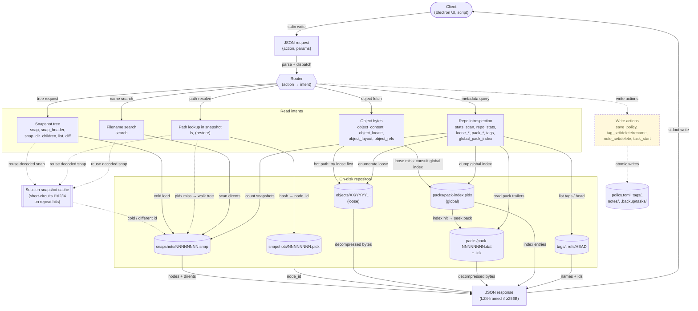

# c-backup JSON RPC API Reference

Complete reference for the JSON RPC interface provided by the `backup` binary. This API is used by the Electron UI (see [manual.md §9](manual.md#9-electron-ui)) and is available to any third-party application.

---

## Modes of Operation

### Single-shot (`--json`)

```sh
echo '{"action":"stats"}' | backup --json /path/to/repo
```

Reads one JSON request from stdin, processes it, writes the response to stdout, and exits. Acquires a shared lock (blocking).

### Session (`--json-session`)

```sh
backup --json-session /path/to/repo
```

Persistent connection: reads and responds to multiple newline-delimited JSON requests on stdin/stdout. Preferred for interactive use — avoids process spawn overhead per request and enables snapshot caching.

---

## Protocol

### Ready Banner

Session mode emits a ready banner immediately on startup:

```json
{"status":"ready","protocol":2,"compression":"lz4","lock":true,"version":"0.1.0_20260406.1944.release"}
```

| Field | Type | Description |
|-------|------|-------------|
| `status` | string | `"ready"` on success, `"error"` if repo cannot be opened |
| `protocol` | number | Protocol version (currently `2`) |
| `compression` | string | Response compression method (`"lz4"`) |
| `lock` | boolean | `true` if shared lock acquired; `false` if exclusive lock held by another process |
| `version` | string | Binary build version string |

### Request Format

```json
{"action": "<name>", "params": { ... }}
```

`params` is optional. Omit it or pass `{}` for actions with no parameters.

### Success Response

```json
{"status": "ok", "data": { ... }}
```

### Error Response

```json
{"status": "error", "message": "description"}
```

### Response Compression

Applies in session mode only. Responses under 256 bytes are plain JSON + newline. Responses of 256+ bytes are LZ4-compressed:

```
 Byte
  0    0x00 magic (distinguishes from plain JSON)
  1    uncompressed length (4 bytes, little-endian)
  5    compressed length (4 bytes, little-endian)
  9    compressed data (comp_len bytes)
       '\n' terminator
```

Detect by checking if the first byte is `0x00` (JSON never starts with a null byte).

### Session Lifecycle

1. Launch: `backup --json-session /path/to/repo`
2. Read ready banner
3. Send newline-delimited requests, read responses
4. Send `{"action":"quit"}` or close stdin to end

SIGPIPE is ignored in session mode. Stderr is redirected to `/dev/null`.

---

## Common Types

### Node Object

Used in responses from: `snap`, `snap_dir_children`, `diff`, `ls`, `search`, `object_refs`

| Field | Type | Description |
|-------|------|-------------|
| `node_id` | number | Unique node identifier within the snapshot |
| `type` | number | 1=reg, 2=dir, 3=symlink, 4=hardlink, 5=fifo, 6=chr, 7=blk |
| `mode` | number | Unix file mode (`st_mode`) |
| `uid` | number | Owner UID |
| `gid` | number | Group GID |
| `size` | number | File size in bytes |
| `mtime_sec` | number | Modification time, seconds |
| `mtime_nsec` | number | Modification time, nanoseconds |
| `content_hash` | string | 64-char hex SHA-256; `"0000...0000"` if no content |
| `xattr_hash` | string | 64-char hex SHA-256; `"0000...0000"` if none |
| `acl_hash` | string | 64-char hex SHA-256; `"0000...0000"` if none |
| `link_count` | number | Hard link count (`st_nlink`) |
| `inode_identity` | number | `st_dev << 32 | st_ino` |
| `union_a` | number | Device major (chr/blk) or symlink target length |
| `union_b` | number | Device minor (chr/blk); 0 otherwise |

### Hash Parameters

All `hash` parameters are 64-character lowercase hex strings (SHA-256).

### Snapshot ID Parameters

All `id` parameters are unsigned 32-bit integers (decimal snapshot numbers).

---

## Actions

### stats

Repository-level statistics.

**Parameters:** none

**Response:**

```json
{
  "snap_count": 42,
  "snap_total": 42,
  "head_entries": 150000,
  "head_logical_bytes": 85000000000,
  "snap_bytes": 2400000,
  "loose_objects": 500,
  "loose_bytes": 120000000,
  "pack_files": 3,
  "pack_bytes": 950000000,
  "total_bytes": 1072400000
}
```

---

### list

All snapshots with header metadata.

**Parameters:** none

**Response:**

```json
{
  "head": 42,
  "snapshots": [
    {
      "id": 1,
      "created_sec": 1712000000,
      "node_count": 150000,
      "dirent_count": 150000,
      "phys_new_bytes": 500000000,
      "gfs_flags": 3,
      "snap_flags": 0,
      "logical_bytes": 85000000000
    }
  ]
}
```

---

### snap

Full snapshot load: header + all nodes + all dirents.

**Parameters:**

| Name | Type | Required | Description |
|------|------|----------|-------------|
| `id` | number | yes | Snapshot ID |

**Response:**

```json
{
  "snap_id": 1,
  "version": 5,
  "created_sec": 1712000000,
  "phys_new_bytes": 500000000,
  "node_count": 2,
  "dirent_count": 2,
  "gfs_flags": 1,
  "snap_flags": 0,
  "nodes": [ { "node_id": 1, "type": 2, ... } ],
  "dirents": [
    { "parent_node": 0, "node_id": 1, "name": "home" },
    { "parent_node": 1, "node_id": 2, "name": "file.txt" }
  ]
}
```

Uses session snapshot cache.

---

### snap_header

Header-only snapshot load (no nodes or dirents). Faster for large snapshots.

**Parameters:**

| Name | Type | Required | Description |
|------|------|----------|-------------|
| `id` | number | yes | Snapshot ID |

**Response:** Same fields as `snap` but without `nodes` and `dirents`.

---

### snap_dir_children

Lazy directory expansion: returns children of a single node.

**Parameters:**

| Name | Type | Required | Description |
|------|------|----------|-------------|
| `id` | number | yes | Snapshot ID |
| `parent_node` | number | yes | Node ID of directory to expand |

**Response:**

```json
{
  "children": [
    {
      "node_id": 5,
      "name": "file.txt",
      "type": 1,
      "size": 4096,
      "mode": 33188,
      "has_children": false
    }
  ]
}
```

Uses session snapshot cache with parent-set and node-map for O(1) lookups.

---

### tags

All tags in the repository.

**Parameters:** none

**Response:**

```json
{
  "tags": [
    { "name": "release-v1", "snap_id": 10, "preserve": false },
    { "name": "legal-hold", "snap_id": 42, "preserve": true }
  ]
}
```

---

### policy

Current `policy.toml` contents.

**Parameters:** none

**Response:**

```json
{
  "paths": ["/home/alice", "/etc"],
  "exclude": ["/home/alice/.cache"],
  "keep_snaps": 7,
  "keep_daily": 30,
  "keep_weekly": 12,
  "keep_monthly": 12,
  "keep_yearly": 5,
  "auto_pack": true,
  "auto_gc": true,
  "auto_prune": true,
  "verify_after": false,
  "strict_meta": false
}
```

Returns error if `policy.toml` does not exist.

---

### save_policy

Update `policy.toml`. All fields are optional; only provided fields are changed.

**Parameters:**

| Name | Type | Required | Description |
|------|------|----------|-------------|
| `paths` | string[] | no | Backup source paths |
| `exclude` | string[] | no | Exclusion paths |
| `keep_snaps` | number | no | Rolling window size |
| `keep_daily` | number | no | Daily anchors to keep |
| `keep_weekly` | number | no | Weekly anchors to keep |
| `keep_monthly` | number | no | Monthly anchors to keep |
| `keep_yearly` | number | no | Yearly anchors to keep |
| `auto_pack` | boolean | no | Auto-pack after backup |
| `auto_gc` | boolean | no | Auto-GC after backup |
| `auto_prune` | boolean | no | Auto-prune after backup |
| `verify_after` | boolean | no | Verify after backup |
| `strict_meta` | boolean | no | Strict metadata checking |

**Response:**

```json
{ "saved": true }
```

---

### object_locate

Check if an object exists and get basic info.

**Parameters:**

| Name | Type | Required | Description |
|------|------|----------|-------------|
| `hash` | string | yes | 64-char hex SHA-256 |

**Response:**

```json
{
  "found": true,
  "type": 1,
  "uncompressed_size": 4096
}
```

---

### object_content

Load object data, returned as base64.

**Parameters:**

| Name | Type | Required | Description |
|------|------|----------|-------------|
| `hash` | string | yes | 64-char hex SHA-256 |
| `max_bytes` | number | no | Prefix load: return only the first N bytes |

**Response:**

```json
{
  "type": 1,
  "size": 4096,
  "truncated": false,
  "content_base64": "SGVsbG8gd29ybGQ..."
}
```

Large objects are streamed through a tmpfile internally.

---

### diff

Changes between two snapshots.

**Parameters:**

| Name | Type | Required | Description |
|------|------|----------|-------------|
| `id1` | number | yes | First (older) snapshot ID |
| `id2` | number | yes | Second (newer) snapshot ID |

**Response:**

```json
{
  "changes": [
    {
      "change": "A",
      "path": "/home/alice/new_file.txt",
      "new_node": { "node_id": 5, "type": 1, ... }
    },
    {
      "change": "M",
      "path": "/etc/config.yaml",
      "old_node": { ... },
      "new_node": { ... }
    },
    {
      "change": "D",
      "path": "/tmp/old_file.log",
      "old_node": { ... }
    }
  ],
  "count": 3
}
```

Change codes: `A` = added, `D` = deleted, `M` = modified content, `C` = changed metadata only.

---

### ls

List directory contents in a snapshot.

**Parameters:**

| Name | Type | Required | Description |
|------|------|----------|-------------|
| `id` | number | yes | Snapshot ID |
| `path` | string | no | Directory path (default: root) |
| `recursive` | boolean | no | Include descendants |
| `type` | string | no | Filter by type: `f`, `d`, `l`, `p`, `c`, `b` |
| `glob` | string | no | Shell glob pattern for names |

**Response:**

```json
{
  "entries": [
    {
      "name": "file.txt",
      "node": { "node_id": 2, "type": 1, ... },
      "symlink_target": null
    }
  ],
  "count": 1
}
```

---

### scan

Physical repository scan.

**Parameters:** none

**Response:**

```json
{
  "snapshot_files": 42,
  "loose_objects": 500,
  "packs": [
    { "name": "pack-00000001.dat", "size": 268435456 }
  ],
  "tag_count": 3,
  "format": "c-backup-1",
  "last_written_version": "0.1.0_20260406.1944.release"
}
```

---

### search

Filename search across snapshots.

**Parameters:**

| Name | Type | Required | Description |
|------|------|----------|-------------|
| `query` | string | yes | Search substring or pattern |
| `id` | number | no | Search only this snapshot (default: all) |
| `max_results` | number | no | Result limit (default: 500) |

**Response:**

```json
{
  "results": [
    {
      "snap_id": 42,
      "path": "/home/alice/documents/report.pdf",
      "node": { ... }
    }
  ],
  "count": 1,
  "truncated": false
}
```

---

### pack_entries

All entries in a specific pack .dat file.

**Parameters:**

| Name | Type | Required | Description |
|------|------|----------|-------------|
| `name` | string | yes | Pack filename (e.g. `"pack-00000001.dat"`) |

**Response:**

```json
{
  "entries": [
    {
      "hash": "abcd1234...",
      "type": 1,
      "compression": 1,
      "uncompressed_size": 4096,
      "compressed_size": 2048,
      "payload_offset": 62
    }
  ],
  "version": 4,
  "count": 100,
  "file_size": 268435456,
  "trailer": {
    "start": 268000000,
    "fhdr_crc_offset": 268000000,
    "offset_table_offset": 268400000,
    "offset_table_size": 800,
    "entry_count_offset": 268400800,
    "footer_offset": 268400804,
    "entry_parity": [
      {
        "offset": 268000004,
        "size": 1300,
        "hdr_parity_size": 260,
        "rs_parity_size": 1024
      }
    ]
  }
}
```

---

### pack_index

All entries in a specific pack .idx file.

**Parameters:**

| Name | Type | Required | Description |
|------|------|----------|-------------|
| `name` | string | yes | Pack filename |

**Response:**

```json
{
  "entries": [
    {
      "hash": "abcd1234...",
      "dat_offset": 62,
      "entry_index": 0
    }
  ],
  "version": 4,
  "count": 100
}
```

---

### all_pack_entries

All entries across all pack files.

**Parameters:** none

**Response:**

```json
{
  "entries": [
    {
      "hash": "abcd1234...",
      "type": 1,
      "compression": 1,
      "uncompressed_size": 4096,
      "compressed_size": 2048,
      "payload_offset": 62,
      "pack_name": "pack-00000001.dat"
    }
  ],
  "count": 5000
}
```

Can produce large responses.

---

### loose_list

Paginated list of loose objects.

**Parameters:**

| Name | Type | Required | Description |
|------|------|----------|-------------|
| `offset` | number | no | Pagination start (default: 0) |
| `limit` | number | no | Max results (default: 5000, max: 5000) |

**Response:**

```json
{
  "objects": [
    {
      "hash": "abcd1234...",
      "type": 1,
      "compression": 0,
      "uncompressed_size": 4096,
      "compressed_size": 4096,
      "pack_skip_ver": 0,
      "file_size": 4152
    }
  ],
  "count": 500,
  "offset": 0,
  "limit": 5000,
  "has_more": false
}
```

---

### repo_stats

Comprehensive per-type statistics across packed and loose objects.

**Parameters:** none

**Response:**

```json
{
  "per_type": [
    { "type": 1, "count": 9000, "uncomp": 80000000000, "comp": 45000000000 },
    { "type": 2, "count": 500, "uncomp": 2000000, "comp": 1500000 },
    { "type": 3, "count": 100, "uncomp": 50000, "comp": 40000 },
    { "type": 4, "count": 10, "uncomp": 500000000, "comp": 200000000 }
  ],
  "pack": { "count": 8500, "uncomp": 75000000000, "comp": 42000000000 },
  "loose": { "count": 1110, "uncomp": 5500000000, "comp": 3500000000 },
  "skip": { "count": 200, "uncomp": 3000000000, "comp": 3000000000 },
  "hiratio": { "count": 300, "uncomp": 4000000000, "comp": 3800000000 }
}
```

Uses V4 .idx files for fast stats when available; falls back to .dat scanning for older versions.

---

### loose_stats

Statistics on loose objects only (lighter weight than `repo_stats`).

**Parameters:** none

**Response:**

```json
{
  "count": 500,
  "total_uncomp": 120000000,
  "per_type": [
    { "type": 1, "count": 450, "uncomp": 115000000 },
    { "type": 2, "count": 40, "uncomp": 4000000 },
    { "type": 3, "count": 10, "uncomp": 1000000 }
  ],
  "skip": { "count": 50, "uncomp": 30000000 }
}
```

---

### object_refs

Find all references to an object across all snapshots.

**Parameters:**

| Name | Type | Required | Description |
|------|------|----------|-------------|
| `hash` | string | yes | 64-char hex SHA-256 |

**Response:**

```json
{
  "refs": [
    { "snap_id": 1, "node_id": 42, "field": "content" },
    { "snap_id": 2, "node_id": 42, "field": "content" },
    { "snap_id": 3, "node_id": 100, "field": "xattr" }
  ],
  "count": 3
}
```

`field` is one of: `"content"`, `"xattr"`, `"acl"`.

---

### object_layout

Physical layout of a loose object file.

**Parameters:**

| Name | Type | Required | Description |
|------|------|----------|-------------|
| `hash` | string | yes | 64-char hex SHA-256 |

**Response:**

```json
{
  "file_size": 4440,
  "header_size": 56,
  "version": 2,
  "type": 1,
  "compression": 0,
  "uncompressed_size": 4096,
  "compressed_size": 4096,
  "segments": [
    { "kind": "header", "offset": 0, "size": 56 },
    { "kind": "payload", "offset": 56, "size": 4096 },
    { "kind": "hdr_parity", "offset": 4152, "size": 260 },
    { "kind": "rs_parity", "offset": 4412, "size": 16 },
    { "kind": "par_crc", "offset": 4428, "size": 4 },
    { "kind": "par_footer", "offset": 4432, "size": 12 }
  ]
}
```

Segment `kind` values: `"header"`, `"payload"`, `"hdr_parity"`, `"rs_parity"`, `"par_crc"`, `"par_footer"`, `"trailer_unknown"`.

---

### global_pack_index

Paginated query of the global pack index.

**Parameters:**

| Name | Type | Required | Description |
|------|------|----------|-------------|
| `offset` | number | no | Pagination start (default: 0) |
| `limit` | number | no | Max entries (default: 1000, max: 5000) |

**Response:**

```json
{
  "header": {
    "magic": 1112691017,
    "version": 1,
    "entry_count": 10000,
    "pack_count": 5
  },
  "fanout": [39, 78, 120, "...256 entries total..."],
  "entries": [
    {
      "hash": "0001abcd...",
      "pack_num": 1,
      "dat_offset": 62,
      "pack_version": 4,
      "entry_index": 0
    }
  ],
  "offset": 0,
  "limit": 1000,
  "has_more": true
}
```

---

### repo_summary

Meta-action that calls multiple sub-actions and aggregates results.

**Parameters:** none

**Response:**

```json
{
  "scan": { ... },
  "list": { ... },
  "tags": { ... },
  "policy": { ... },
  "loose_list": { ... },
  "all_pack_entries": { ... },
  "global_pack_index": { ... }
}
```

Any sub-action that fails returns `null` for that key; others continue.

---

### tag_set

Create or replace a tag pointing at a snapshot.

**Parameters:**

| Name | Type | Required | Description |
|------|------|----------|-------------|
| `name` | string | yes | Tag name |
| `snap_id` | number | yes | Target snapshot ID |
| `preserve` | boolean | no | If `true`, snapshot is pinned against pruning |

**Response:**

```json
{ "saved": true }
```

Existing tags with the same name are overwritten atomically.

---

### tag_delete

Remove a tag. The pointed-at snapshot is unaffected.

**Parameters:**

| Name | Type | Required | Description |
|------|------|----------|-------------|
| `name` | string | yes | Tag name |

**Response:**

```json
{ "deleted": true }
```

Returns an error if the tag does not exist.

---

### tag_rename

Atomically rename a tag.

**Parameters:**

| Name | Type | Required | Description |
|------|------|----------|-------------|
| `old_name` | string | yes | Current tag name |
| `new_name` | string | yes | New tag name |

**Response:**

```json
{ "renamed": true }
```

Fails if `old_name` does not exist or `new_name` is already taken.

---

### note_get

Load a snapshot's note.

**Parameters:**

| Name | Type | Required | Description |
|------|------|----------|-------------|
| `id` | number | yes | Snapshot ID |

**Response:**

```json
{ "text": "before v2.3 migration" }
```

Empty string if the snapshot has no note. Notes are stored under `<repo>/notes/` as one plain-text file per annotated snapshot.

---

### note_set

Create or replace a snapshot's note.

**Parameters:**

| Name | Type | Required | Description |
|------|------|----------|-------------|
| `id` | number | yes | Snapshot ID |
| `text` | string | yes | Note body (max 4096 bytes) |

**Response:**

```json
{ "saved": true }
```

---

### note_delete

Remove a snapshot's note.

**Parameters:**

| Name | Type | Required | Description |
|------|------|----------|-------------|
| `id` | number | yes | Snapshot ID |

**Response:**

```json
{ "deleted": true }
```

Idempotent: succeeds even if no note exists.

---

### note_list

Enumerate all annotated snapshots.

**Parameters:** none

**Response:**

```json
{
  "notes": [
    { "snap_id": 10, "text": "release-candidate" },
    { "snap_id": 42, "text": "known good state" }
  ]
}
```

---

### task_start

Fork a detached child that runs a long operation. Returns immediately with a task ID; progress is tracked via `task_status` / `task_list`.

**Parameters:**

| Name | Type | Required | Description |
|------|------|----------|-------------|
| `command` | string | yes | One of `run`, `gc`, `prune`, `pack`, `verify`, `restore` |
| `repair` | boolean | no | (`verify` only) Rewrite corrupted objects via parity |
| `snapshot` | string | no | (`restore` only) Snapshot ID or tag name |
| `dest` | string | yes (`restore`) | Destination path on the binary's host |
| `file` | string | no | (`restore` only) Specific file or subtree path within the snapshot |
| `verify` | boolean | no | (`restore` only) Verify restored object hashes |

**Response:**

```json
{ "task_id": "6824e3f4028-a1b2c3d4" }
```

The child acquires the repo's exclusive lock non-blocking. Returns `{"status":"error"}` immediately if the lock is contended. Status, progress, and exit state are written to `<repo>/.backup/tasks/<task_id>.json` via atomic tmp+rename; readers see consistent snapshots at all times.

The `run` command reads source paths and automation flags from `policy.toml`; it does not accept override parameters in this release. `prune` is reserved but not yet implemented and will return an error.

---

### task_list

Enumerate all tasks (active + recent) for the repo.

**Parameters:** none

**Response:**

```json
{
  "tasks": [
    {
      "task_id": "6824e3f4028-a1b2c3d4",
      "command": "run",
      "pid": 12345,
      "started": 1745263092,
      "state": "running",
      "exit_code": 0,
      "alive": true,
      "progress": {
        "current": 84120,
        "total": 150000,
        "phase": "scanning"
      }
    },
    {
      "task_id": "6824e2a1ff3-91c0aab8",
      "command": "verify",
      "pid": 12100,
      "started": 1745262500,
      "state": "completed",
      "exit_code": 0,
      "alive": false,
      "progress": { "current": 5000, "total": 5000, "phase": "done" }
    }
  ]
}
```

`alive` is derived at call time by checking whether the stored PID is still the task child process (guards against PID reuse).

---

### task_status

Per-task status snapshot.

**Parameters:**

| Name | Type | Required | Description |
|------|------|----------|-------------|
| `task_id` | string | yes | Task ID returned from `task_start` |

**Response:**

```json
{
  "task_id": "6824e3f4028-a1b2c3d4",
  "command": "run",
  "pid": 12345,
  "started": 1745263092,
  "state": "running",
  "exit_code": 0,
  "alive": true,
  "progress": {
    "current": 84120,
    "total": 150000,
    "phase": "scanning"
  }
}
```

On task failure, an `error` string field is present describing the failure. Reads are lock-free and scan the single `<task_id>.json` file.

---

### task_cancel

Request graceful cancellation of a running task. Sends SIGTERM to the child PID.

**Parameters:**

| Name | Type | Required | Description |
|------|------|----------|-------------|
| `task_id` | string | yes | Task ID |

**Response:**

```json
{ "cancelled": true }
```

The acknowledgement is immediate; the task writes its terminal `failed` status entry when the child finishes winding down. If the task has already completed, returns an error. A task that does not honour SIGTERM within a reasonable window can be escalated to SIGKILL externally; the next exclusive lock acquisition runs the standard crash-recovery path (prune-resume, tmp/ cleanup, pack-resume).

---

### journal

Filtered, paginated read of the operation journal at `<repo>/logs/journal.jsonl`.

**Parameters:**

| Name | Type | Required | Description |
|------|------|----------|-------------|
| `offset` | number | no | Pagination start (default: 0) |
| `limit` | number | no | Max entries (default: 100) |
| `operation` | string | no | Filter by operation name (`run`, `gc`, `pack`, `verify`, etc.) |
| `result` | string | no | Filter by result (`success`, `failed`, `cancelled`, `crash`) |
| `state` | string | no | Filter by entry state (`started` or `completed`) |
| `since` | string | no | ISO 8601 timestamp; exclude entries older than this |

**Response:**

```json
{
  "entries": [
    {
      "op_id": "6824e3f4028-a1b2c3d4",
      "state": "completed",
      "timestamp": "2026-04-21T18:51:40Z",
      "operation": "run",
      "source": "ui",
      "user": "vifair",
      "result": "success",
      "duration_ms": 12340,
      "task_id": "6824e3f4028-a1b2c3d4",
      "summary": { "snap_id": 42, "files_backed_up": 150000, "bytes_new": 500000000 }
    },
    {
      "op_id": "6824e2a1ff3-91c0aab8",
      "state": "completed",
      "timestamp": "2026-04-21T18:41:20Z",
      "operation": "verify",
      "source": "cli",
      "user": "vifair",
      "result": "crash",
      "duration_ms": 3500,
      "signal": 11
    }
  ],
  "count": 2,
  "orphan_count": 0
}
```

Every operation writes two journal entries linked by `op_id`: a `started` entry at operation begin and a `completed` entry at end. Catastrophic failures (SIGSEGV, SIGABRT, SIGBUS) are caught by a pre-installed signal handler that writes a minimal completion entry with `result: "crash"` and the signal number, using a pre-allocated buffer and direct `write()` syscall (no malloc, no stdio).

`orphan_count` reports the number of `started` entries with no matching `completed` — these indicate SIGKILL, power loss, or kernel panic. The UI surfaces these in the health dashboard.

The `summary` field is operation-specific; see the implementation in `src/ops/journal.c` for the schema per operation.

---

### quit

Session mode only. Ends the session cleanly. No response is sent.

---

## Error Handling

| Condition | Behaviour |
|-----------|-----------|
| Unknown action | `{"status":"error","message":"unknown action '<name>'"}` |
| Missing required parameter | `{"status":"error","message":"<action>: missing '<param>' param"}` |
| Invalid hash format | `{"status":"error","message":"invalid hex hash"}` |
| Object/snapshot not found | `{"status":"error","message":"not found"}` |
| Repository I/O error | `{"status":"error","message":"..."}` with details |
| Malformed JSON request | `{"status":"error","message":"invalid JSON"}` |

---

## Session Caching

In session mode, the server maintains a single-slot snapshot cache:

- Caches the most recently loaded snapshot (decompressed nodes + dirents)
- Builds a parent-set hash table (which nodes have children) for `snap_dir_children`
- Builds a node-map hash table (node_id to node_t pointer) for O(1) lookups
- Auto-evicts when a different snapshot ID is requested
- Cleared on session end

This makes repeated `snap_dir_children` calls for the same snapshot nearly free.

---

## Architecture: From Binary Entry to File Access

This section traces how an RPC call traverses the binary, layer by layer, down to the `pread()`/`mmap()` calls that touch the on-disk repository.

### High-Level Diagram



### Layer 1 — Process Entry (`src/cli/main.c`)

The binary's `main()` parses two RPC-only flags:

- `--json` → `main.c:107–119`. Calls `repo_open()` (`:109`), then hands the open repo straight to `json_api_dispatch()` (`:116`), then `repo_close()`.
- `--json-session` → `main.c:122–135`. Same `repo_open()` (`:125`), then `json_api_session()` (`:132`).

`repo_open()` (in `src/store/repo.c`) is what actually populates the in-memory `repo_t` — it resolves the repo path, opens the on-disk format header, and prepares lazy structures (pack cache, etc.). No object data is read yet; it is all on-demand from this point on.

### Layer 2 — RPC Loop & Locking (`src/api/json_api.c`)

#### One-shot dispatch — `json_api_dispatch()` (`:2323`)

1. `read_stdin_all()` (`:2325`) slurps the entire stdin payload.
2. `cJSON_Parse()` (`:2331`) parses it; missing `action` → error.
3. Linear scan over `actions[]` (`:2349–2362`) finds the handler.
4. `repo_lock_shared(repo)` (`:2365`) — **blocking** shared lock.
5. Handler is invoked; result wrapped via `write_ok()` / `write_error()`.

#### Session dispatch — `json_api_session()` (`:2384`)

1. `stderr → /dev/null` (`:2388`) — protocol cleanliness.
2. `repo_lock_shared_nb(repo)` (`:2396`) — **non-blocking** shared lock. The boolean result is what becomes the `lock` field of the ready banner. If a backup/GC/pack process holds the exclusive lock, the session still starts but `lock:false` warns the client of stale-read potential.
3. Ready banner emitted (`:2400`) with protocol/compression/version.
4. `_cache_active = 1` (`:2409`) enables the snapshot cache (see Layer 3).
5. Main loop (`:2416–2470`): `getline()` for newline-delimited requests; per-request dispatch is identical to the one-shot path but without re-locking.
6. On exit, `session_snap_cache_clear()` (`:2470`) frees the cached snapshot and hash tables.

#### Lock file

`repo_lock_shared()` lives in `src/store/repo.c:666`. It opens `{repo}/lock` (`O_RDWR|O_CREAT`), runs `flock(fd, LOCK_SH)`, and stores the fd on `repo->lock_fd` with `lock_mode=1`. The `_nb` variant at `:686` uses `LOCK_SH | LOCK_NB` and is what lets the session detect exclusive contention without blocking the GUI startup.

#### Response framing & LZ4 — `write_json()` (`:290–327`)

Every successful response funnels through `write_json()`:

- Computes `LZ4_compressBound()` (`:295`).
- `LZ4_compress_default()` (`:301`) compresses the JSON.
- Writes the 9-byte binary frame: `0x00` magic, 4-byte uncompressed length (LE), 4-byte compressed length (LE), then compressed bytes and `'\n'` (`:309–318`).
- On compression failure or for sub-256B payloads, falls back to plain JSON + newline (`:323–326`).

The leading `0x00` is the discriminator: JSON itself can never start with a null byte, so a client can sniff one byte to decide whether to LZ4-decompress.

### Layer 3 — Session Snapshot Cache

The cache is **single-slot** (LRU of size one) and lives entirely in `static` storage in `json_api.c:38–51`:

| Symbol | Purpose |
|--------|---------|
| `_cached_snap` | The `snapshot_t*` itself (nodes + packed dirent_data) |
| `_cached_snap_id` | Snapshot ID currently cached |
| `_cache_active` | Set to `1` only during `--json-session` |
| `_cached_pset` / `_cached_pset_occ` / `_cached_pset_cap` | Open-addressed hash set of node_ids that appear as `parent_node` in any dirent. Used by `snap_dir_children` to answer "does this node have children?" in O(1). |
| `_cached_nm_keys` / `_cached_nm_vals` / `_cached_nm_occ` / `_cached_nm_cap` | Open-addressed hash map `node_id → const node_t*` so lookups during directory expansion are O(1) instead of O(N) over `snap->nodes[]`. |

`session_snap_get()` (`:131`) is the cache's only entry point:

1. If `snap_id == _cached_snap_id`, return the cached pointer.
2. Otherwise evict: `snapshot_free(_cached_snap)` and `_free_cached_tables()` (`:137–140`).
3. `snapshot_load(repo, snap_id, &snap)` (`:144`) loads the new snapshot from disk.
4. If `_cache_active`, install the new snapshot and call `_build_cached_tables()` (`:64–125`), which power-of-2-sizes both hash tables (start 32, double until ≥ load) and hashes node_ids with the FNV-1a-style `0x9E3779B97F4A7C15` mixer.

The net effect: a client that opens a snapshot and then expands many directories pays the snapshot decompression cost **once**, and every subsequent `snap_dir_children` is constant-time work over already-resident memory.

### Layer 4 — Action Handlers and Their Disk Paths

The dispatch table at `json_api.c:2291–2317` is the canonical list. Below are the call chains for the most representative handlers, followed by which on-disk artifacts each one touches.

#### `snap` — full snapshot load (`handle_snap`, `:419–473`)

```
handle_snap
  └── session_snap_get()                       json_api.c:131
        └── snapshot_load()                    src/store/snapshot.c:306
              └── open()/read() snaps/snap-NNN.bin   (decompresses nodes + dirent blob)
  ├── snap_add_header_fields()                 :438
  ├── walk snap->nodes[] → JSON                :442
  └── walk dirent_data dirent_rec_t records   :447–468
```

If the cache is warm, the first three lines collapse to a pointer return — the handler then just walks already-decoded memory.

#### `snap_dir_children` — lazy directory expansion (`:493–651`)

```
handle_snap_dir_children
  ├── session_snap_get()                       :511   (loads snap if cold)
  ├── use _cached_pset / _cached_nm_*          :519–525
  │     (or _build_cached_tables() inline at :527–572 for one-shot mode)
  ├── linear scan of dirent_data for parent    :573–616
  └── per-child: node-map lookup → JSON        :617–648
```

This is the hottest path for the GUI's tree view. It is intentionally tuned so that **no disk I/O** happens for repeated expansions of the same snapshot.

#### `object_content` / `object_locate` — payload retrieval (`:869–939`)

```
handle_object_content
  ├── hex_to_hash()                            :876
  ├── object_load() / object_load_prefix()     src/store/object.c:1367
  │     ├── hash_to_path() → objects/XX/YYY…   :1372
  │     ├── open(O_RDONLY) loose object        :1376
  │     │     ├── pread() 56-byte header       :1383
  │     │     ├── read compressed payload      :1403
  │     │     └── (v2) read RS parity trailer, verify/repair
  │     └── on ENOENT → pack_object_load()     pack.c:773
  │           ├── pack_find_entry()            pack.c:583  (bsearch over cache)
  │           │     └── pack_cache_load()      pack.c:391
  │           │           └── pack_index_open() pack_index.c:35
  │           │                 └── mmap() packs/pack-index.pidx
  │           ├── dat_open_or_checkout()       fopen("packs/pack-NNNNNNNN.dat")
  │           ├── fseeko(dat_offset) + read_entry_hdr()
  │           ├── (v3/v4) load_entry_parity() + RS verify/repair
  │           └── LZ4_decompress_safe / ZSTD_decompress / memcpy
  └── base64_encode() into JSON                :928
```

So a single `object_content` call may walk: **lock file → mmapped global pack index → pack `.dat` header → parity records → decompressor**, all under one shared `flock`.

#### `ls` — filtered directory listing (`:975–1017`)

```
handle_ls
  └── snapshot_ls_collect()                    src/ops/ls.c
        └── snapshot_load()                    (or cache hit)
              → walks dirent tree, applies path/recursive/type/glob filters
```

#### `search` — cross-snapshot filename search (`:1939–1983`)

```
handle_search
  ├── if id given:  search_one_snapshot()      src/ops/search.c
  └── otherwise:    snapshot_list_all() then snapshot_search_multi()
        → loads each snapshot in turn (no cache benefit for full sweep)
```

#### `pack_entries` — enumerate one pack file (`:1221–1329`)

```
handle_pack_entries
  ├── pack_enumerate_dat()                     pack.c:3952
  │     └── opens packs/pack-NNNNNNNN.dat, walks entry headers
  └── trailer parsing via pread():
        ├── parity_footer_t at fend - sizeof(pftr)         :1265
        ├── offset table at fend - 16 - 8*count            :1279–1290
        └── per-entry parity records                       :1298–1300
```

This handler deliberately uses positional reads on the trailer rather than full-file mmap so that very large packs do not pollute the page cache.

#### `object_layout` — physical loose-object map (`:2038–2140`)

```
handle_object_layout
  ├── construct objects/XX/YYY… path           :2053–2055
  ├── open(O_RDONLY)                           :2057
  ├── pread() object_header_t                  :2069
  ├── compute segments[] (header / payload)    :2085–2106
  └── pread() parity_footer_t at end           :2112–2117
```

Pure introspection — never invokes the decompressor.

#### `global_pack_index` — paginated dump (`:2189–2246`)

```
handle_global_pack_index
  ├── pack_index_open()                        pack_index.c:35
  │     └── mmap(packs/pack-index.pidx, MAP_PRIVATE)
  │           ├── validate magic / version
  │           ├── verify parity_footer_t
  │           └── CRC32C + RS-repair if corrupt
  ├── serialize header (magic/version/counts)
  ├── serialize fanout[256]
  ├── slice [offset, offset+limit) of entries
  └── pack_index_close()                       (munmap)
```

### Layer 5 — Disk Artifacts Touched by RPC

| Artifact | Path | Touched by | Access pattern |
|----------|------|------------|----------------|
| Repo lock | `{repo}/lock` | every action (via `repo_lock_shared`); task children take `LOCK_EX \| LOCK_NB` | `flock(LOCK_SH[\|LOCK_NB])` for sessions |
| Snapshot files | `{repo}/snaps/snap-NNN.bin` | `snap`, `snap_header`, `snap_dir_children`, `ls`, `search`, `diff`, `list`, `repo_summary` | `read()`, decompress |
| Loose objects | `{repo}/objects/XX/YYY…` | `object_content`, `object_locate`, `object_layout`, `loose_list`, `loose_stats` | `pread()` header + payload + parity |
| Pack data | `{repo}/packs/pack-NNNNNNNN.dat` | `object_content` (fallback), `pack_entries`, `all_pack_entries`, `repo_stats`, `scan` | `fseeko()`+`read()`, trailer `pread()` |
| Pack legacy idx | `{repo}/packs/pack-NNNNNNNN.idx` | `pack_index`, fallback `pack_cache_load()` | sequential read |
| Global pack index | `{repo}/packs/pack-index.pidx` | `global_pack_index`, all packed-object lookups | `mmap(MAP_PRIVATE)` |
| Tags | `{repo}/tags/*` | `tags`, `tag_set`, `tag_delete`, `tag_rename` | direct file I/O; atomic rename for writes |
| Policy | `{repo}/policy.toml` | `policy`, `save_policy` | direct read; atomic tmp+rename for writes |
| Snapshot notes | `{repo}/notes/<snap-id>` | `note_get`, `note_set`, `note_delete`, `note_list` | direct file I/O |
| Journal | `{repo}/logs/journal.jsonl` | every action (via wrapping start/complete writes); `journal` action reads | append-only; tail-read for `journal` queries |
| Task status | `{repo}/.backup/tasks/<task-id>.json` | `task_start` (write), `task_list`/`task_status` (read), `task_cancel` (PID signal) | atomic tmp+rename for child writes; lock-free reads |

### Recap: a Single `object_content` Round-Trip

1. **Client** writes `{"action":"object_content","params":{"hash":"…"}}\n` to the session's stdin.
2. **Session loop** (`json_api.c:2416`) `getline()`s the request.
3. **cJSON** parses; **dispatch table** routes to `handle_object_content` (`:869`).
4. **Hash decode** → 32 bytes.
5. **`object_load`** tries `objects/XX/YYY…` first. On hit: `pread()` header, `pread()` payload, RS-verify, decompress.
6. On miss: **`pack_object_load`** → `pack_find_entry` → `pack_cache_load` → first time only, `pack_index_open` `mmap`s `pack-index.pidx`. Subsequent lookups are just `bsearch` over the resident cache.
7. **`fopen` + `fseeko`** the resolved `pack-NNNNNNNN.dat` to `dat_offset`, read the entry header, parity-verify (v3/v4), decompress into a fresh buffer.
8. **`base64_encode`** the result, build the JSON object, hand to **`write_ok`**.
9. **`write_json`** LZ4-compresses (since payload > 256 B), writes the 9-byte binary frame and the compressed body.
10. The shared `flock` is held for the entire round-trip — released only when the session exits.
